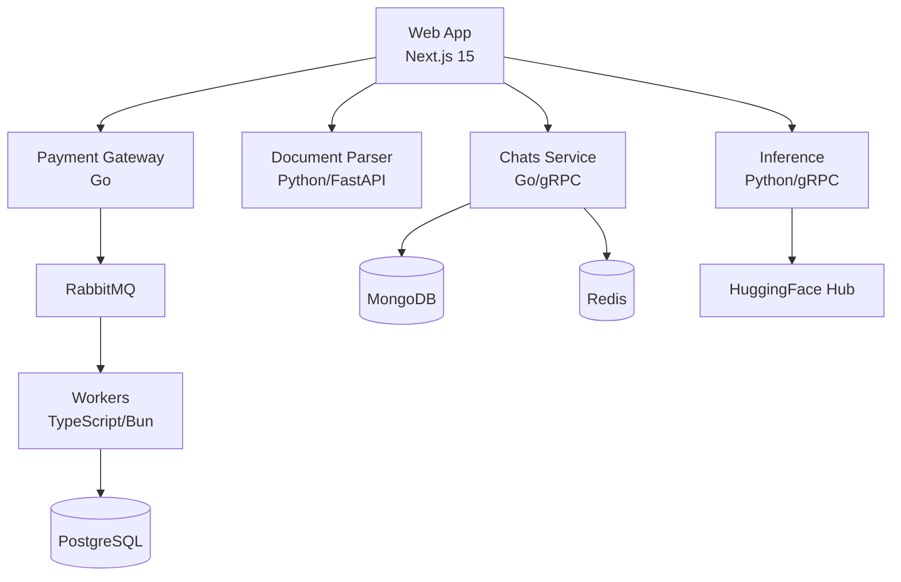

# Detect AI

[](https://github.com/kunalPisolkar24/detectAI/actions/workflows/ci.yml)
[](https://lbesson.mit-license.org/)
[](https://github.com/kunalPisolkar24/detectAI)

A full-stack platform that detects AI-generated text using a dual-model system (a fine-tuned BERT transformer and a 3-layer DNN). Built as a Turborepo monorepo with microservices architecture, deployed on Vercel, Lightning AI, and AWS.

## Features

- **AI Text Detection** — Dual-model system (premium BERT + standard DNN) for analyzing text
- **Subscription Management** — Paddle.js-powered monthly/yearly plans with webhook handling
- **Multi-Provider Auth** — Email/password, Google, and GitHub login via NextAuth
- **Human Verification** — Cloudflare Turnstile bot prevention
- **Chat Conversations** — Persistent chat history with streaming support

## Architecture



### Services

| Service | Language | Role | Docs |
|---------|----------|------|------|
| **Web** | TypeScript (Next.js 15) | Frontend, BFF, auth, UI | [docs](apps/web/docs/README.md) |
| **Inference** | Python (gRPC) | Dual ONNX model inference | [docs](services/inference/docs/README.md) |
| **Chats** | Go (gRPC) | Chat storage, streaming, background worker | [docs](services/chats/docs/README.md) |
| **Document Parser** | Python (FastAPI) | Text extraction from PDF/DOCX/TXT | [docs](services/document-parser/docs/README.md) |
| **Payment Gateway** | Go | Paddle webhook validation, RabbitMQ forwarding | [docs](services/payments/gateway/docs/README.md) |
| **Workers** | TypeScript (Bun) | Payments, analytics, cron processing | [docs](services/workers/docs/README.md) |
| **Terraform** | HCL | AWS infrastructure (RDS, DocumentDB, ElastiCache, MQ) | [docs](infra/docs/README.md) |

## Tech Stack

| Layer | Technology |
|-------|------------|
| Framework | Next.js 15 (App Router), Turborepo |
| UI | React, Shadcn UI, Tailwind CSS, Framer Motion |
| Auth | NextAuth.js (JWT), bcrypt |
| Database | PostgreSQL (Prisma), MongoDB, Redis (x3), RabbitMQ |
| Payments | Paddle.js |
| Inference | ONNX Runtime, HuggingFace Transformers, scikit-learn |
| Observability | OpenTelemetry, Prometheus, structlog / pino |
| Infrastructure | Docker Compose, Terraform, AWS (RDS, DocumentDB, ElastiCache, MQ) |
| CI/CD | GitHub Actions, Vercel |

## Getting Started

### Prerequisites

- [pnpm](https://pnpm.io/)
- [Docker](https://docs.docker.com/get-docker/)

### Setup

```bash
# Clone
git clone https://github.com/kunalPisolkar24/detectAI.git
cd detectAI

# Install dependencies
pnpm install

# Set up environment
cp infra/docker/local/.env.example infra/docker/local/.env
# Edit the .env file with your secrets

# See all available commands
make help

# Start the local stack
make local-up
```

The web app will be available at [http://localhost:3000](http://localhost:3000).

### Build Without Starting

```bash
make build STACK=local SERVICE=frontend
make build STACK=prod
```

See [Infrastructure Quick Start](infra/docs/getting-started/quickstart.md) for the full local development guide, including Terraform and Floci/LocalStack setup.

## Project Structure

```
detectAI/
├── apps/
│   └── web/                    # Next.js 15 full-stack app
├── services/
│   ├── chats/                  # Go gRPC chat service
│   ├── document-parser/        # Python text extraction
│   ├── inference/              # Python gRPC model serving
│   └── payments/gateway/       # Go webhook gateway
├── services/workers/           # TypeScript background workers
├── tools/
│   ├── model-publisher/        # HuggingFace model publishing CLI
│   └── seed-secrets/           # AWS Secrets Manager seeding CLI
└── infra/
    ├── docker/                 # Compose stacks + reusable atoms
    ├── terraform/              # AWS infrastructure as code
    └── docs/                   # Infrastructure documentation
```

## Documentation

Each component has its own documentation in `docs/`. Start with the quickstart for the component you're working on:

| Component | Quick Start | Full Docs |
|-----------|-------------|-----------|
| Web App | [Quickstart](apps/web/docs/getting-started/quickstart.md) | [Index](apps/web/docs/README.md) |
| Inference | [Quickstart](services/inference/docs/getting-started/quickstart.md) | [Index](services/inference/docs/README.md) |
| Chats | [Quickstart](services/chats/docs/getting-started/quickstart.md) | [Index](services/chats/docs/README.md) |
| Document Parser | [Quickstart](services/document-parser/docs/getting-started/quickstart.md) | [Index](services/document-parser/docs/README.md) |
| Payment Gateway | [Quickstart](services/payments/gateway/docs/getting-started/quickstart.md) | [Index](services/payments/gateway/docs/README.md) |
| Workers | [Quickstart](services/workers/docs/getting-started/quickstart.md) | [Index](services/workers/docs/README.md) |
| Infrastructure | [Quickstart](infra/docs/getting-started/quickstart.md) | [Index](infra/docs/README.md) |
| Terraform | [README](infra/terraform/README.md) | [Docs](infra/docs/concepts/terraform.md) |
| Model Publisher | [Quickstart](tools/model-publisher/docs/getting-started/quickstart.md) | [Index](tools/model-publisher/docs/README.md) |
| Seed Secrets | [Quickstart](tools/seed-secrets/docs/getting-started/quickstart.md) | [Index](tools/seed-secrets/docs/README.md) |

## Contributing

See [CONTRIBUTING.md](CONTRIBUTING.md) for guidelines on branching, PR process, and AI agent conventions.

1. Fork the Project
2. Create your Feature Branch (`git checkout -b feature/AmazingFeature`)
3. Commit your Changes
4. Push to the Branch (`git push origin feature/AmazingFeature`)
5. Open a Pull Request

## License

Distributed under the MIT License. See [LICENSE](LICENSE) for more information.
