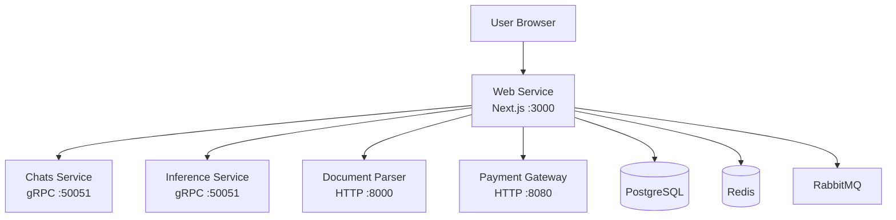

# Web Service Documentation

Welcome to the Detect AI Web service documentation. This guide will help you understand how the service works and how to use it.

## New to This Service?

Start here:

1. **[Quick Start](getting-started/quickstart.md)** - Get the service running in minutes
2. **[Architecture](concepts/architecture.md)** - Learn how the service is structured
3. **[Configuration](getting-started/configuration.md)** - Set up the service for your environment

## What Is This Service?

The Web service is the **full-stack user-facing application** for Detect AI. It serves as:

- The **frontend UI** (React/Next.js with Shadcn UI)
- The **backend-for-frontend (BFF)** that orchestrates calls to backend services
- The **authentication hub** (NextAuth with email/password, Google, GitHub)
- The **AI text detection interface** where users submit text for analysis
- The **subscription management** portal (Paddle.js payments)

## Documentation by Topic

### Getting Started

| Document | What You'll Learn | When to Read |
|----------|-------------------|--------------|
| [Quick Start](getting-started/quickstart.md) | Run the service locally | First time using the service |
| [Configuration](getting-started/configuration.md) | All settings and how to configure them | Setting up the service |

### Concepts

| Document | What You'll Learn | When to Read |
|----------|-------------------|--------------|
| [Architecture](concepts/architecture.md) | How the service is built and why | Understanding the system |
| [Request Flows](concepts/request-flows.md) | How requests move through the system | Understanding the flow |

### Components

| Document | What You'll Learn | When to Read |
|----------|-------------------|--------------|
| [API Routes](components/api-routes.md) | How to call the service's API endpoints | Integrating with the frontend |
| [Authentication](components/auth.md) | How login/signup works | Implementing auth features |
| [Backend Services](components/services.md) | How the service connects to backends | Understanding service integrations |
| [Infrastructure](components/infrastructure.md) | Redis, database, analytics, tracing | Debugging infrastructure |

### Operations

| Document | What You'll Learn | When to Read |
|----------|-------------------|--------------|
| [Health Checks](operations/health.md) | Health probes and degradation | Monitoring the service |
| [Observability](operations/observability.md) | Metrics, logs, and alerts | Monitoring and debugging |

### Testing

| Document | What You'll Learn | When to Read |
|----------|-------------------|--------------|
| [Testing Overview](testing/overview.md) | How to test the service | Writing or running tests |

## Reading Order for Different Roles

### New Developers
1. [Quick Start](getting-started/quickstart.md) - Get it running
2. [Architecture](concepts/architecture.md) - Understand the big picture
3. [Request Flows](concepts/request-flows.md) - See how requests work
4. [Configuration](getting-started/configuration.md) - Set up your environment
5. [Authentication](components/auth.md) - Learn about auth

### Frontend Developers
1. [Architecture](concepts/architecture.md) - Understand the project structure
2. [Authentication](components/auth.md) - Learn about auth
3. [API Routes](components/api-routes.md) - Learn the API
4. [Request Flows](concepts/request-flows.md) - Understand the flow

### DevOps/SRE
1. [Quick Start](getting-started/quickstart.md) - Get it running
2. [Configuration](getting-started/configuration.md) - Configure the service
3. [Health Checks](operations/health.md) - Set up monitoring
4. [Observability](operations/observability.md) - Configure metrics and alerts

### Backend Developers
1. [Backend Services](components/services.md) - Learn service integrations
2. [Request Flows](concepts/request-flows.md) - Understand the flow
3. [API Routes](components/api-routes.md) - Learn the API
4. [Testing Overview](testing/overview.md) - Write and run tests

## Related Files

- **Main README**: [`../../README.md`](../../README.md) - Project overview
- **Makefile**: [`../../Makefile`](../../Makefile) - Docker orchestration commands
- **Package.json**: [`../package.json`](../package.json) - Dependencies and scripts
- **Docker Compose**: [`../../infra/docker/`](../../infra/docker/) - Infrastructure stacks
