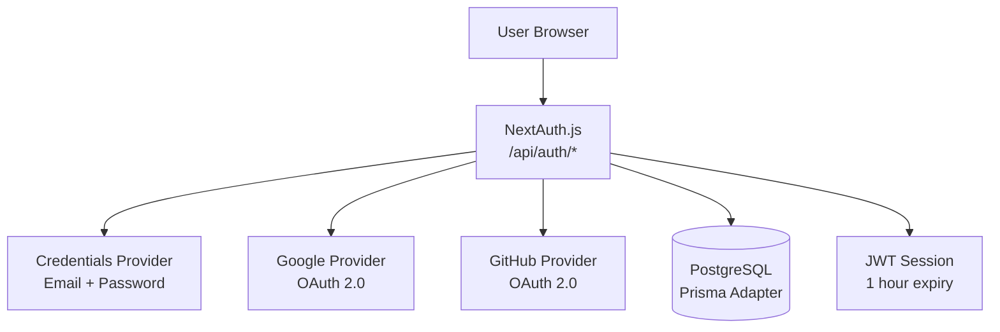
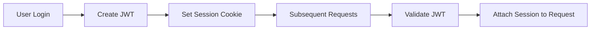
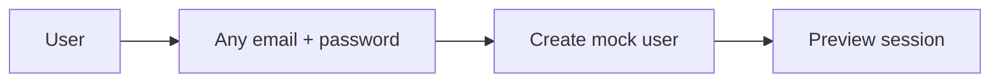

# Authentication

This document explains how authentication works in the Web service. The service uses **NextAuth.js** with multiple providers and a JWT-based session strategy.

## Overview

Authentication is handled by NextAuth.js, which manages:

- User sign-up and sign-in
- Session management (JWT tokens)
- OAuth providers (Google, GitHub)
- Email/password credentials
- Cloudflare Turnstile (bot protection)



## Authentication Providers

### 1. Email/Password (Credentials)

**What it does:** Allows users to sign in with their email and password.

**How it works:**
1. User enters email and password on the login page
2. NextAuth calls the `authorize` function
3. Function looks up the user in PostgreSQL by email
4. Password is compared using bcrypt
5. If valid, user object is returned and JWT is created

**Security features:**
- Passwords are hashed with bcrypt
- Turnstile CAPTCHA protection (configurable)
- JWT expires after 1 hour

**Preview mode:** Any syntactically valid email/password works. No database lookup.

### 2. Google OAuth

**What it does:** Allows users to sign in with their Google account.

**Configuration required:**
```bash
GOOGLE_ID=your-google-client-id
GOOGLE_SECRET=your-google-client-secret
```

**How it works:**
1. User clicks "Sign in with Google"
2. Browser redirects to Google's OAuth consent screen
3. Google redirects back with an authorization code
4. NextAuth exchanges the code for tokens
5. User profile is extracted and matched/created in database
6. JWT session is created

### 3. GitHub OAuth

**What it does:** Allows users to sign in with their GitHub account.

**Configuration required:**
```bash
GITHUB_ID=your-github-client-id
GITHUB_SECRET=your-github-client-secret
```

**How it works:** Same flow as Google OAuth, but with GitHub's authorization endpoint.

## Session Strategy

The service uses **JWT-based sessions** (not database sessions):



**JWT payload contains:**
- `id` — User's database ID
- `name` — User's display name
- `email` — User's email address
- `picture` — Profile image URL
- `isPremium` — Whether user has active subscription
- `iat` — Issued at timestamp

**Session configuration:**
```typescript
session: {
  strategy: "jwt",    // JWT-based (not database sessions)
  maxAge: 60 * 60,    // 1 hour expiry
}
```

**Why JWT?**
- Stateless — no database lookup on every request
- Fast — validation happens in memory
- Scalable — works across multiple server instances

## JWT Callbacks

### `jwt` callback

Called when a JWT is created or updated:

```typescript
async jwt({ token, user, trigger, session }) {
  // On initial login: copy user data to token
  if (user) {
    token.id = user.id
    token.isPremium = user.isPremium ?? false
    token.name = user.name ?? null
    token.email = user.email ?? null
    token.picture = user.image ?? null
  }

  // On session update: refresh token data
  if (trigger === "update" && session) {
    if (typeof session.name === "string") token.name = session.name
    if (typeof session.picture === "string") token.picture = session.picture
    if (typeof session.isPremium === "boolean") token.isPremium = session.isPremium
  }

  // Periodic premium check (non-premium users only, 60s throttle)
  if (!isPreviewMode() && trigger !== "update" && token.isPremium === false && token.id) {
    // Revalidate premium status from database
  }

  return token
}
```

### `session` callback

Called when a session is created or accessed:

```typescript
async session({ session, token }) {
  if (session.user && token) {
    session.user.id = token.id
    session.user.name = token.name
    session.user.email = token.email
    session.user.image = token.picture
    session.user.isPremium = token.isPremium
  }
  return session
}
```

**Why periodic premium check?**
- Users may upgrade their subscription
- JWT is cached for 1 hour; premium status could be stale
- Throttled to 1 check per 60 seconds to avoid database overload

## Custom Pages

| Page | Route | Purpose |
|------|-------|---------|
| Sign In | `/login` | Custom login page |
| Error | `/auth/error` | Authentication error page |

## Preview Mode

In preview mode (`ENV_TYPE=preview`), authentication is simplified:



**What changes:**
- Any syntactically valid email/password works
- No database lookup
- User ID is `preview-{email}`
- `isPremium` is always `false`
- Prisma adapter is disabled

**Why preview mode?**
- UI development without backend services
- Testing frontend changes quickly
- Demo environments

## Protected Routes

### Client-Side Protection

Use the `useSession` hook to check authentication:

```typescript
import { useSession } from "next-auth/react"

function MyComponent() {
  const { data: session, status } = useSession()

  if (status === "loading") return <Spinner />
  if (status === "unauthenticated") return <Redirect to="/login" />

  return <div>Hello, {session.user.name}</div>
}
```

### Server-Side Protection

Use `getServerSession` in API routes and server components:

```typescript
import { getServerSession } from "next-auth"
import { authOptions } from "@/lib/config/auth-options"

export async function GET() {
  const session = await getServerSession(authOptions)
  if (!session?.user?.id) {
    return NextResponse.json({ error: "Unauthorized" }, { status: 401 })
  }
  // ... handle request
}
```

### Server Actions

Use `getServerSession` in server actions:

```typescript
"use server"
import { getServerSession } from "next-auth"
import { authOptions } from "@/lib/config/auth-options"

export async function saveMessage(content: string) {
  const session = await getServerSession(authOptions)
  if (!session?.user?.id) throw new Error("Unauthorized")
  // ... save message
}
```

## Premium Status

The `isPremium` flag indicates whether a user has an active subscription:

**How it's determined:**
1. On login: checked from database (`subscription.status === ACTIVE`)
2. In JWT: stored as `token.isPremium`
3. Periodically revalidated: every 60 seconds for non-premium users

**Why revalidate?**
- Users may upgrade after login
- JWT is cached; premium status could be stale
- Throttled to avoid excessive database queries

## Troubleshooting

### "Unauthorized" error

- Check if the user is logged in
- Verify the session cookie is present
- Ensure `NEXTAUTH_SECRET` is set correctly

### OAuth callback errors

- Verify `GOOGLE_ID/SECRET` and `GITHUB_ID/SECRET` are correct
- Check that callback URLs are configured in OAuth provider settings
- Ensure `NEXTAUTH_URL` matches your domain

### Session not persisting

- Check `NEXTAUTH_SECRET` is set and consistent
- Verify cookies are not being blocked
- Ensure `NEXTAUTH_URL` matches your dev server URL

### Premium status not updating

- The JWT revalidates every 60 seconds for non-premium users
- Force a session update with `update()` from `useSession`
- Check database for correct subscription status

## Related Documentation

- [Configuration](../getting-started/configuration.md) - Auth-related env vars
- [Architecture](../concepts/architecture.md) - How auth fits in the system
- [API Routes](api-routes.md) - Protected API endpoints
