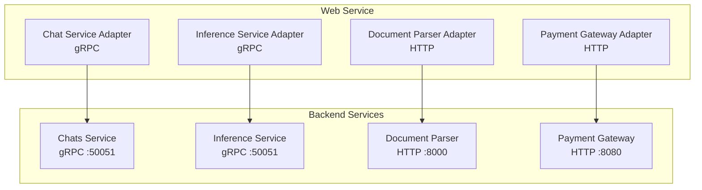
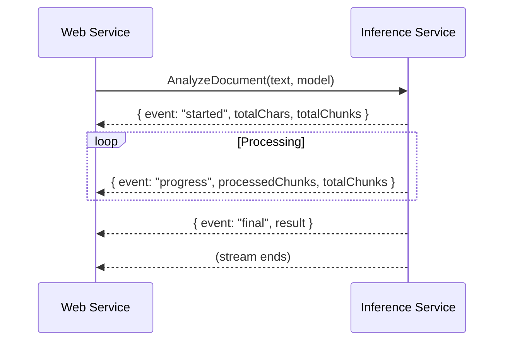

# Backend Services

This document explains how the Web service connects to backend microservices. The web app acts as a **backend-for-frontend (BFF)**, translating between the frontend's needs and the backend services' protocols.

## Overview

The Web service connects to four backend services:



| Service | Protocol | Default URL | Purpose |
|---------|----------|-------------|---------|
| Chats Service | gRPC | `chat-service:50051` | Chat CRUD, message storage |
| Inference Service | gRPC | `ai-service:50051` | AI text detection |
| Document Parser | HTTP | `http://document-parser:8000` | File extraction |
| Payment Gateway | HTTP | `http://payment-gateway:8080` | Subscription management |

## Chats Service (gRPC)

**What it does:** Manages chat sessions and messages. The web service calls this for creating chats, saving messages, and retrieving history.

### Client Implementation

Located at `features/chat/services/grpc-chat-service.ts`:

```typescript
export class GrpcChatService implements IChatService {
  private get client() {
    return getChatGrpcClient()
  }

  async createChat(initialMessage: string): Promise<ChatSession> {
    const userId = await this.getUserId()
    const title = initialMessage.slice(0, 40) || "New Chat"
    return new Promise((resolve, reject) => {
      this.client.CreateChat({ user_id: userId, title }, (err, response) => {
        if (err) return reject(err)
        resolve({ id: response.chat_id, title, messages: [], updatedAt: new Date() })
      })
    })
  }
}
```

### Available Operations

| Method | gRPC Call | Description |
|--------|-----------|-------------|
| `createChat` | `CreateChat` | Create a new chat session |
| `getChat` | `GetChat` + `GetChatHistory` | Get chat with messages |
| `getHistory` | `GetUserChats` | List user's chats |
| `sendMessage` | `SaveMessage` + `Detect` | Send message and get analysis |
| `deleteChat` | `DeleteChat` | Delete a chat |
| `renameChat` | `RenameChat` | Rename a chat |

### Connection Configuration

```bash
CHAT_SERVICE_URL=localhost:50051   # gRPC endpoint
```

The gRPC client uses:
- `@grpc/grpc-js` for the transport
- `@grpc/proto-loader` for proto file loading
- Keepalive settings for connection reliability

## Inference Service (gRPC)

**What it does:** Analyzes text for AI-generated content. Supports both unary (single request) and streaming (document analysis) calls.

### Client Implementation

Located at `features/chat/services/inference-service.ts`:

```typescript
export const inferenceService = {
  async detect(text: string, model: ModelType): Promise<AnalysisResult> {
    const client = getGrpcClient()
    const metadata = getGrpcMetadata()
    return new Promise((resolve, reject) => {
      client.Detect({ text, model_id: model }, metadata, (err, response) => {
        if (err) reject(new Error("AI Analysis Service Unavailable"))
        else resolve(mapProtoResponseToAnalysis(response, model))
      })
    })
  },

  async streamDocument(text: string, model: ModelType, handlers: { ... }): Promise<void> {
    // Streaming analysis for large documents
  }
}
```

### Available Operations

| Method | gRPC Call | Description |
|--------|-----------|-------------|
| `detect` | `Detect` | Analyze a single text snippet |
| `streamDocument` | `AnalyzeDocument` | Stream analysis for large documents |

### Analysis Models

| Model | Description |
|-------|-------------|
| `spark` | Fast, general-purpose detection |
| `flare` | Detailed analysis with highlights |

### Connection Configuration

```bash
AI_SERVICE_URL=localhost:50051    # gRPC endpoint
AI_SERVICE_API_KEY=your-api-key   # API key for authentication
```

### Streaming Events

When using `streamDocument`, three event types are emitted:



| Event | Fields | Description |
|-------|--------|-------------|
| `started` | `totalChars`, `totalChunks` | Analysis has begun |
| `progress` | `processedChunks`, `totalChunks` | Processing update |
| `final` | `result` | Complete analysis result |

### Error Handling

| Error | Handling |
|-------|----------|
| Connection failure | Returns `AI Analysis Service Unavailable` |
| Stream cancelled | Returns `InferenceStreamAbortedError` |
| Timeout | Metrics recorded as `cancelled` |

## Document Parser (HTTP)

**What it does:** Extracts text content from uploaded files (PDF, DOCX, etc.).

### Configuration

```bash
FILE_EXTRACTOR_API_URL=http://document-parser:8000
```

### Health Check

```bash
curl http://localhost:8000/health
```

The readiness probe (`/api/readyz`) checks this endpoint.

## Payment Gateway (HTTP)

**What it does:** Manages subscriptions, billing, and payment processing via Paddle.

### Configuration

```bash
PAYMENT_GATEWAY_URL=http://payment-gateway:8080
```

### Health Check

```bash
curl http://localhost:8080/readyz
```

The readiness probe (`/api/readyz`) checks this endpoint.

## Service Health Checks

The Web service periodically checks backend health:

```mermaid
graph TB
    ReadyZ[/api/readyz] --> InferenceCheck[gRPC Health: Inference]
    ReadyZ --> ChatCheck[gRPC Health: Chats]
    ReadyZ --> DocCheck[HTTP Health: Document Parser]
    ReadyZ --> PayCheck[HTTP Health: Payment Gateway]

    InferenceCheck -->|2s timeout| Result[Health Result]
    ChatCheck -->|2s timeout| Result
    DocCheck -->|2s timeout| Result
    PayCheck -->|2s timeout| Result
```

**gRPC health check:**
- Uses standard `grpc.health.v1.Health/Check` protocol
- 2-second timeout
- Returns `SERVING` or `NOT_SERVING`

**HTTP health check:**
- Simple GET request to `/health` or `/readyz`
- 2-second timeout
- Checks for HTTP 200 response

See [Health Checks](../operations/health.md) for details.

## Mock Services for Testing

Each service adapter has a corresponding mock for testing:

```
features/chat/services/
├── grpc-chat-service.ts       # Real gRPC implementation
├── mock-chat-service.ts       # Test mock
├── inference-service.ts       # Real inference client
└── chat-service.interface.ts  # Interface definition
```

**Why mocks?**
- Unit tests run without external services
- Integration tests can use real or mock services
- Preview mode uses mock implementations

## Configuration Reference

| Variable | Default | Description |
|----------|---------|-------------|
| `CHAT_SERVICE_URL` | `localhost:50051` | Chats service gRPC endpoint |
| `AI_SERVICE_URL` | `localhost:50051` | Inference service gRPC endpoint |
| `AI_SERVICE_API_KEY` | — | API key for inference service |
| `FILE_EXTRACTOR_API_URL` | `http://localhost:8000` | Document parser HTTP endpoint |
| `PAYMENT_GATEWAY_URL` | `http://localhost:8080` | Payment gateway HTTP endpoint |

## Troubleshooting

### "AI Analysis Service Unavailable"

- Check if the inference service is running
- Verify `AI_SERVICE_URL` is correct
- Check network connectivity
- Look at inference service logs

### "gRPC connection refused"

- Ensure the backend service is running
- Check the service URL in configuration
- Verify no firewall is blocking the port

### Health check failing

- Check if the service is deployed and healthy
- Verify the health endpoint URL
- Look at service logs for errors

## Related Documentation

- [Configuration](../getting-started/configuration.md) - Service URL settings
- [Health Checks](../operations/health.md) - Health probe details
- [Request Flows](../concepts/request-flows.md) - How requests flow through services
