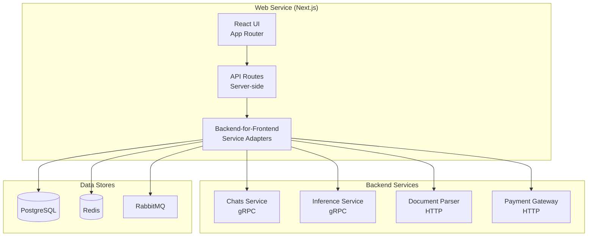
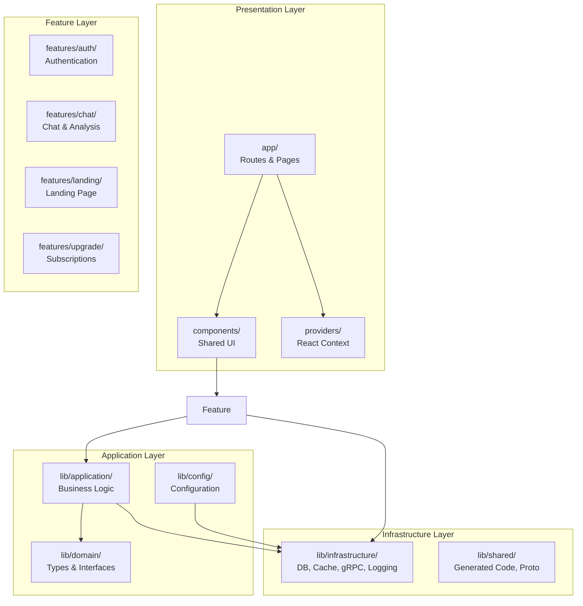
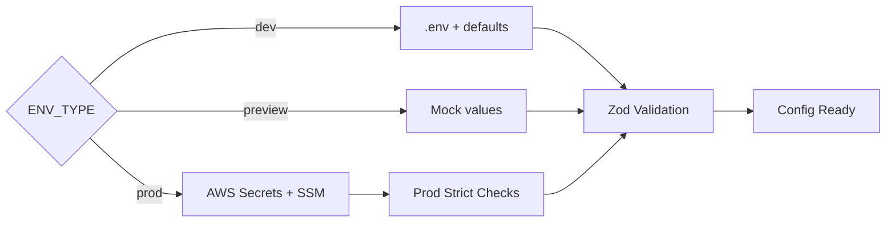
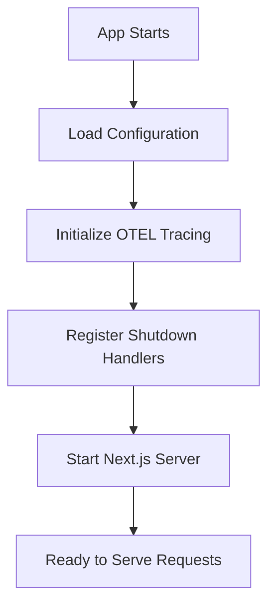

# Architecture

This document explains how the Web service is structured and why it's designed this way.

## Overview

The Web service is a **Next.js 15 full-stack application** that serves as the user-facing frontend and the backend-for-frontend (BFF). It handles UI rendering, API orchestration, authentication, and connects to all backend microservices.



**Why this design?**
- **Single deployment** — One app serves both UI and API, simplifying operations
- **Server-side rendering** — Next.js renders pages on the server for fast initial loads
- **BFF pattern** — Backend adapters translate between the frontend's needs and the microservices' protocols

## How the Code is Organized

The service uses a **feature-based architecture** where related code (components, hooks, services, tests) lives together under `features/`. Shared infrastructure lives in `lib/`.



**Why feature-based?**
- Easy to find related code (all chat logic is in `features/chat/`)
- Clear boundaries between features
- Tests live next to the code they test

## Project Structure

```
apps/web/
├── app/                          # Next.js App Router
│   ├── (auth)/                   # Authentication pages (login, signup)
│   ├── (landing)/                # Landing page
│   ├── (main)/                   # Main app layout (chat, profile)
│   ├── api/                      # API routes (server-side)
│   │   ├── auth/                 # NextAuth API routes
│   │   ├── chat/analyze/stream/  # Streaming AI analysis endpoint
│   │   ├── healthz/              # Liveness probe
│   │   ├── metrics/              # Prometheus metrics
│   │   ├── readyz/               # Readiness probe
│   │   └── services/             # Health proxies for backend services
│   ├── upgrade/                  # Subscription upgrade page
│   └── layout.tsx                # Root layout (providers, theme)
│
├── features/                     # Domain-driven feature modules
│   ├── auth/                     # Authentication (actions, components, hooks, services)
│   ├── chat/                     # Chat & AI analysis (components, hooks, services, stores)
│   ├── landing/                  # Landing page
│   ├── preview/                  # Preview mode (mock data)
│   ├── profile/                  # User profile
│   ├── rate-limit/               # Rate limiting service
│   ├── tracing/                  # OpenTelemetry tracing
│   └── upgrade/                  # Subscription upgrade
│
├── lib/                          # Shared libraries
│   ├── application/              # Business logic (rate limiting, user service)
│   ├── config/                   # Configuration (env, auth, AWS, preview)
│   ├── core/                     # Core utilities (fonts, serialization)
│   ├── domain/                   # Domain types and interfaces
│   ├── infrastructure/           # External system connections
│   │   ├── grpc-client.ts        # gRPC client for inference service
│   │   ├── grpc-loader.ts        # Proto file loader
│   │   ├── logger.ts             # Pino logger with trace context
│   │   ├── metrics.ts            # Prometheus metrics
│   │   ├── prisma.ts             # Prisma ORM client
│   │   ├── redis.ts              # Redis client (ioredis)
│   │   ├── service-health.ts     # gRPC health check probe
│   │   ├── shutdown.ts           # Graceful shutdown handlers
│   │   └── tracing.ts            # OpenTelemetry setup
│   ├── services/                 # Cache and lock services
│   ├── shared/                   # Generated code, proto definitions
│   └── utils/                    # General utilities
│
├── components/                   # Shared UI components (Shadcn)
├── providers/                    # React context providers
├── test/                         # Test utilities, mocks, MSW handlers
├── e2e/                          # Playwright E2E tests
└── docs/                         # This documentation
```

## Key Design Patterns

### Feature Modules

Each feature module follows a consistent structure:

```
features/chat/
├── actions/              # Server actions (form submissions)
├── components/           # React components
├── constants.ts          # Feature-specific constants
├── hooks/                # React hooks
├── services/             # Backend service adapters
│   ├── chat-service.interface.ts  # Interface definition
│   ├── grpc-chat-service.ts       # gRPC implementation
│   ├── inference-service.ts       # Inference client
│   └── mock-chat-service.ts       # Test mock
├── stores/               # Zustand state stores
├── types.ts              # Feature-specific types
├── utils/                # Utility functions
└── __tests__/            # Unit and integration tests
```

**Why this structure?**
- Everything related to "chat" is in one place
- Easy to test (mock services live alongside real ones)
- Clear interface boundaries (`IChatService`)

### Domain Types

Domain types are defined in `lib/domain/` and represent the core business concepts:

```typescript
// lib/domain/chat.ts
interface Message {
  id: string
  role: "user" | "assistant"
  content: string
  analysis?: AnalysisResult
  createdAt: Date
}

interface AnalysisResult {
  model: "spark" | "flare"
  label: "AI" | "Human"
  confidence: number
  scores: { ai: number; human: number }
  highlights: AnalysisHighlightSpan[]
}

interface ChatSession {
  id: string
  title: string
  messages: Message[]
  updatedAt: Date
}
```

**Why separate domain types?**
- Frontend and backend share the same type definitions
- Clear contract between components
- Easy to validate data matches expected shapes

### Configuration System

Configuration uses a three-mode system (`ENV_TYPE`):



See [Configuration](../getting-started/configuration.md) for details.

### Infrastructure Adapters

External systems are accessed through adapter modules in `lib/infrastructure/`:

| Adapter | Purpose | Library |
|---------|---------|---------|
| `prisma.ts` | PostgreSQL ORM | Prisma Client |
| `redis.ts` | Redis operations | ioredis |
| `grpc-client.ts` | gRPC to inference service | @grpc/grpc-js |
| `grpc-loader.ts` | Proto file loading | @grpc/proto-loader |
| `analytics-publisher.ts` | RabbitMQ message publishing | amqplib |
| `logger.ts` | Structured logging | pino |
| `metrics.ts` | Prometheus metrics | prom-client |
| `tracing.ts` | Distributed tracing | OpenTelemetry |
| `service-health.ts` | gRPC health probes | @grpc/grpc-js |

**Why adapters?**
- Easy to swap implementations (e.g., mock Redis in tests)
- Clear dependency boundaries
- Infrastructure concerns don't leak into business logic

## How the Service Starts

When the Next.js app starts, it:

1. **Loads configuration** — Resolves `ENV_TYPE` and validates all env vars
2. **Initializes tracing** — Sets up OpenTelemetry (if `OTEL_EXPORTER_OTLP_ENDPOINT` is set)
3. **Registers shutdown handlers** — Graceful cleanup for SIGTERM/SIGINT
4. **Starts the Next.js server** — Serves UI and API routes



## Why This Design?

| Benefit | Explanation |
|---------|-------------|
| **Single deployment** | One app serves UI and API, simplifying ops |
| **Feature isolation** | Each feature is self-contained with its own components, hooks, and services |
| **Type safety** | Shared domain types ensure consistency across frontend and backend |
| **Testability** | Mock services live alongside real ones; tests run in isolation |
| **Flexibility** | Can swap backend services without changing UI code |
| **Observability** | Built-in metrics, logging, and tracing from the start |

## Next Steps

- [Request Flows](request-flows.md) - See how requests are processed
- [Configuration](../getting-started/configuration.md) - Learn about settings
- [Backend Services](../components/services.md) - How the service connects to backends
