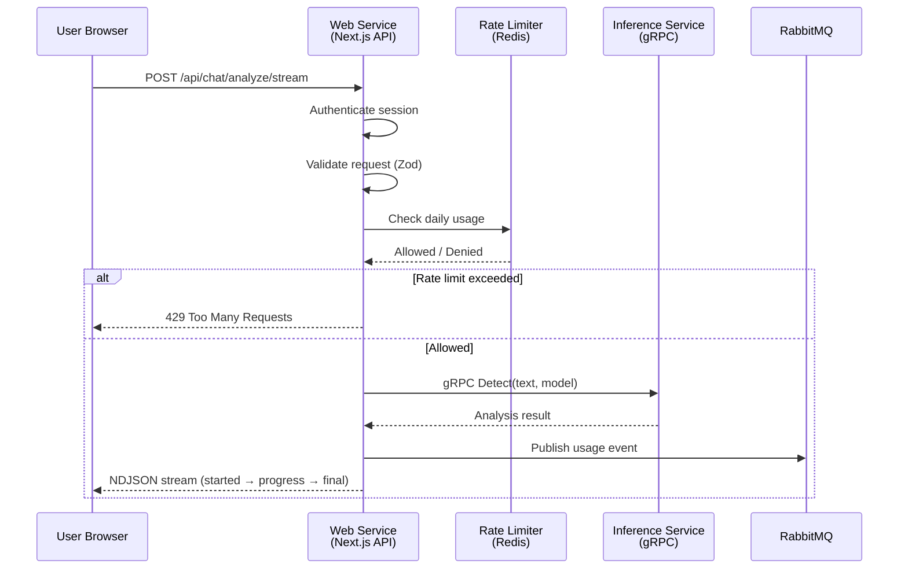
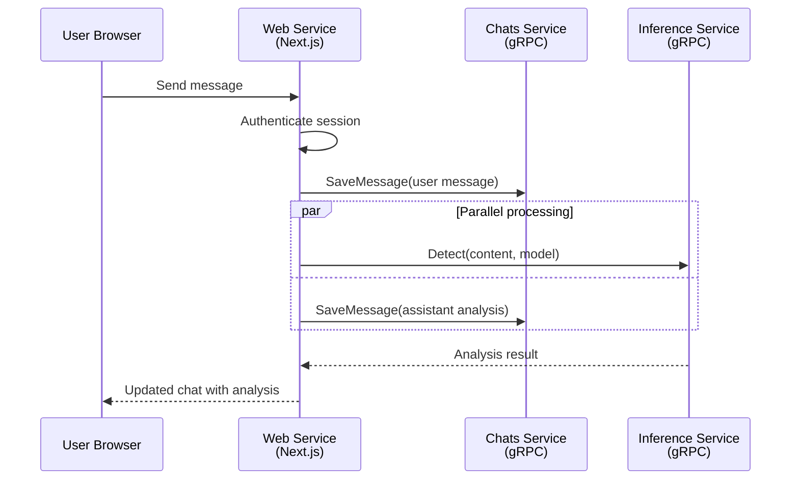
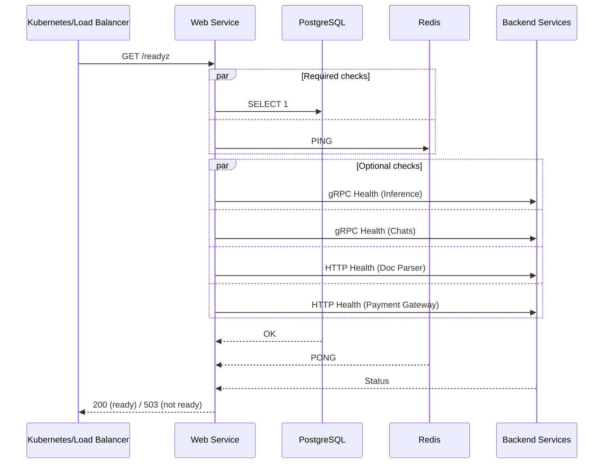
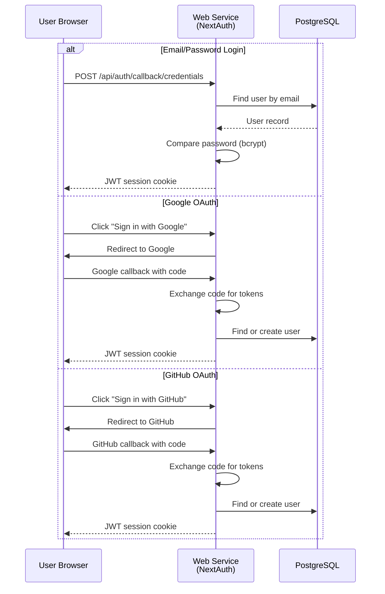
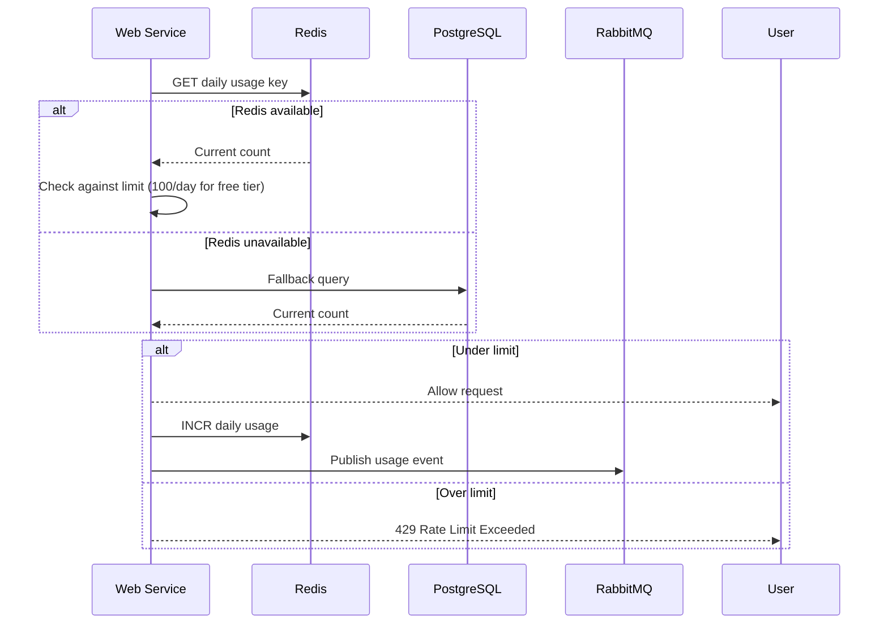

# Request Flows

This document explains how user requests are processed by the Web service. We'll look at each main operation and see what happens step by step.

## AI Text Analysis (Streaming)

When a user submits text for AI detection, the request flows through a streaming pipeline:

**What happens:**
1. User clicks "Analyze" with text content
2. Browser sends POST request to `/api/chat/analyze/stream`
3. API route authenticates the session (NextAuth JWT)
4. Request body is validated with Zod schema
5. Rate limiter checks daily usage against Redis
6. If allowed, the inference service is called via gRPC
7. Analysis result is streamed back as NDJSON chunks
8. Usage event is published to RabbitMQ for billing

**Why streaming?**
- User sees progress immediately (started → progress → final events)
- Large documents can take time; streaming keeps the user informed
- NDJSON format allows chunked transfer encoding

## Chat Message Flow

When a user sends a message in a chat conversation:

**What happens:**
1. User types a message and clicks send
2. Web service authenticates the user
3. User message is saved to the Chats service via gRPC
4. In parallel, the inference service analyzes the text
5. Analysis result is saved as an assistant message
6. Updated chat is returned to the user

## Health Check Flow

When Kubernetes or a load balancer checks if the service is ready:

**What happens:**
1. Kubernetes calls `/readyz` every few seconds
2. Web service runs all checks in parallel
3. **Required checks**: PostgreSQL and Redis must be healthy
4. **Optional checks**: Backend services (inference, chats, doc parser, payments)
5. If required checks pass → 200 OK (ready)
6. If optional checks fail → 200 OK with `degraded` status
7. If required checks fail → 503 Not Ready

**Why two types of checks?**
- Required checks ensure the app can serve basic requests
- Optional checks indicate degraded functionality (can still serve UI)
- Prevents one failing backend from blocking all deployments

## Authentication Flow

When a user signs up or logs in:

**What happens:**
1. User enters credentials or clicks OAuth button
2. NextAuth handles the authentication flow
3. For credentials: password is compared with bcrypt
4. For OAuth: code is exchanged for tokens, user is found/created
5. JWT session cookie is set (1 hour expiry)
6. User is redirected to the app

## Rate Limiting Flow

When a user makes an analysis request:

**What happens:**
1. Rate limiter reads daily usage from Redis
2. If Redis is unavailable, falls back to PostgreSQL
3. Compares usage against tier limit (100/day for free users)
4. If under limit: allows request, increments counter, publishes event
5. If over limit: returns 429 error

**Why Redis + PostgreSQL fallback?**
- Redis is fast for real-time counting
- PostgreSQL ensures usage is persisted for billing
- Fallback ensures rate limiting works even if Redis is down

## Summary

| Operation | How It Works | Speed |
|-----------|--------------|-------|
| AI Analysis | gRPC to inference service, streamed back | Fast (streaming) |
| Chat Message | gRPC to chats service + inference | Fast (parallel) |
| Health Check | Parallel probes to all dependencies | Fast (cached) |
| Authentication | NextAuth with JWT/cookies | Fast (in-memory) |
| Rate Limiting | Redis counter with DB fallback | Fast (Redis) / Medium (DB) |

## Next Steps

- [API Routes](../components/api-routes.md) - Complete API reference
- [Backend Services](../components/services.md) - How services connect
- [Health Checks](../operations/health.md) - Health probe details
