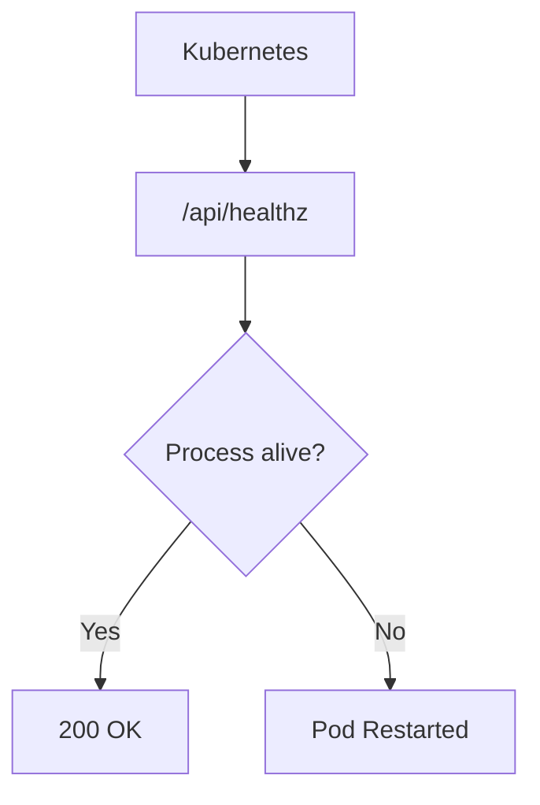
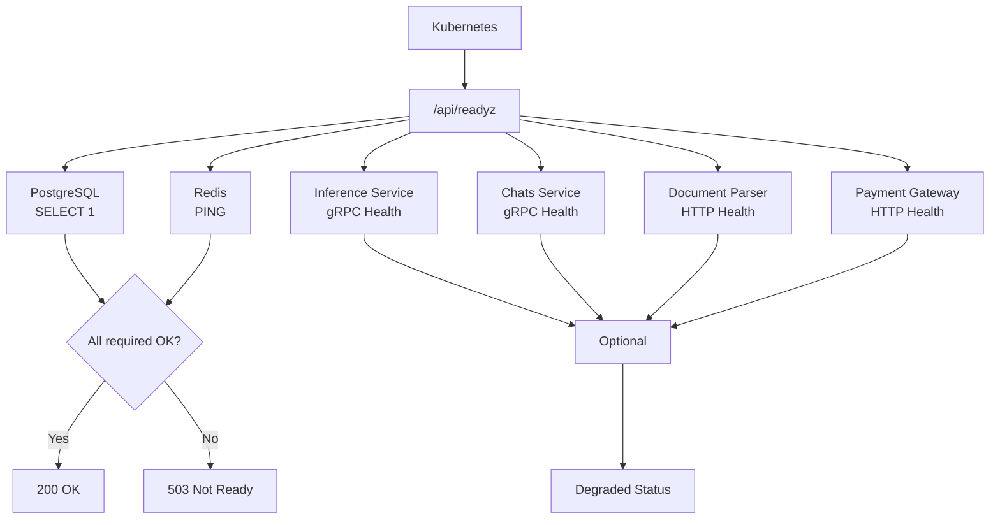

# Health Checks

This document explains how the Web service monitors its own health and how you can check if it's working properly.

## Why Health Checks Matter

Health checks help you know:
- Is the service running?
- Can it connect to its databases?
- Is it ready to handle requests?
- Are backend services available?

This is important for:
- **Kubernetes** — Decides when to restart pods and route traffic
- **Load balancing** — Route traffic only to healthy instances
- **Debugging** — Quickly identify what's broken

## How Health Checks Work

The service has two types of health checks:

### 1. Liveness Probe — `/api/healthz`

**What it does:** Always returns 200 if the process is alive. Used by Kubernetes to know if the pod should be restarted.



**What it checks:** Nothing — just confirms the process is running.

**Why it's simple:** If the process is stuck (deadlock, infinite loop), Kubernetes will restart it. This probe should never fail unless the process is truly dead.

**Response:**

```json
{
  "status": "ok"
}
```

### 2. Readiness Probe — `/api/readyz`

**What it does:** Checks if the service can handle requests by testing all dependencies.



**Required checks** (must pass for 200 OK):

| Check | Protocol | Timeout | What It Tests |
|-------|----------|---------|---------------|
| PostgreSQL | SQL (`SELECT 1`) | 8s | Database connectivity |
| Redis | `PING` | 8s | Cache connectivity |

**Optional checks** (degraded mode if they fail):

| Check | Protocol | Timeout | What It Tests |
|-------|----------|---------|---------------|
| Inference Service | gRPC health | 8s | AI analysis availability |
| Chats Service | gRPC health | 8s | Chat storage availability |
| Document Parser | HTTP `/health` | 8s | File extraction availability |
| Payment Gateway | HTTP `/readyz` | 8s | Payment processing availability |

**Response (all healthy):**

```json
{
  "status": "ready",
  "checks": {
    "postgres": { "status": "ok", "latencyMs": 12 },
    "redis": { "status": "ok", "latencyMs": 3 },
    "documentParser": { "status": "ok", "latencyMs": 45 },
    "paymentGateway": { "status": "ok", "latencyMs": 30 },
    "analysis": {
      "status": "ok",
      "checks": {
        "inference": { "status": "ok", "latencyMs": 8 },
        "chatService": { "status": "ok", "latencyMs": 6 }
      }
    }
  }
}
```

**Response (degraded — optional service down):**

```json
{
  "status": "degraded",
  "checks": {
    "postgres": { "status": "ok", "latencyMs": 12 },
    "redis": { "status": "ok", "latencyMs": 3 },
    "documentParser": { "status": "error", "error": "health 503" },
    "paymentGateway": { "status": "ok", "latencyMs": 30 },
    "analysis": { "status": "ok", "checks": { ... } }
  }
}
```

**Response (not ready — required service down):**

```json
{
  "status": "not_ready",
  "checks": {
    "postgres": { "status": "error", "error": "connection refused" },
    "redis": { "status": "ok", "latencyMs": 3 }
  }
}
```

**HTTP status codes:**

| Status | Meaning |
|--------|---------|
| `200` | Ready (required checks pass) |
| `503` | Not ready (required checks fail) |

## Why Two Types of Checks?

| Probe | Purpose | Failure Action |
|-------|---------|----------------|
| Liveness | Detect stuck processes | Kubernetes restarts the pod |
| Readiness | Detect unavailable services | Kubernetes removes pod from load balancer |

**Why required vs optional?**
- Required checks ensure the app can serve basic requests
- Optional checks indicate degraded functionality (can still serve UI)
- Prevents one failing backend from blocking all deployments

## Caching

Results are cached for 10 seconds to avoid overwhelming dependencies with every probe:

```typescript
const PG_REDIS_TTL_MS = 10_000  // 10 seconds
```

This means:
- First probe after cache expires: runs all checks
- Subsequent probes within 10 seconds: returns cached results
- Balance between freshness and performance

## Preview Mode

In preview mode (`ENV_TYPE=preview`), all checks are skipped:

```json
{
  "status": "ready",
  "mode": "preview",
  "checks": {
    "postgres": { "status": "skipped" },
    "redis": { "status": "skipped" },
    "documentParser": { "status": "skipped" },
    "paymentGateway": { "status": "skipped" },
    "analysis": { "status": "skipped" }
  }
}
```

**Why skip in preview?** No real databases or services are running.

## Kubernetes Configuration

### Liveness Probe

```yaml
livenessProbe:
  httpGet:
    path: /api/healthz
    port: 3000
  initialDelaySeconds: 10
  periodSeconds: 30
  timeoutSeconds: 5
  failureThreshold: 3
```

### Readiness Probe

```yaml
readinessProbe:
  httpGet:
    path: /api/readyz
    port: 3000
  initialDelaySeconds: 15
  periodSeconds: 10
  timeoutSeconds: 10
  failureThreshold: 3
```

## Monitoring Health

### What to Monitor

| Metric | Warning | Critical |
|--------|---------|----------|
| Service up | Down > 1 min | Down > 2 min |
| PostgreSQL latency | > 1s | > 5s |
| Redis latency | > 100ms | > 1s |
| Backend services | 1 degraded | All degraded |

### Health Check Commands

```bash
# Check liveness
curl http://localhost:3000/api/healthz

# Check readiness
curl http://localhost:3000/api/readyz

# Check with pretty JSON
curl -s http://localhost:3000/api/readyz | jq .

# Check specific dependency
curl -s http://localhost:3000/api/readyz | jq .checks.postgres
```

## Troubleshooting

**Service reports `not_ready`?**
- Check if PostgreSQL is running
- Check if Redis is running
- Verify network connectivity
- Look at service logs for connection errors

**Service reports `degraded`?**
- Check which optional service is failing
- Verify backend services are deployed
- Check network connectivity to backends
- Review backend service logs

**Health check timeout?**
- Check database performance
- Verify no network issues
- Look at service logs
- Increase timeout if needed (currently 8s per check, 20s total)

**Probe causing high load?**
- Results are cached for 10 seconds
- Each check has its own 8s timeout
- Total suite has 20s timeout
- Consider adjusting probe intervals

## Related Documentation

- [Configuration](../getting-started/configuration.md) - Health check settings
- [Observability](observability.md) - Metrics and alerts
- [Architecture](../concepts/architecture.md) - How components connect
