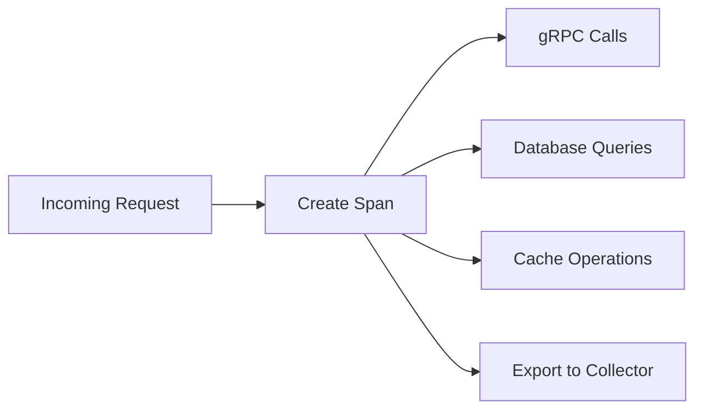

# Observability

This document explains how to monitor the Web service and understand its behavior through logs, metrics, and traces.

## What is Observability?

Observability means being able to understand what's happening inside a system by looking at its outputs. For the Web service, this includes:

- **Logs** — Written records of what happened
- **Metrics** — Numbers that measure performance
- **Traces** — Requests flowing through the system

## Logs

Logs are written to standard output in JSON format using **Pino** (a fast JSON logger). In development, they're pretty-printed with colors.

### What Gets Logged

| Component | What It Logs |
|-----------|--------------|
| API Routes | Request handling, errors |
| Auth | Login attempts, session creation |
| Services | gRPC calls, HTTP requests |
| Infrastructure | Database queries, cache operations |
| Rate Limiting | Usage checks, limit hits |
| Analytics | Event publishing, failures |

### Example Log Entry

```json
{
  "level": "info",
  "msg": "AI analysis completed",
  "model": "spark",
  "userId": "user123",
  "duration": 1250,
  "traceId": "abc123...",
  "spanId": "def456...",
  "env": "production"
}
```

### Log Levels

| Level | When to Use |
|-------|-------------|
| `debug` | Detailed information for debugging |
| `info` | Normal operations |
| `warn` | Something unexpected but not critical |
| `error` | Something failed |

### Configuration

```bash
LOG_LEVEL=info   # debug, info, warn, error
```

### Trace Context Injection

When OpenTelemetry tracing is active, every log entry includes `traceId` and `spanId`:

```typescript
// lib/infrastructure/logger.ts
mixin() {
  return withTraceContext()  // Adds traceId and spanId
}
```

This allows you to correlate logs with traces for debugging.

### Sensitive Data Redaction

The logger automatically redacts sensitive fields:

```typescript
redact: ["password", "token", "secret", "cookie", "authorization"]
```

## Metrics

Metrics are exposed at `/api/metrics` in Prometheus format. They're collected using **prom-client**.

### Key Metrics

#### HTTP Requests

| Metric | What It Tells You |
|--------|-------------------|
| `http_request_duration_seconds` | How long HTTP requests take |
| Labels: `method`, `route`, `status_code` | Request details |

**Buckets:** 0.1s, 0.3s, 0.5s, 0.7s, 1s, 3s, 5s, 10s

#### Database

| Metric | What It Tells You |
|--------|-------------------|
| `db_query_duration_seconds` | How long database queries take |
| Labels: `model`, `operation`, `status` | Query details |

**Buckets:** 0.01s, 0.05s, 0.1s, 0.5s, 1s, 2s

#### Cache

| Metric | What It Tells You |
|--------|-------------------|
| `cache_operations_total` | Total cache operations |
| Labels: `operation`, `status` | Operation type and result |

#### AI Inference

| Metric | What It Tells You |
|--------|-------------------|
| `ai_inference_duration_seconds` | How long AI analysis takes |
| Labels: `model`, `status` | Model used and result |

**Buckets:** 0.5s, 1s, 2s, 5s, 10s, 20s

#### Rate Limiting

| Metric | What It Tells You |
|--------|-------------------|
| `rate_limit_hits_total` | Total rate limit hits |
| Labels: `tier` | User tier (free, premium) |

#### Analytics Publishing

| Metric | What It Tells You |
|--------|-------------------|
| `analytics_publish_failures_total` | Failed analytics publishes |
| Labels: `stage` | Failure stage (connect, publish, dropped) |

#### Usage Tracking

| Metric | What It Tells You |
|--------|-------------------|
| `usage_redis_errors_total` | Redis errors during usage tracking |
| Labels: `operation` | Operation type (get, incr, corrupt_value) |
| `usage_sync_fallback_total` | Fallback to direct DB writes |
| Labels: `reason` | Fallback reason (redis_and_queue_down, queue_down) |

#### Default Metrics

`prom-client` automatically collects:
- `process_cpu_seconds_total` — CPU usage
- `process_resident_memory_bytes` — Memory usage
- `nodejs_heap_size_total_bytes` — Heap size
- `nodejs_heap_size_used_bytes` — Heap used
- And more...

### Viewing Metrics

```bash
# View all metrics
curl http://localhost:3000/api/metrics

# With authentication
curl -H "Authorization: Bearer your-token" http://localhost:3000/api/metrics

# Pretty print
curl -s http://localhost:3000/api/metrics | grep http_request_duration
```

### Metric Examples

**Request duration histogram:**

```
http_request_duration_seconds_bucket{method="POST",route="/api/chat/analyze/stream",status_code="200",le="0.5"} 12
http_request_duration_seconds_bucket{method="POST",route="/api/chat/analyze/stream",status_code="200",le="1"} 45
http_request_duration_seconds_bucket{method="POST",route="/api/chat/analyze/stream",status_code="200",le="3"} 78
```

**Rate limit hits counter:**

```
rate_limit_hits_total{tier="free"} 156
```

## Distributed Tracing

Traces are exported to an OpenTelemetry collector when configured.

### Configuration

```bash
OTEL_EXPORTER_OTLP_ENDPOINT=https://otel-collector:4318   # Empty disables tracing
OTEL_SERVICE_NAME=web                                       # Service name in traces
```

### How It Works



### Automatic Instrumentation

The service uses `@opentelemetry/auto-instrumentations-node` which automatically instruments:
- HTTP requests
- Database queries
- gRPC calls
- And more...

**Disabled instrumentations:**
- `@opentelemetry/instrumentation-fs` — File system (noisy)
- `@opentelemetry/instrumentation-dns` — DNS (low value)
- `@opentelemetry/instrumentation-net` — Network (low value)

### Trace Context Propagation

When making outgoing requests, the trace context is automatically propagated:

```typescript
// gRPC metadata includes trace context
const metadata = getGrpcMetadata()  // Includes traceparent header
```

## Dashboards

### Recommended Grafana Panels

| Panel | Metric | Purpose |
|-------|--------|---------|
| Request Rate | `rate(http_request_duration_seconds_count[5m])` | Requests per second |
| Request Latency | `histogram_quantile(0.95, ...)` | 95th percentile latency |
| Error Rate | `rate(http_request_duration_seconds_count{status_code=~"5.."}[5m])` | Server errors |
| AI Inference Duration | `histogram_quantile(0.95, ai_inference_duration_seconds)` | AI analysis speed |
| Rate Limit Hits | `rate(rate_limit_hits_total[5m])` | Users hitting limits |
| Cache Hit Rate | `rate(cache_operations_total{status="hit"}[5m])` | Cache effectiveness |

## Alerts

### Built-in Alerts

| Alert | Condition | What It Means |
|-------|-----------|---------------|
| **High error rate** | > 5% errors for 5 minutes | Something is broken |
| **High latency** | P95 > 3s for 10 minutes | Performance issue |
| **Rate limit surge** | > 100 hits/minute | Possible abuse |
| **Analytics failures** | > 10 dropped/minute | Queue issue |

### Alert Rules (Prometheus)

```yaml
groups:
  - name: web-service
    rules:
      - alert: WebHighErrorRate
        expr: rate(http_request_duration_seconds_count{status_code=~"5.."}[5m]) / rate(http_request_duration_seconds_count[5m]) > 0.05
        for: 5m
        labels:
          severity: warning
        annotations:
          summary: "High error rate in web service"

      - alert: WebHighLatency
        expr: histogram_quantile(0.95, rate(http_request_duration_seconds_bucket[5m])) > 3
        for: 10m
        labels:
          severity: warning
        annotations:
          summary: "High latency in web service"
```

## Monitoring Checklist

### Daily

- [ ] Check service health status (`/api/readyz`)
- [ ] Review error logs for anomalies
- [ ] Monitor request rate and latency

### Weekly

- [ ] Review performance trends
- [ ] Check rate limit hits for abuse patterns
- [ ] Validate alert thresholds

### Monthly

- [ ] Review capacity and scaling needs
- [ ] Update alert thresholds if needed
- [ ] Review and clean up old logs

## Troubleshooting with Observability

### Slow Response Times

1. Check `http_request_duration_seconds` — Are requests taking too long?
2. Check `db_query_duration_seconds` — Database issues?
3. Check `ai_inference_duration_seconds` — AI service slow?
4. Check `cache_operations_total` — Cache not working?

### Rate Limiting Issues

1. Check `rate_limit_hits_total` — How many users are hitting limits?
2. Check `usage_redis_errors_total` — Redis issues?
3. Check `usage_sync_fallback_total` — Fallback to DB?

### Analytics Not Working

1. Check `analytics_publish_failures_total` — Which stage is failing?
2. Check RabbitMQ connectivity
3. Look at logs for "Analytics publish failed"

### High Memory Usage

1. Check `nodejs_heap_size_used_bytes` — Memory growing?
2. Check for memory leaks in logs
3. Consider increasing container memory limits

## Related Documentation

- [Health](health.md) - Health check details
- [Configuration](../getting-started/configuration.md) - Monitoring settings
- [Infrastructure](../components/infrastructure.md) - Component details
