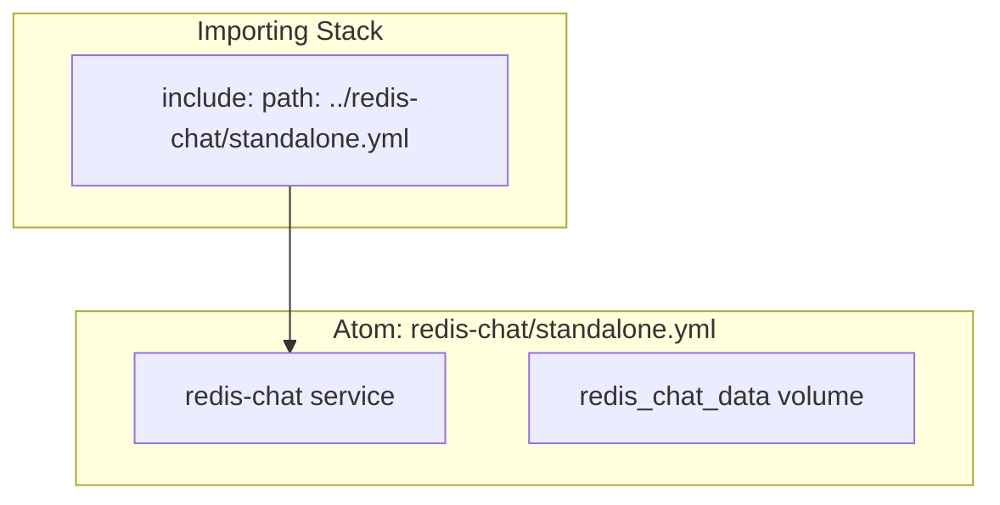

# Standalone Atoms

This document explains the "standalone atom" pattern used to define reusable datastore components in Docker Compose.

## What is an Atom?

An atom is a self-contained Docker Compose file that defines a single datastore. Atoms are designed to be imported by other compose files using the `include:` directive.



## Why Atoms?

| Problem | Solution |
|---------|----------|
| Duplicated datastore definitions | Single definition per atom |
| Port conflicts between stacks | Variable-based port assignments |
| Hard to test datastores | Run atoms independently |
| Inconsistent configs | Shared atom = consistent config |

## Available Atoms

| Atom | File | Purpose |
|------|------|---------|
| PostgreSQL | `postgres-users/standalone.yml` | User data |
| Redis Users | `redis-users/standalone.yml` | User cache + rate limit |
| Redis Chat | `redis-chat/standalone.yml` | Chat cache + streams |
| Redis Events | `redis-events/standalone.yml` | Payment dedup |
| MongoDB | `mongo-chat/standalone.yml` | Chat messages |
| RabbitMQ | `rabbitmq/standalone.yml` | Message queue |
| RabbitMQ UI | `rabbitmq/management.yml` | Management overlay |

## Atom Anatomy

Every atom follows this structure:

```yaml
# 1. YAML anchor for reuse
x-redis-chat: &redis-chat
  image: redis:7-alpine
  restart: unless-stopped
  command: redis-server --appendonly yes --requirepass ${REDIS_CHAT_PASSWORD}
  healthcheck:
    test: ["CMD", "redis-cli", "-a", "${REDIS_CHAT_PASSWORD}", "ping"]
    interval: 5s
    timeout: 3s
    retries: 10

# 2. Service definition
services:
  redis-chat:
    <<: *redis-chat
    ports:
      - "${REDIS_CHAT_PORT:-6381}:6379"
    volumes:
      - redis_chat_data:/data

# 3. Persistent volume
volumes:
  redis_chat_data:
```

### Key Design Decisions

1. **No `container_name`**: Allows multiple projects to use the same atom
2. **No `networks`**: Uses the default network of the importing stack
3. **Variable-based ports**: Avoids conflicts when multiple atoms run together
4. **Health checks**: Enables `depends_on: condition: service_healthy`
5. **YAML anchors**: Makes the service definition reusable within the file

## Importing Atoms

### Using `include:` (Recommended)

```yaml
# local/compose.yml
include:
  - path: ../postgres-users/standalone.yml
  - path: ../redis-users/standalone.yml
  - path: ../redis-chat/standalone.yml
```

The `include:` directive merges the atom's services, volumes, and networks into the importing stack.

### Using `-f` Flag (Alternative)

```bash
docker compose -f local/compose.yml -f ../redis-chat/standalone.yml up -d
```

### Overriding Atom Configuration

When importing, you can override variables:

```yaml
# local/compose.yml
include:
  - path: ../redis-chat/standalone.yml

services:
  redis-chat:
    ports:
      - "6381:6379"  # Override default port
```

Or via environment variables in `.env`:

```bash
# local/.env
REDIS_CHAT_PORT=6381
```

## Running Atoms Independently

You can run any atom standalone for testing:

```bash
# Run just PostgreSQL
docker compose -f infra/docker/postgres-users/standalone.yml up -d

# Run just Redis Chat
docker compose -f infra/docker/redis-chat/standalone.yml up -d

# Run just MongoDB
docker compose -f infra/docker/mongo-chat/standalone.yml up -d
```

## Atom Reference

### PostgreSQL Users

```yaml
# postgres-users/standalone.yml
Services: postgres-users
Port: ${POSTGRES_PORT:-5432}
Volume: postgres_users_data
Image: postgres:16-alpine
Health: pg_isready
```

**Environment variables:**
- `POSTGRES_USER` - Database username
- `POSTGRES_PASSWORD` - Database password
- `POSTGRES_DB` - Database name
- `POSTGRES_PORT` - Host port (default: 5432)

### Redis Users

```yaml
# redis-users/standalone.yml
Services: redis-users
Port: ${REDIS_PORT:-6379}
Volume: redis_users_data
Image: redis:7-alpine
Health: redis-cli ping
Config: --appendonly yes --maxmemory-policy volatile-ttl
```

**Environment variables:**
- `REDIS_PASSWORD` - Redis password
- `REDIS_PORT` - Host port (default: 6379)

### Redis Chat

```yaml
# redis-chat/standalone.yml
Services: redis-chat
Port: ${REDIS_CHAT_PORT:-6381}
Volume: redis_chat_data
Image: redis:7-alpine
Health: redis-cli ping
Config: --appendonly yes
```

**Environment variables:**
- `REDIS_CHAT_PASSWORD` - Redis password (default: `test_redis_password`)
- `REDIS_CHAT_PORT` - Host port (default: 6381)

### Redis Events

```yaml
# redis-events/standalone.yml
Services: redis-events
Port: ${EVENT_REDIS_PORT:-6382}
Volume: redis_events_data
Image: redis:7-alpine
Health: redis-cli ping
Config: --appendonly yes --save "900 1 300 10" --maxmemory-policy noeviction
```

**Environment variables:**
- `EVENT_REDIS_PASSWORD` - Redis password
- `EVENT_REDIS_PORT` - Host port (default: 6382)

### MongoDB Chat

```yaml
# mongo-chat/standalone.yml
Services: mongo-chat
Port: ${MONGO_CHAT_PORT:-27018}
Volume: mongo_chat_data
Image: mongo:6.0
Health: mongosh --eval db.adminCommand('ping')
```

**Environment variables:**
- `MONGO_CHAT_PORT` - Host port (default: 27018)

### RabbitMQ

```yaml
# rabbitmq/standalone.yml
Services: rabbitmq
Port: ${RABBITMQ_PORT:-5672}
Volume: rabbitmq_data
Image: rabbitmq:3-management-alpine
Health: rabbitmq-diagnostics -q ping
```

**Environment variables:**
- `RABBITMQ_USER` - Username (default: `guest`)
- `RABBITMQ_PASS` - Password (default: `guest`)
- `RABBITMQ_PORT` - Host port (default: 5672)

### RabbitMQ Management (Overlay)

```yaml
# rabbitmq/management.yml
Services: rabbitmq (adds port)
Port: ${RABBITMQ_UI_PORT:-15672}
```

This is an overlay that adds the management UI port to an existing RabbitMQ instance.

## Creating a New Atom

To create a new atom:

1. Create a directory under `infra/docker/<name>/`
2. Create `standalone.yml` following the pattern
3. Create `.env.example` with default values
4. Add health checks
5. Use variable-based ports

```yaml
# Example: my-service/standalone.yml
x-my-service: &my-service
  image: my-image:latest
  restart: unless-stopped
  environment:
    - MY_VAR=${MY_VAR}
  healthcheck:
    test: ["CMD", "curl", "-f", "http://localhost:8080/health"]
    interval: 10s
    timeout: 5s
    retries: 3

services:
  my-service:
    <<: *my-service
    ports:
      - "${MY_SERVICE_PORT:-8080}:8080"
    volumes:
      - my_service_data:/data

volumes:
  my_service_data:
```

## Bundle: data/compose.yml

The `data/` directory contains a bundle that imports multiple atoms:

```yaml
# data/compose.yml
include:
  - path: ../postgres-users/standalone.yml
  - path: ../redis-users/standalone.yml
```

This provides a quick way to start the basic data layer.

## Next Steps

- [Docker Compose](../concepts/docker-compose.md) - How stacks use atoms
- [Datastores](datastores.md) - What each datastore does
- [Configuration](../getting-started/configuration.md) - All environment variables
