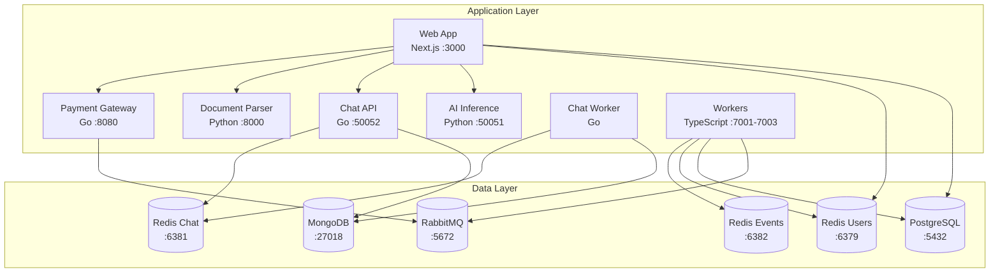
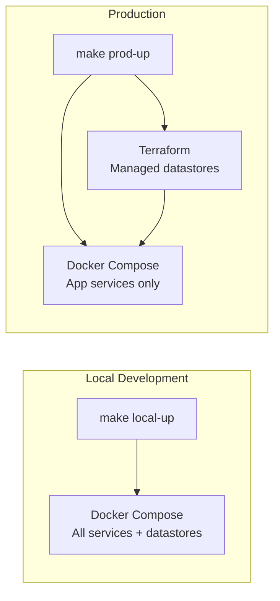
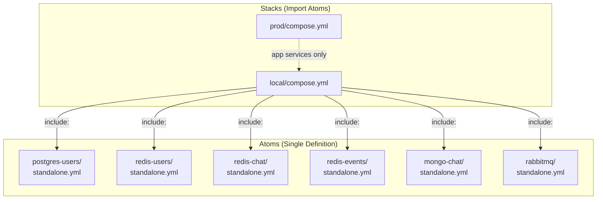
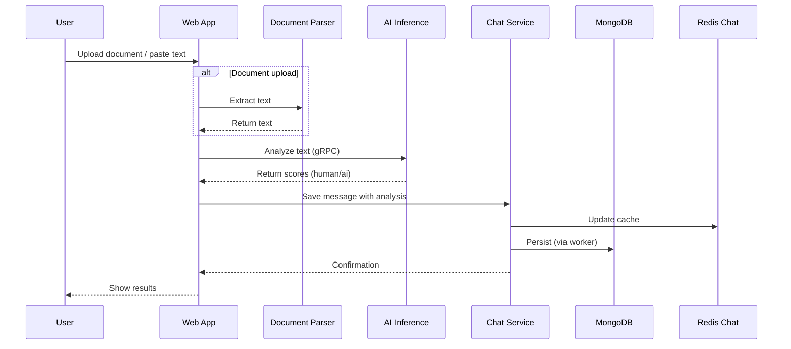
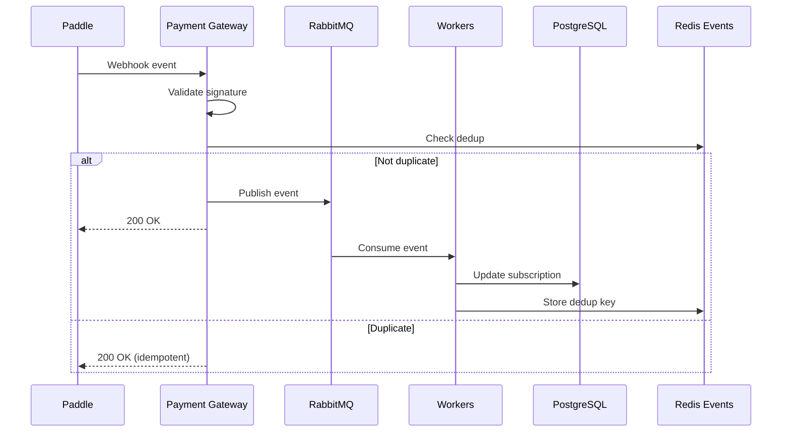
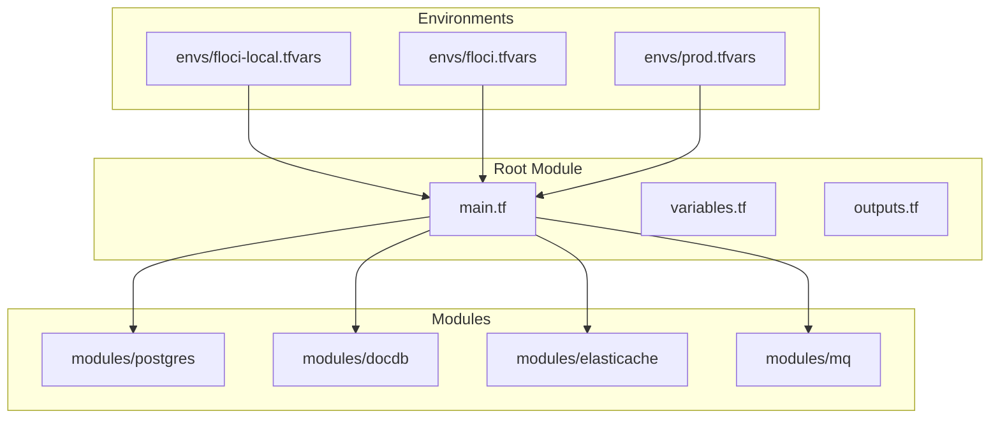
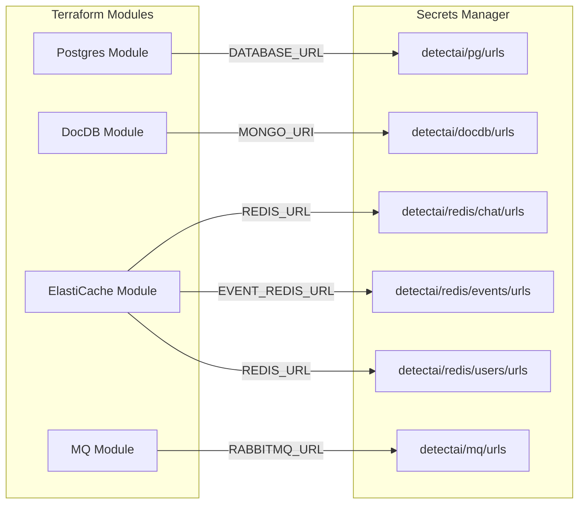

# Architecture

This document explains how the DetectAI infrastructure is structured and why it's designed this way.

## Overview

DetectAI is a microservices-based platform for AI text detection. The infrastructure consists of two main layers:

1. **Application Services** - The running code (web app, workers, inference, etc.)
2. **Datastores** - Where data lives (PostgreSQL, MongoDB, Redis, RabbitMQ)

## Two Deployment Modes

DetectAI supports two deployment modes with the same codebase:

| Mode | Command | Datastores | Use Case |
|------|---------|------------|----------|
| **Local** | `make local-up` | Docker containers | Daily development |
| **Production** | `make prod-up` | AWS (Terraform-managed) | Staging/production |

**Why two modes?**
- **Local**: Everything runs in Docker, zero AWS dependency, fast iteration
- **Production**: App services in Docker, datastores managed by Terraform on AWS

## The Compose Atom Pattern

Instead of one giant compose file, infrastructure is broken into reusable "atoms":

**Benefits:**
- Each datastore defined once (no duplication)
- Multiple stacks can share the same atom
- Easy to test individual datastores
- Consistent configuration across environments

## Data Flow

### User Text Detection Flow

### Payment Webhook Flow

## Terraform Structure

Terraform manages the stateful datastores on AWS:

### The Secret Contract

Terraform doesn't just create resources -- it composes connection URLs and stores them in AWS Secrets Manager:

Apps fetch these secrets at startup -- they never construct URLs themselves.

## Why This Design?

| Benefit | Explanation |
|---------|-------------|
| **Environment Parity** | Same code runs locally and in production |
| **Separation of Concerns** | Each service owns its data and logic |
| **Scalability** | Services can be scaled independently |
| **Testability** | Each component can be tested in isolation |
| **Maintainability** | Clear boundaries between components |
| **Cost Efficiency** | Local uses Docker, prod uses managed services |

## Service Responsibilities

| Service | Language | Port | Responsibility |
|---------|----------|------|----------------|
| **Web** | TypeScript | 3000 | User interface, auth, API routes |
| **Payment Gateway** | Go | 8080 | Paddle webhook validation, event publishing |
| **Document Parser** | Python | 8000 | Text extraction from PDF, DOCX, etc. |
| **AI Inference** | Python | 50051 | Text analysis, AI detection scoring |
| **Chat API** | Go | 50052 | Chat session management, message storage |
| **Chat Worker** | Go | - | Background message persistence |
| **Worker Analytics** | TypeScript | 7001 | Analytics event processing |
| **Worker Cron** | TypeScript | 7002 | Scheduled background tasks |
| **Worker Payments** | TypeScript | 7003 | Payment event processing |

## Next Steps

- [Docker Compose](docker-compose.md) - How compose stacks work
- [Terraform](terraform.md) - Infrastructure as code details
- [Datastores](../components/datastores.md) - What each datastore does
