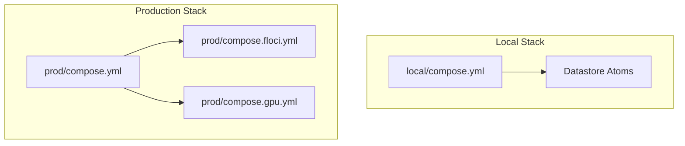
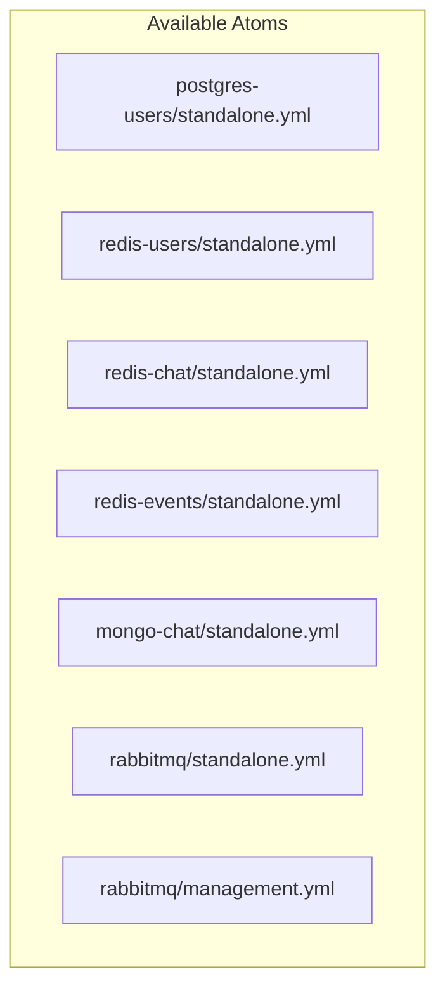
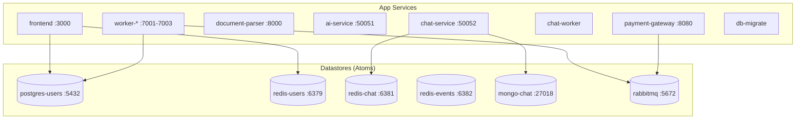
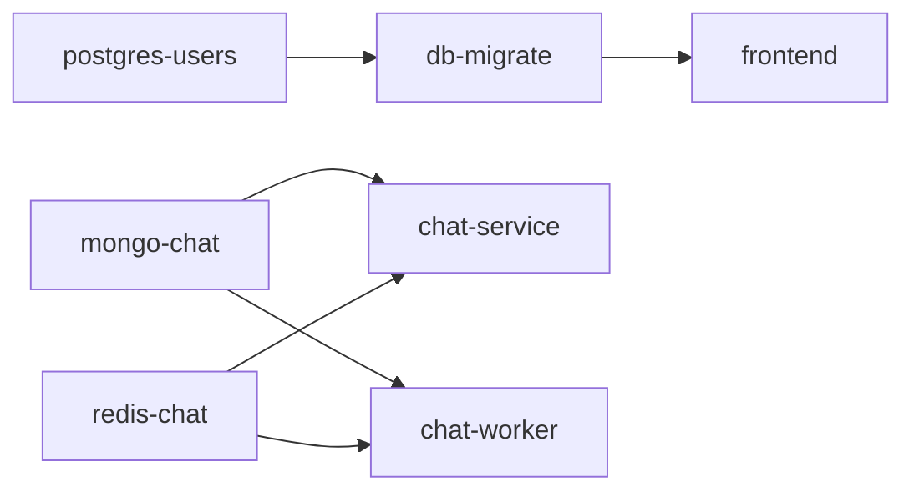
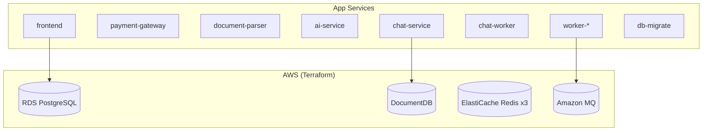
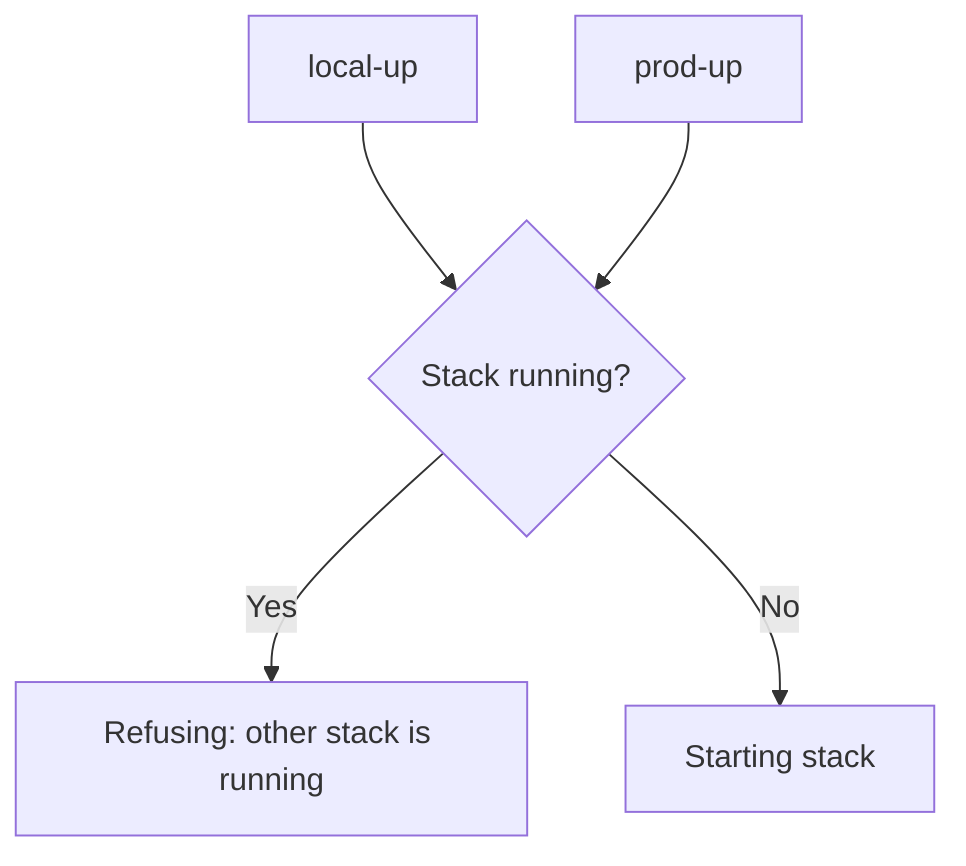

# Docker Compose

This document explains how Docker Compose is used to run DetectAI, including the atom pattern, overlays, and stack management.

## Overview

DetectAI uses Docker Compose to define and run services. There are two main stacks (local and production), built from reusable "atoms" (standalone datastore definitions).

## The Two Stacks



| Stack | Command | Datastores | Project Name |
|-------|---------|------------|--------------|
| Local | `make local-up` | Docker containers | `detectai-local` |
| Production | `make prod-up` | AWS (Terraform) | `detectai-prod` |

**Important**: Never run both stacks at the same time. The Makefile enforces this with guards.

## Standalone Atoms

Atoms are self-contained compose files that define a single datastore. They're designed to be imported by other stacks.



### How Atoms Work

Each atom follows the same pattern:

```yaml
# Example: redis-chat/standalone.yml
x-redis-chat: &redis-chat
  image: redis:7-alpine
  restart: unless-stopped
  command: redis-server --appendonly yes --requirepass ${REDIS_CHAT_PASSWORD}
  healthcheck:
    test: ["CMD", "redis-cli", "-a", "${REDIS_CHAT_PASSWORD}", "ping"]
    interval: 5s
    timeout: 3s
    retries: 10

services:
  redis-chat:
    <<: *redis-chat
    volumes:
      - redis_chat_data:/data

volumes:
  redis_chat_data:
```

**Key design choices:**
- Uses YAML anchors (`&redis-chat`) for reuse
- No `container_name` or `networks` -- lets multiple projects coexist
- Environment variables for all configurable values
- Health checks for service dependency management
- Persistent volumes for data

### Importing Atoms

Stacks import atoms using the `include:` directive:

```yaml
# local/compose.yml
include:
  - path: ../postgres-users/standalone.yml
  - path: ../redis-users/standalone.yml
  - path: ../redis-chat/standalone.yml
  - path: ../redis-events/standalone.yml
  - path: ../mongo-chat/standalone.yml
  - path: ../rabbitmq/standalone.yml
  - path: ../rabbitmq/management.yml
```

### Port Assignments

Atoms use variable-based port assignments to avoid conflicts:

| Atom | Default Port | Variable |
|------|--------------|----------|
| postgres-users | 5432 | `POSTGRES_PORT` |
| redis-users | 6379 | `REDIS_PORT` |
| redis-chat | 6381 | `REDIS_CHAT_PORT` |
| redis-events | 6381 | `EVENT_REDIS_PORT` |
| mongo-chat | 27018 | `MONGO_CHAT_PORT` |
| rabbitmq | 5672 | `RABBITMQ_PORT` |

## Local Stack

The local stack includes everything: app services + all datastores.



### Starting the Local Stack

```bash
# Using Make
make local-up

# Using Docker Compose directly
docker compose --env-file infra/docker/local/.env \
  -f infra/docker/local/compose.yml up -d
```

### Service Dependencies

The local stack uses `depends_on` with health checks:



Services wait for their dependencies to be healthy before starting.

## Production Stack

The production stack includes only app services. Datastores are managed by Terraform on AWS.



### Starting the Production Stack

```bash
# Standard production (real AWS)
make prod-up

# With Floci/LocalStack emulator
make prod-up-floci
```

## Overlays

Overlays are compose files that modify the base stack. They're applied with `-f` flags.

### Floci Overlay

The Floci overlay attaches services to the emulator's network:

```yaml
# prod/compose.floci.yml
networks:
  floci:
    name: ${FLOCI_NETWORK:-documents_default}
    external: true

services:
  frontend:
    networks:
      - default
      - floci
  # ... all other services
```

**Why?** Terraform-emulated services (RDS, DocDB) are on the Floci network. App containers need to reach them.

### GPU Overlay

The GPU overlay reserves an NVIDIA GPU for the inference service:

```yaml
# prod/compose.gpu.yml
services:
  ai-service:
    deploy:
      resources:
        reservations:
          devices:
            - driver: nvidia
              count: 1
              capabilities: [gpu]
```

**When is it applied?** Automatically when the host has a GPU and Docker can access it. Override with `GPU=1` or `GPU=0`.

### Applying Overlays

```bash
# Floci + GPU overlays are applied automatically
make prod-up-floci

# Manual overlay application
docker compose -f compose.yml -f compose.floci.yml -f compose.gpu.yml up -d
```

## Single-Stack Rule

The Makefile enforces that only one stack runs at a time:



This prevents port conflicts and data corruption.

## Container Naming

| Container | Service |
|-----------|---------|
| `detect_ai_frontend` | Web app |
| `payment_gateway` | Payment gateway |
| `detect_ai_doc_parser` | Document parser |
| `detect_ai_inference` | AI inference |
| `worker_analytics` | Analytics worker |
| `worker_cron` | Cron worker |
| `worker_payments` | Payments worker |

Chat services don't have fixed container names (multiple can run).

## Health Checks

Every service has a health check:

| Service | Health Check | Interval |
|---------|--------------|----------|
| PostgreSQL | `pg_isready` | 5s |
| Redis | `redis-cli ping` | 5s |
| MongoDB | `mongosh --eval db.adminCommand('ping')` | 10s |
| RabbitMQ | `rabbitmq-diagnostics ping` | 5s |
| Web | `wget /api/healthz` | 15s |
| Payment Gateway | `wget /readyz` | 10s |
| AI Inference | `grpc_health_probe` | 30s |
| Chat Service | `wget /metrics` | 30s |
| Workers | `fetch /ready` | 30s |

## Next Steps

- [Standalone Atoms](../components/standalone-atoms.md) - Deep dive into atom pattern
- [Configuration](../getting-started/configuration.md) - All environment variables
- [Troubleshooting](../operations/troubleshooting.md) - Common issues
