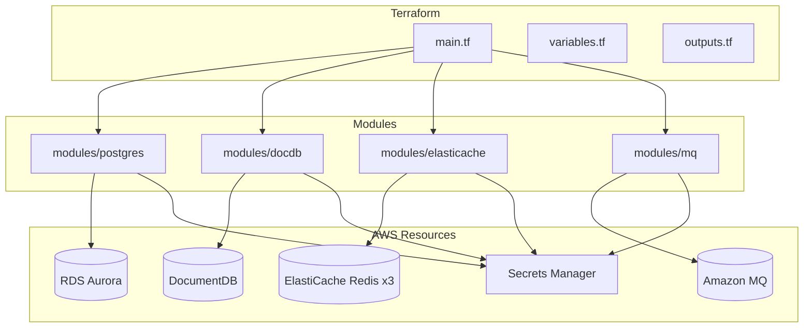
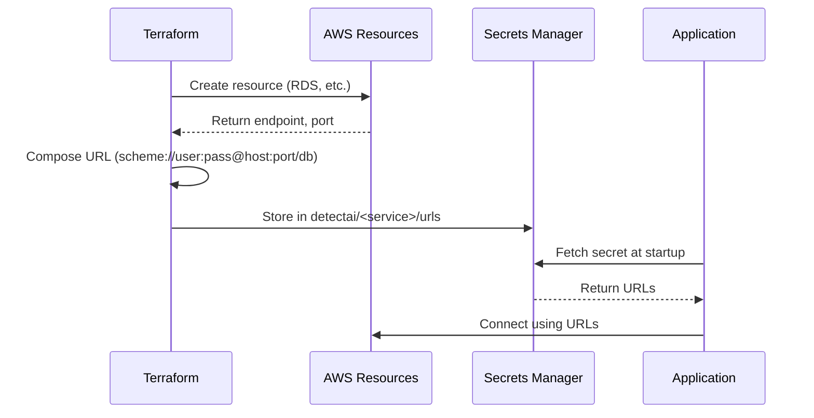
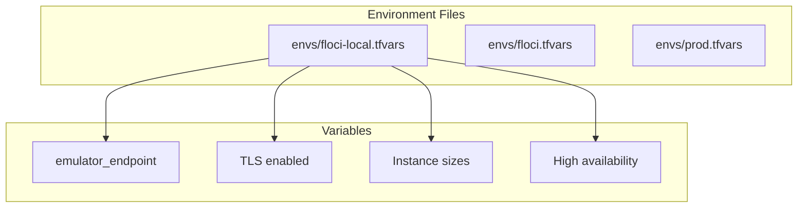
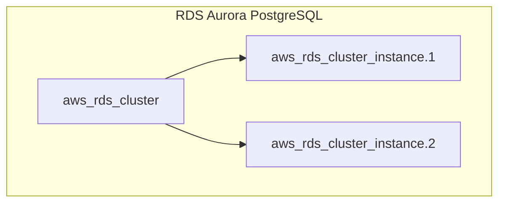

# Terraform

This document explains how Terraform manages DetectAI's infrastructure on AWS, including modules, environments, and the secret contract.

## Overview

Terraform manages the stateful datastores that run on AWS:
- **RDS Aurora PostgreSQL** - User data, subscriptions
- **Amazon DocumentDB** - Chat messages (MongoDB-compatible)
- **ElastiCache Redis** - Caching, streaming, deduplication (3 instances)
- **Amazon MQ RabbitMQ** - Message queuing for async processing



## Module Structure

Each module follows the same pattern:

```
modules/<name>/
├── main.tf        # Resources
├── variables.tf   # Input variables
└── outputs.tf     # Output values
```

### Module Summary

| Module | Resources | Secret |
|--------|-----------|--------|
| `postgres` | RDS cluster + instances | `detectai/pg/urls` |
| `docdb` | DocumentDB cluster + instance | `detectai/docdb/urls` |
| `elasticache` | ElastiCache replication group | `detectai/redis/<prefix>/urls` |
| `mq` | Amazon MQ broker | `detectai/mq/urls` |

## The Secret Contract

This is the most important concept: **Terraform composes connection URLs and stores them in Secrets Manager**. Apps never assemble URLs themselves.



### Secrets Created by Terraform

| Secret Name | Contents |
|-------------|----------|
| `detectai/pg/urls` | `DATABASE_URL`, `DATABASE_URL_REPLICA` |
| `detectai/docdb/urls` | `MONGO_URI`, `MONGO_DATABASE`, `MONGO_MODE` |
| `detectai/redis/chat/urls` | `CHAT_REDIS_ADDR`, `REDIS_PASSWORD`, `REDIS_URL`, `REDIS_TLS_ENABLED` |
| `detectai/redis/events/urls` | `EVENT_REDIS_URL`, `EVENT_REDIS_PASSWORD`, `EVENT_REDIS_TLS_ENABLED` |
| `detectai/redis/users/urls` | `REDIS_URL`, `REDIS_PASSWORD`, `REDIS_TLS_ENABLED` |
| `detectai/mq/urls` | `RABBITMQ_URL`, `RABBITMQ_UI_URL`, `RABBITMQ_QUEUE_TYPE` |

Each module also creates a `detectai/<service>/master` secret with break-glass credentials.

## Environments

Environments are controlled by `.tfvars` files:



| File | Endpoint | TLS | Instance Size | HA |
|------|----------|-----|---------------|-----|
| `floci-local.tfvars` | `http://localhost:4566` | Off | `cache.t3.micro` | Single node |
| `floci.tfvars` | `https://4566-...cloudspaces.litng.ai` | Off | `cache.t3.micro` | Single node |
| `prod.tfvars` | `null` (real AWS) | On | `cache.r6g.large` | Multi-AZ |

### Key Variable Differences

| Variable | Local | Production |
|----------|-------|------------|
| `emulator_endpoint` | `http://localhost:4566` | `null` |
| `db_sslmode` | `disable` | `require` |
| `docdb_tls_enabled` | `false` | `true` |
| `redis_*_transit_encryption_enabled` | `false` | `true` |
| `secret_recovery_window` | `0` | `30` |
| `mq_deployment_mode` | `SINGLE_INSTANCE` | `CLUSTER_MULTI_AZ` |
| `mq_apply_immediately` | `true` | `false` |

## Quick Commands

```bash
# From repo root
make tf-fmt            # Check formatting
make tf-validate       # Init + validate + test
make tf-plan-local     # Plan with floci-local
make tf-apply-local    # Apply with floci-local
make tf-destroy-local  # Destroy with floci-local
make tf-test           # Run unit tests
```

### Direct Terraform Commands

```bash
cd infra/terraform

# Initialize
terraform init

# Plan
terraform plan -var-file=envs/floci-local.tfvars

# Apply
terraform apply -var-file=envs/floci-local.tfvars

# Destroy
terraform destroy -var-file=envs/floci-local.tfvars

# Run tests
terraform test
```

## State Backends

| Backend | Use Case | File |
|---------|----------|------|
| Local file | Daily development | `terraform.tfstate` (default) |
| Emulator S3 | Smoke testing prod flow | `backend.local-s3.hcl` |
| Real AWS S3 | Production | `backend.prod.hcl` |

### Switching Backends

```bash
# Local (default)
terraform init

# Emulator S3
terraform init -reconfigure -backend-config=backend.local-s3.hcl

# Real AWS
terraform init -reconfigure -backend-config=backend.prod.hcl
```

## Resource Details

### PostgreSQL (RDS Aurora)



- **Engine**: Aurora PostgreSQL 16.6
- **Instances**: 1 (local) / 2 (prod HA)
- **Endpoints**: Writer + Reader for read replicas
- **Password**: Random 32-char, URL-encoded for URI safety

### DocumentDB

- **Engine**: DocumentDB 5.0.0 (MongoDB-compatible)
- **Mode**: `standalone` (local) / `sharded` (prod)
- **TLS**: Configurable per environment
- **URI**: Includes `retryWrites=false` for DocumentDB compatibility

### ElastiCache Redis (x3)

| Instance | Purpose | HA | Eviction Policy |
|----------|---------|-----|-----------------|
| `redis-chat` | Chat cache + streams | Primary + Replica, Multi-AZ | - |
| `redis-events` | Payment dedup | Single node | `noeviction` |
| `redis-users` | User cache + rate limit | Single node | `volatile-ttl` |

**Why 3 Redis instances?**
- **Isolation**: Different failure domains
- **Different configs**: HA vs single-node, different eviction policies
- **Security**: Separate auth tokens

### Amazon MQ (RabbitMQ)

- **Engine**: RabbitMQ 3.13
- **Deployment**: `SINGLE_INSTANCE` (local) / `CLUSTER_MULTI_AZ` (prod)
- **Queue type**: `quorum` (durable, replicated)

## Testing

### Unit Tests (Mocked)

```bash
terraform test
```

Uses `mock_provider` to test without AWS resources. Tests cover:
- Happy paths for emulator and prod
- Invalid input validation
- ElastiCache HA invariants

### Integration Tests (Emulator)

```bash
terraform apply -var-file=envs/floci-local.tfvars

# Verify via emulator API
aws --endpoint-url http://localhost:4566 rds describe-db-clusters
aws --endpoint-url http://localhost:4566 docdb describe-db-clusters
aws --endpoint-url http://localhost:4566 elasticache describe-replication-groups
aws --endpoint-url http://localhost:4566 mq list-brokers

# Data plane checks
psql "$(terraform output -raw database_url)" -c "select 1"
redis-cli -h $(terraform output -raw redis_chat_primary_address) ping

terraform destroy -var-file=envs/floci-local.tfvars
```

## Prod Hardening Checklist

When moving to real AWS:

- [ ] S3 backend with versioning + encryption + lockfile
- [ ] `secret_recovery_window=30`
- [ ] `db_sslmode=require`
- [ ] `docdb_tls_enabled=true`
- [ ] `redis_*_transit_encryption_enabled=true`
- [ ] `redis_*_at_rest_encryption_enabled=true`
- [ ] `mq CLUSTER_MULTI_AZ` with subnet_ids/security_groups
- [ ] `deletion_protection=true`
- [ ] `backup_retention_period=7`

## Next Steps

- [Secrets](../operations/secrets.md) - How secrets are managed
- [Datastores](../components/datastores.md) - Datastore details
- [Troubleshooting](../operations/troubleshooting.md) - Common issues
