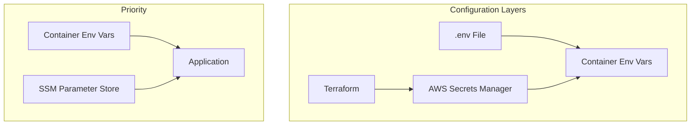

# Configuration

This document explains all the environment variables and configuration options for the DetectAI infrastructure.

## How Configuration Works

DetectAI uses a layered configuration approach:



1. **Terraform** creates infrastructure and stores URLs in AWS Secrets Manager
2. **.env files** provide environment-specific values for Docker Compose
3. **Containers** receive environment variables from both sources
4. **Apps** can also fetch config from SSM Parameter Store at runtime

## Environment Files

There are two `.env` files, one for each stack:

| File | Purpose | Gitignored? |
|------|---------|-------------|
| `infra/docker/local/.env` | Local development stack | Yes |
| `infra/docker/prod/.env` | Production stack | Yes |

Both have corresponding `.env.example` files that are committed to git:

```bash
# Create your local .env
cp infra/docker/local/.env.example infra/docker/local/.env

# Create your prod .env
cp infra/docker/prod/.env.example infra/docker/prod/.env
```

## Local Stack Variables

### Required Variables

These must be set for the local stack to work:

| Variable | Description | Example |
|----------|-------------|---------|
| `GITHUB_ID` | GitHub OAuth client ID | `Iv1.abc123...` |
| `GITHUB_SECRET` | GitHub OAuth client secret | `secret123...` |
| `GOOGLE_ID` | Google OAuth client ID | `123456789.apps.googleusercontent.com` |
| `GOOGLE_SECRET` | Google OAuth client secret | `secret456...` |
| `NEXTAUTH_SECRET` | Secret for NextAuth.js sessions | `your-random-secret-string` |

### Application Ports

All ports have sensible defaults. Override in `.env` if needed:

| Variable | Default | Description |
|----------|---------|-------------|
| `PORT_FRONTEND` | `3000` | Web app port |
| `PORT_GATEWAY` | `8080` | Payment gateway port |
| `DOC_PARSER_PORT` | `8000` | Document parser port |
| `GRPC_PORT` | `50051` | AI inference gRPC port |
| `METRICS_PORT` | `8333` | AI inference metrics port |
| `CHAT_GRPC_HOST_PORT` | `50052` | Chat API gRPC port (host) |
| `CHAT_METRICS_HOST_PORT` | `9095` | Chat API metrics port (host) |
| `CHAT_WORKER_METRICS_PORT_HOST` | `9099` | Chat worker metrics port |
| `WORKER_ANALYTICS_PORT` | `7001` | Analytics worker port |
| `WORKER_CRON_PORT` | `7002` | Cron worker port |
| `WORKER_PAYMENTS_PORT` | `7003` | Payments worker port |

### Datastore Ports

| Variable | Default | Description |
|----------|---------|-------------|
| `POSTGRES_PORT` | `5432` | PostgreSQL port |
| `REDIS_PORT` | `6379` | Redis users port |
| `REDIS_CHAT_PORT` | `6381` | Redis chat port |
| `EVENT_REDIS_PORT` | `6382` | Redis events port |
| `MONGO_CHAT_PORT` | `27018` | MongoDB port |
| `RABBITMQ_PORT` | `5672` | RabbitMQ AMQP port |
| `RABBITMQ_UI_PORT` | `15672` | RabbitMQ management UI |

### Database Credentials

| Variable | Default | Description |
|----------|---------|-------------|
| `POSTGRES_USER` | `postgres` | PostgreSQL username |
| `POSTGRES_PASSWORD` | `postgres` | PostgreSQL password |
| `POSTGRES_DB` | `detect_ai` | PostgreSQL database name |
| `DATABASE_URL` | - | Full PostgreSQL connection URL |
| `DATABASE_URL_REPLICA` | - | PostgreSQL read replica URL |
| `REDIS_PASSWORD` | `redis_password` | Redis users password |
| `REDIS_CHAT_PASSWORD` | `test_redis_password` | Redis chat password |
| `EVENT_REDIS_PASSWORD` | - | Redis events password |
| `RABBITMQ_USER` | `guest` | RabbitMQ username |
| `RABBITMQ_PASS` | `guest` | RabbitMQ password |

### Service URLs

Internal service URLs (used by other services to connect):

| Variable | Description |
|----------|-------------|
| `AI_SERVICE_URL` | AI inference service URL |
| `AI_SERVICE_API_KEY` | API key for AI service |
| `CHAT_SERVICE_URL` | Chat service URL |
| `FILE_EXTRACTOR_API_URL` | Document parser URL |
| `PAYMENT_GATEWAY_URL` | Payment gateway URL |
| `RABBITMQ_URL` | RabbitMQ connection URL |

## Production Stack Variables

The production stack uses the same variables plus additional ones for AWS:

### AWS Configuration

| Variable | Default | Description |
|----------|---------|-------------|
| `AWS_REGION` | `ap-south-1` | AWS region |
| `AWS_ENDPOINT_URL` | - | Floci/LocalStack endpoint (empty for real AWS) |
| `SSM_ENABLED` | `true` | Enable SSM Parameter Store |
| `ENV_TYPE` | `prod` | Environment type |

### Secrets Manager Names

| Variable | Default | Description |
|----------|---------|-------------|
| `PG_URLS_SECRET_NAME` | `detectai/pg/urls` | PostgreSQL URLs secret |
| `REDIS_URLS_SECRET_NAME` | `detectai/redis/users/urls` | Redis users URLs secret |
| `MQ_URLS_SECRET_NAME` | `detectai/mq/urls` | RabbitMQ URLs secret |
| `WEB_SECRETS_NAME` | `detectai/web/secrets` | Web app secrets |
| `GATEWAY_SECRETS_NAME` | `detectai/gateway/secrets` | Gateway secrets |
| `WORKERS_SECRETS_NAME` | `detectai/workers/secrets` | Workers secrets |
| `INFERENCE_SECRETS_NAME` | `detectai/inference/secrets` | Inference secrets |

## AI Inference Configuration

| Variable | Default | Description |
|----------|---------|-------------|
| `BATCH_SIZE` | - | Inference batch size |
| `BATCH_TIMEOUT` | - | Batch timeout in seconds |
| `MAX_TEXT_CHARS` | - | Maximum text characters |
| `INFERENCE_PROVIDERS` | `CPUExecutionProvider` | ONNX execution providers |
| `HF_TOKEN` | - | Hugging Face token for model downloads |

## Workers Configuration

| Variable | Default | Description |
|----------|---------|-------------|
| `RABBITMQ_PREFETCH` | `1` | RabbitMQ prefetch count |
| `CRON_CHECK_INTERVAL_MS` | `900000` | Cron check interval (15 min) |
| `CRON_BATCH_SIZE` | `100` | Cron batch size |

## Chat Service Configuration

| Variable | Default | Description |
|----------|---------|-------------|
| `CHAT_BATCH_SIZE` | - | Chat message batch size |
| `STREAM_PARTITION_COUNT` | - | Redis stream partitions |
| `CACHE_TTL` | - | Cache TTL in seconds |
| `MONGO_MODE` | `standalone` | MongoDB mode (standalone/sharded) |

## Document Parser Configuration

| Variable | Default | Description |
|----------|---------|-------------|
| `WORKERS` | - | Number of gunicorn workers |
| `WORKER_THREADS` | - | Worker threads |
| `MAX_UPLOAD_SIZE_BYTES` | - | Max upload size |
| `MAX_TEXT_LENGTH` | - | Max extracted text length |
| `MAX_PDF_PAGES` | - | Max PDF pages to process |

## Observability Configuration

| Variable | Default | Description |
|----------|---------|-------------|
| `LOG_LEVEL` | - | Log level (debug/info/warn/error) |
| `OTEL_EXPORTER_OTLP_ENDPOINT` | - | OpenTelemetry collector endpoint |
| `OTEL_SERVICE_NAME` | - | Service name for traces |
| `OTEL_TRACES_SAMPLER` | - | Trace sampler strategy |
| `OTEL_TRACES_SAMPLER_ARG` | - | Sampler argument (ratio) |

## Variable Precedence

When the same variable is set in multiple places, the last one wins:

```
1. .env file (lowest priority)
2. Docker Compose environment section
3. Shell environment variables (highest priority)
```

For apps that use SSM Parameter Store:

```
1. Container environment variables
2. SSM Parameter Store (if SSM_ENABLED=true)
3. Secrets Manager (for URL-type secrets)
```

## Next Steps

- [Architecture](../concepts/architecture.md) - Understand the system design
- [Datastores](../components/datastores.md) - Learn what each datastore does
- [Secrets](../operations/secrets.md) - How secrets are managed
