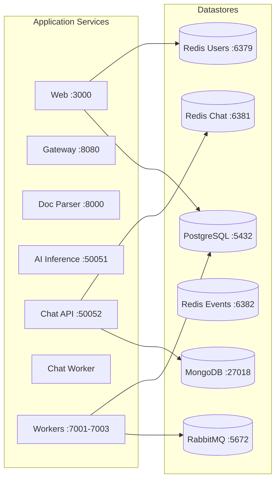

# Quick Start

This guide will help you get the full DetectAI stack running locally in under 5 minutes.

## Prerequisites

- Docker and Docker Compose (v2+)
- GNU Make (optional, but recommended)
- 8 GB RAM available for Docker

## Step 1: Clone and Navigate

```bash
git clone <repo-url> detectAI
cd detectAI
```

## Step 2: Create Your Environment File

```bash
cp infra/docker/local/.env.example infra/docker/local/.env
```

Edit the `.env` file and fill in at least these required values:

```bash
# Authentication (required for login to work)
GITHUB_ID=your-github-client-id
GITHUB_SECRET=your-github-client-secret
GOOGLE_ID=your-google-client-id
GOOGLE_SECRET=your-google-client-secret
NEXTAUTH_SECRET=your-random-secret-string
```

> **Tip**: For local development, you can use placeholder values for OAuth if you don't need login. The app will still work for AI detection features.

## Step 3: Start the Stack

```bash
# Using Make (recommended)
make local-up

# Or using Docker Compose directly
docker compose --env-file infra/docker/local/.env -f infra/docker/local/compose.yml up -d
```

This starts everything:



## Step 4: Verify It's Running

```bash
# Check all containers are healthy
make local-ps

# Or directly
docker compose --env-file infra/docker/local/.env -f infra/docker/local/compose.yml ps
```

You should see all services with status `Up` and health checks passing.

## Step 5: Open the App

Open [http://localhost:3000](http://localhost:3000) in your browser.

You should see the DetectAI homepage. Try:
1. Upload a text document for AI detection
2. Paste text directly for analysis
3. Start a chat conversation

## What Just Happened?

When you ran `make local-up`, Docker Compose:

1. **Created a network** (`detectai-local`) for all services to communicate
2. **Started datastores** - PostgreSQL, Redis (x3), MongoDB, RabbitMQ
3. **Ran database migrations** - Set up the Prisma schema in PostgreSQL
4. **Built and started app services** - Web, Gateway, workers, inference, etc.
5. **Connected everything** - Services talk to each other via the internal network

## Try the Chat Feature

The chat service uses gRPC. You can test it with `grpcurl`:

```bash
# Create a chat
grpcurl -plaintext -d '{
  "user_id": "test-user",
  "title": "My First Chat"
}' localhost:50052 chat.ChatService/CreateChat

# Save a message (use the chat_id from above)
grpcurl -plaintext -d '{
  "chat_id": "<chat-id>",
  "user_id": "test-user",
  "role": "user",
  "content": "Hello, world!"
}' localhost:50052 chat.ChatService/SaveMessage
```

## Viewing Logs

```bash
# All services
make local-logs

# Specific service
make local-logs SERVICE=frontend
make local-logs SERVICE=chat-service
make local-logs SERVICE=worker-payments
```

## Stopping the Stack

```bash
# Stop (preserves data)
make local-down

# Stop and remove all data
make local-clean
```

## Next Steps

- [Configuration](configuration.md) - Customize settings for your environment
- [Architecture](../concepts/architecture.md) - Understand how everything fits together
- [Datastores](../components/datastores.md) - Learn what each datastore does

## Troubleshooting

### "Port already in use"

Another process is using the port. Either stop it or change the port in your `.env` file:

```bash
# Find what's using the port
lsof -i :3000

# Change port in .env
PORT_FRONTEND=3001
```

### "Not enough memory"

Docker needs at least 8 GB RAM. Increase it in Docker Desktop settings (Settings > Resources > Memory).

### Services keep restarting

Check the logs for the failing service:

```bash
make local-logs SERVICE=<service-name>
```

### Database migration fails

Make sure PostgreSQL is healthy before the migration runs:

```bash
docker compose --env-file infra/docker/local/.env -f infra/docker/local/compose.yml ps postgres-users
```

### "Connection refused" errors

Services may still be starting up. Wait 30 seconds and check health:

```bash
docker compose --env-file infra/docker/local/.env -f infra/docker/local/compose.yml ps
```
