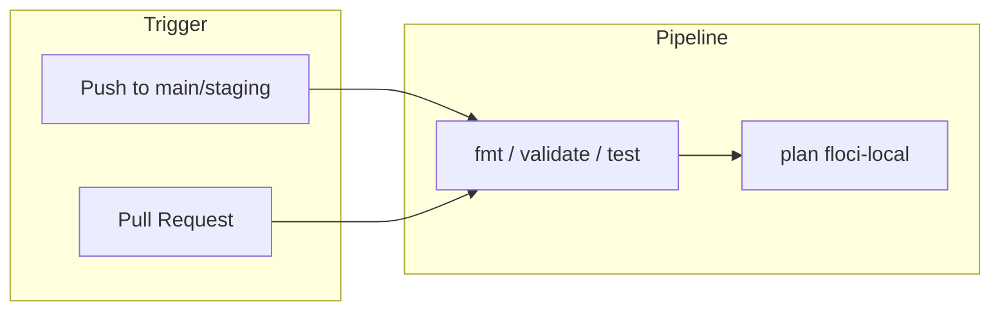
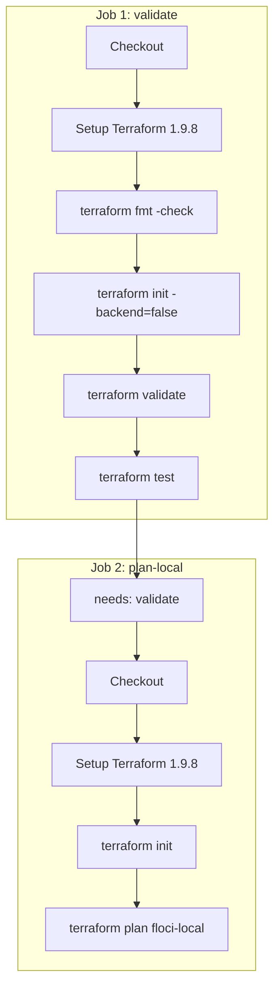
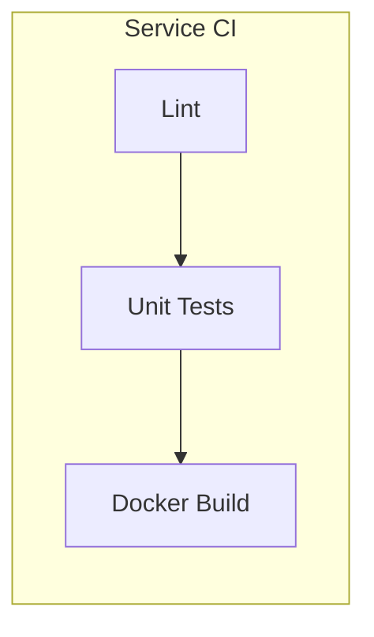
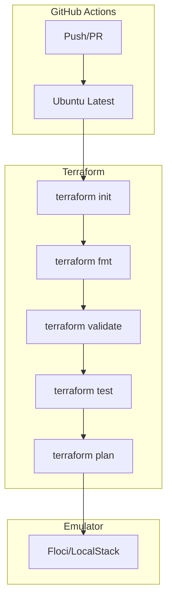

# CI/CD

This document explains the GitHub Actions pipelines for DetectAI infrastructure.

## Overview

DetectAI uses GitHub Actions for continuous integration. The pipeline validates infrastructure changes on every push and pull request.



## Terraform Pipeline

The main infrastructure pipeline runs on changes to `infra/terraform/**`.

### Triggers

| Event | Branches | Paths |
|-------|----------|-------|
| Push | `main`, `staging` | `infra/terraform/**` |
| Pull Request | `main`, `staging` | `infra/terraform/**` |
| Manual | - | `workflow_dispatch` |

### Jobs



### Job Details

#### Job 1: validate

Runs static checks and unit tests:

```yaml
steps:
  - name: Check formatting
    run: terraform fmt -check -recursive -diff

  - name: Init (no backend)
    run: terraform init -backend=false

  - name: Validate
    run: terraform validate

  - name: Unit tests (mocked)
    run: terraform test
```

**What it checks:**
- Code formatting (`terraform fmt`)
- Configuration validity (`terraform validate`)
- Unit tests with mocked providers (`terraform test`)

#### Job 2: plan-local

Plans against the Floci/LocalStack emulator:

```yaml
steps:
  - name: Init
    run: terraform init

  - name: Plan (floci-local)
    run: terraform plan -var-file=envs/floci-local.tfvars -input=false -detailed-exitcode
```

**What it does:**
- Initializes with the local backend
- Plans against `http://localhost:4566`
- Fails if plan has changes (catches drift)

### Permissions

```yaml
permissions:
  contents: read
```

The pipeline only reads the repository. No write access needed.

## Service Pipelines

Each service has its own CI workflow:

| Workflow | Service | Trigger |
|----------|---------|---------|
| `service-chats.yaml` | Chat service | `services/chats/**` |
| `service-inference.yaml` | AI inference | `services/inference/**` |
| `service-web.yaml` | Web app | `apps/web/**` |
| `service-workers.yaml` | Workers | `services/workers/**` |
| `service-payment-gateway.yaml` | Payment gateway | `services/payments/**` |
| `service-file-processing.yaml` | Document parser | `services/document-parser/**` |

### Typical Service Pipeline



## Running Locally

### Validate Terraform

```bash
# From repo root
make tf-validate

# Or directly
cd infra/terraform
terraform fmt -check -recursive
terraform init -backend=false
terraform validate
terraform test
```

### Plan Against Emulator

```bash
# Start Floci/LocalStack first
# Then plan
make tf-plan-local
```

### Run Service Tests

```bash
# Chat service
cd services/chats
make test

# Workers
cd services/workers
npm test
```

## CI Best Practices

### Before Pushing

1. **Format your code**: `make tf-fmt`
2. **Validate**: `make tf-validate`
3. **Test locally**: `make tf-test`
4. **Plan against emulator**: `make tf-plan-local`

### Pull Request Checklist

- [ ] Terraform formatting passes
- [ ] Validation passes
- [ ] Unit tests pass
- [ ] Plan against emulator succeeds
- [ ] No unexpected changes in plan output
- [ ] Documentation updated if needed

### Common CI Failures

| Failure | Cause | Fix |
|---------|-------|-----|
| `fmt check failed` | Code not formatted | Run `terraform fmt -recursive` |
| `validation failed` | Invalid configuration | Check `variables.tf` constraints |
| `test failed` | Unit test error | Fix the failing test |
| `plan failed` | Emulator not running | Start Floci/LocalStack |

## Pipeline Architecture



## Local Development vs CI

| Aspect | Local | CI |
|--------|-------|-----|
| Backend | Local file | Local (no backend) |
| Emulator | Your machine | Not used (mocked) |
| Tests | Full suite | Unit tests only |
| Plan | Against emulator | Against emulator (in plan job) |

## Next Steps

- [Troubleshooting](troubleshooting.md) - Common CI issues
- [Terraform](../concepts/terraform.md) - How Terraform works
- [Secrets](secrets.md) - How secrets are managed
