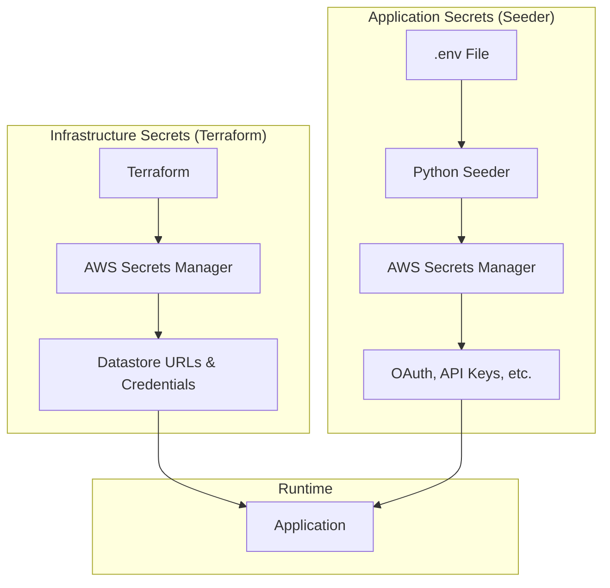
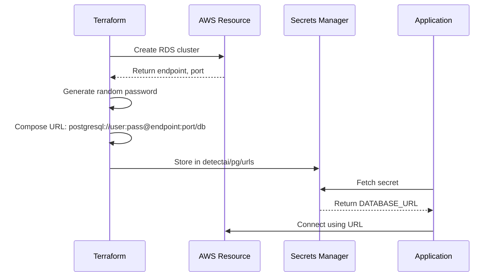
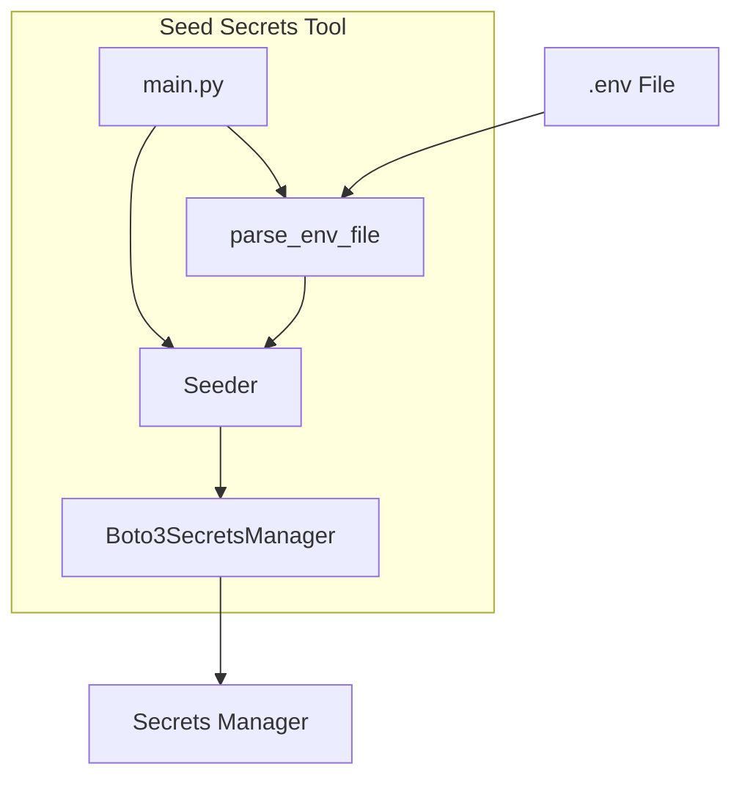
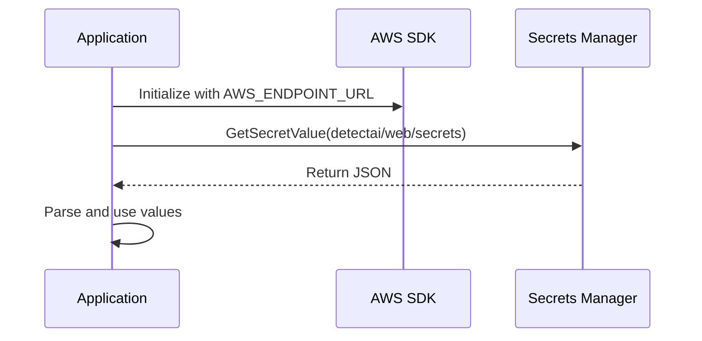
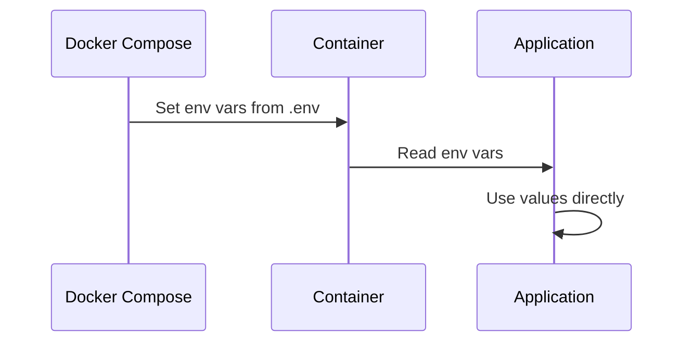
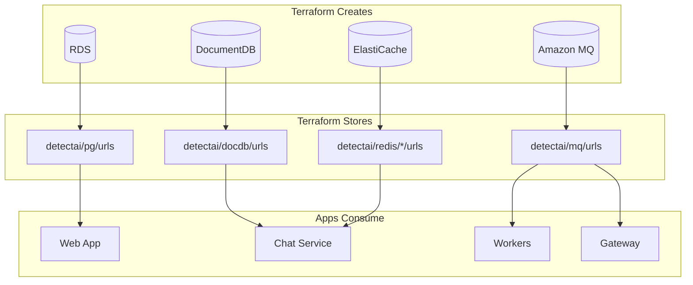

# Secrets Management

This document explains how secrets are managed in DetectAI, including Terraform-managed secrets and application-seeded secrets.

## Overview

DetectAI has two types of secrets:



| Type | Managed By | Contents | Rotation |
|------|------------|----------|----------|
| Infrastructure | Terraform | Database URLs, credentials | Automatic on apply |
| Application | Python Seeder | OAuth keys, API secrets | Manual via seeder |

## Infrastructure Secrets (Terraform)

Terraform creates and manages secrets for datastore connection strings.

### Secret Names

| Secret | Contents |
|--------|----------|
| `detectai/pg/urls` | `DATABASE_URL`, `DATABASE_URL_REPLICA` |
| `detectai/pg/master` | PostgreSQL master credentials |
| `detectai/docdb/urls` | `MONGO_URI`, `MONGO_DATABASE`, `MONGO_MODE` |
| `detectai/docdb/master` | DocumentDB master credentials |
| `detectai/redis/chat/urls` | `CHAT_REDIS_ADDR`, `REDIS_PASSWORD`, `REDIS_URL` |
| `detectai/redis/events/urls` | `EVENT_REDIS_URL`, `EVENT_REDIS_PASSWORD` |
| `detectai/redis/users/urls` | `REDIS_URL`, `REDIS_PASSWORD` |
| `detectai/mq/urls` | `RABBITMQ_URL`, `RABBITMQ_UI_URL`, `RABBITMQ_QUEUE_TYPE` |
| `detectai/mq/master` | RabbitMQ admin credentials |

### How It Works



### Why This Pattern?

- **Apps never construct URLs** - They fetch them from Secrets Manager
- **Single source of truth** - Terraform knows the actual endpoint/port
- **Environment agnostic** - Same secret name, different values per environment
- **Auditable** - All changes tracked in Terraform state

## Application Secrets (Seeder)

Application secrets are seeded by a Python tool from `.env` files.

### Secret Names

| Secret | Contents |
|--------|----------|
| `detectai/web/secrets` | OAuth, NextAuth, Turnstile, Paddle, API keys |
| `detectai/gateway/secrets` | Paddle webhook secret, internal API key |
| `detectai/workers/secrets` | Paddle API key, environment |
| `detectai/inference/secrets` | AI service API key |

### The Seeder Tool

Located at `tools/seed-secrets/`, the seeder is a clean-architecture Python tool:



### Running the Seeder

```bash
# Install dependencies
make seed-install

# Seed to Floci/LocalStack
make seed-floci

# Preview without writing
make seed-floci-dry

# Seed to real AWS (requires confirmation)
make seed-aws

# Bootstrap everything (Terraform + seed + verify)
make prod-floci-bootstrap
```

### Seeder Features

- **Allowlist-only**: Only processes known secret names
- **Shared key sync**: `INTERNAL_API_KEY` and `AI_SERVICE_API_KEY` are synced across secrets
- **Dry-run mode**: Preview changes without writing
- **Floci-aware**: Works with both emulator and real AWS
- **Strict validation**: Refuses to overwrite Terraform-managed secrets

### What Gets Seeded

From `infra/docker/prod/.env`:

```bash
# detectai/web/secrets
{
  "NEXTAUTH_SECRET": "...",
  "INTERNAL_API_KEY": "...",
  "AI_SERVICE_API_KEY": "...",
  "NEXT_PUBLIC_TURNSTILE_SITE_KEY": "...",
  "TURNSTILE_SECRET_KEY": "...",
  "NEXT_PUBLIC_PADDLE_CLIENT_TOKEN": "...",
  "GOOGLE_ID": "...",
  "GOOGLE_SECRET": "...",
  "GITHUB_ID": "...",
  "GITHUB_SECRET": "...",
  "PROMETHEUS_WEB_SCRAPE_TOKEN": "..."
}

# detectai/gateway/secrets
{
  "PADDLE_WEBHOOK_SECRET": "...",
  "INTERNAL_API_KEY": "..."  # Synced from web
}

# detectai/workers/secrets
{
  "PADDLE_API_KEY": "...",
  "PADDLE_ENVIRONMENT": "sandbox"
}

# detectai/inference/secrets
{
  "AI_SERVICE_API_KEY": "..."  # Synced from web
}
```

## How Apps Fetch Secrets

### Production (ENV_TYPE=prod)

Apps fetch secrets at startup using AWS SDK:



### Local (ENV_TYPE=dev)

Apps use environment variables directly from Docker Compose:



## Secret Contract

The contract between Terraform and applications:



## Verification

### Check Terraform Secrets

```bash
# List all secrets
aws --endpoint-url http://localhost:4566 secretsmanager list-secrets

# Get specific secret
aws --endpoint-url http://localhost:4566 secretsmanager get-secret-value \
  --secret-id detectai/pg/urls
```

### Check App Secrets

```bash
# Run verification
make floci-verify
```

This checks:
1. Emulator health
2. All infrastructure resources exist
3. All 4 app secrets are seeded

### Verify from Application

```bash
# Check if app can fetch secrets
docker exec <container> env | grep DATABASE_URL
```

## Troubleshooting

### "Secret not found"

- **Terraform secrets**: Run `make tf-apply-local`
- **App secrets**: Run `make seed-floci`

### "Access denied"

- Check `AWS_ENDPOINT_URL` is set correctly
- For real AWS, ensure IAM permissions

### "Secret value is empty"

- Check `.env` file has the required values
- Run `make seed-floci-dry` to preview

### "Cannot overwrite Terraform secret"

This is by design. Terraform-managed secrets should only be updated by Terraform.

## Best Practices

1. **Never commit `.env` files** - They contain secrets
2. **Use different secrets per environment** - Dev vs prod
3. **Rotate secrets regularly** - Use Terraform for infra, seeder for app
4. **Verify after changes** - Run `make floci-verify`
5. **Use dry-run first** - `make seed-floci-dry` before writing

## Next Steps

- [Terraform](../concepts/terraform.md) - How infrastructure secrets are managed
- [Environment](../components/environment.md) - How .env files work
- [Troubleshooting](troubleshooting.md) - Common issues
