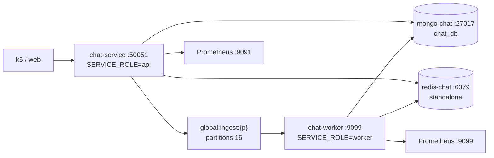

# Chats

Stateful Go gRPC service that stores chat sessions and messages in MongoDB with a Redis hot cache and partitioned ingest streams. Single binary runs as `api` (gRPC server `:50051`) or `worker` (stream consumer) via `SERVICE_ROLE`, hexagonal ports/adapters, bucketed message persistence and DLQ.

## Overview

Stateful service exposing `ChatService` (`api/proto/chat_service.proto`) with `CreateChat/GetChat/GetUserChats/RenameChat/DeleteChat` (sync mongo) plus `SaveMessage` (async `XAdd` + cache, worker `BulkUpsert`) and `GetChatHistory` (page-1 hot merge, cold fallback). Handles `200`-char titles, `20k`-char messages, `user/assistant/system/tool` roles, `20/100` paging with `1M` offset guard, via per-`chat_id` `crc32` stream partitions (`16` default) and `100`-item `24h` hot cache.

```text
POST gRPC  CreateChat(chat)              -> chat_id
POST gRPC  SaveMessage(chat, message)    -> message_id (XAdd, worker persists)
POST gRPC  GetChatHistory(chat, page)    -> messages[] desc + has_more
```

## Packages

| Package | Purpose |
|---|---|
| `grpc`, `protobuf` | gRPC server, health, codegen |
| `mongo-driver` | MongoDB persistence (`chats`, `messages` buckets) |
| `go-redis/v9` | Redis streams + hot cache |
| `prometheus/client_golang` | Metrics (`:9091` api, `:9099` worker) |
| `zap` | Structured logging |
| `envconfig`, `godotenv` | Typed config + validation |
| `google/uuid` | `chat_id` / `message_id` generation |
| `testify`, `redismock` | Tests/mocks |
| `testcontainers`, `mongodb`, `redis` modules | Integration |

See `go.mod` for full list.

## Architecture



Async ingest (`XAdd` → `BulkUpsert` → `XAck`, poison-ack + DLQ) keeps writes off the read path; cache merge keeps page-1 hot. See [Architecture](docs/01-architecture.md) for ports, startup DAG and class view.

## Configuration

```ini
SERVICE_ROLE=api                 # required, api|worker
MONGO_URI=mongodb://mongo-chat:27017  # required
CHAT_REDIS_ADDR=redis-chat:6379       # required (single primary, *redis.Client)
MONGO_DATABASE=chat_db          # optional
MONGO_MODE=standalone            # optional, standalone|sharded (messages on chat_id:hashed when sharded)
MONGO_TLS_ENABLED=false         # optional, true for DocumentDB TLS
MONGO_MAX_POOL_SIZE=100         # optional, 1..500 (default 20 when sharded)
MONGO_MIN_POOL_SIZE=10          # optional, 0..max (default 5 when sharded)
GRPC_PORT=:50051                # optional
METRICS_PORT=:9091              # optional, :9099 worker
REDIS_POOL_SIZE=100             # optional, 1..500
BATCH_SIZE=50                   # optional, 1..500
STREAM_PARTITION_COUNT=16       # optional, 1..128
CACHE_TTL=24h                   # optional
```

See `docs/08-configuration.md` for full reference and `infra/docker/mongo-chat/.env.example`, `infra/docker/redis-chat/.env.example` for datastore knobs.

## API

```text
gRPC  ChatService/CreateChat         (user_id, title) -> chat_id
gRPC  ChatService/GetChat            (chat_id + x-user-id) -> session
gRPC  ChatService/GetUserChats        (user_id, limit) -> chats[] desc
gRPC  ChatService/RenameChat         (chat_id, new_title) -> success
gRPC  ChatService/DeleteChat         (chat_id) -> success
gRPC  ChatService/SaveMessage        (chat/user/role/content) -> message_id, timestamp
gRPC  ChatService/GetChatHistory     (chat_id, page, page_size) -> messages[] desc + has_more
gRPC  grpc.health.v1.Health/Check    -> SERVING / NOT_SERVING
GET   :9091|9099/metrics             -> Prometheus
```

Auth via `x-user-id` header (preferred) or `user_id` body; mismatch → `PermissionDenied`. See `docs/09-api.md` for full proto and status codes (`OK`, `INVALID_ARGUMENT`, `UNAUTHENTICATED`, `PERMISSION_DENIED`, `NOT_FOUND` etc).

## Observability

Logs are `zap` JSON to stdout. Metrics at `GET :9091/metrics` (api) and `:9099/metrics` (worker) for Prometheus.

Metrics configured:

- Messages ingested/published — counts mongo `BulkUpsert` and redis `XAdd` success
- Stream lag — per-partition `XInfoGroups` lag gauge
- Cache hits/misses — page-1 hot path tracking
- gRPC request duration — latency by method and status
- DLQ messages — counts moves to `chat:dlq:messages`
- Stream/database errors — counts failures by operation

Alerts configured:

- Chats down — service not up for more than 2 minutes
- High error rate — stream + db errors above threshold for 5 minutes
- High latency — p95 request latency above half a second for 10 minutes
- Stream lag — max partition lag above 100 for 5 minutes
- DLQ growing — any increase in DLQ messages over 15 minutes

See `docs/10-observability.md` for PromQL.

## Testing

All test commands are wrapped with `make` — check `Makefile` for details.

```bash
# Generate gRPC code from proto
make proto

# Run unit tests
make test

# Run tests with coverage report
make test-coverage

# Run containerized load (mongo + redis + service + worker + k6)
make load-test SCENARIO=smoke VUS=1 DURATION=10s
make load-test SCENARIO=load VUS=10 DURATION=2m RPS=50

# Tear down load rig
make load-down
```

See `docs/11-testing.md` and `tests/load/README.md` for scenarios.

## Docker

```bash
# Start standalone stack (mongo-chat 27018 + redis-chat 6381 + service + worker)
docker compose -f infra/compose.yml up -d --build

# Self-contained load rig (isolated chat_loadnet, no host ports + k6)
make load-test SCENARIO=smoke VUS=1 DURATION=10s
make load-down
```

`infra/compose.yml` (`name: chats`) reuses `infra/docker/mongo-chat|redis-chat` atoms (standalone, `MONGO_MODE=standalone`); sharded mode (`MONGO_MODE=sharded`, `messages` on `chat_id:hashed`, `chats` stays unsharded) uses the same compose with an external `MONGO_URI` (DocumentDB/elastic via Terraform `detectai/docdb`); queries are `chat_id`-targeted so no compose change is needed. `infra/compose.load.yml` (`name: chats-load`) keeps datastores internal-only so both stacks run side-by-side.

## Documentation

| Guide | What |
|---|---|
| [Architecture](docs/01-architecture.md) | Dual-role api/worker, hexagonal ports, startup DAG, class view |
| [Request Flows](docs/02-request-flows.md) | CreateChat sync, SaveMessage async, GetHistory hot/cold |
| [Validation](docs/03-validation.md) | Auth, title/content/role/page limits |
| [Caching](docs/04-caching.md) | Hot ZSET, Lua dedup, merge, populate |
| [Streaming](docs/05-streaming.md) | Partitions, ingest streams, consume contract |
| [Worker](docs/06-worker.md) | Consumer loop, batch, DLQ, recovery |
| [Health](docs/07-health.md) | Ticker, probes, ports |
| [Configuration](docs/08-configuration.md) | Full env reference |
| [API](docs/09-api.md) | Full proto, methods, status codes |
| [Observability](docs/10-observability.md) | Metrics, alerts, dashboards |
| [Testing](docs/11-testing.md) | Unit, integration, load |

Full index: [docs/README.md](docs/README.md).
