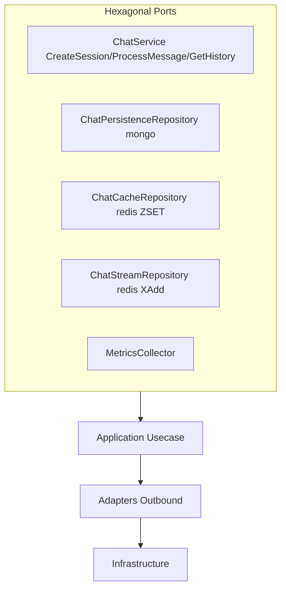
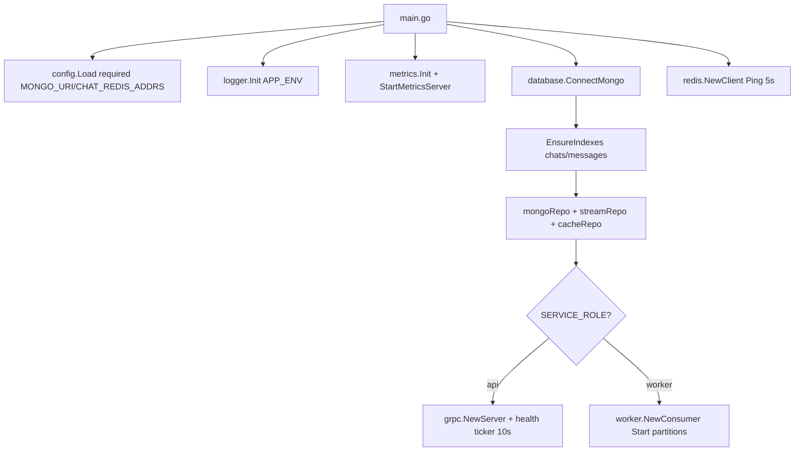
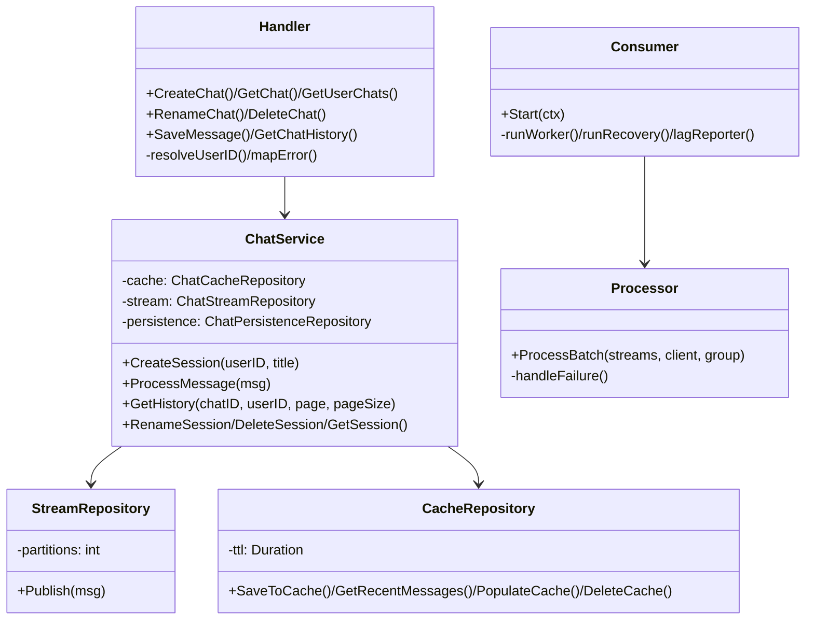

# Architecture

## High-level

```mermaid
graph LR
    Web[k6 / web] --> API[chat-service :50051<br/>SERVICE_ROLE=api]
    API --> Mongo[(chat-mongo :27017<br/>chat_db)]
    API --> Redis[(chat-redis :6379<br/>standalone)]
    API --> Stream[global:ingest:{p}<br/>partitions 16]
    Stream --> Worker[chat-worker :9099<br/>SERVICE_ROLE=worker]
    Worker --> Mongo
    Worker --> Redis
    API --> Metrics1[Prometheus :9091]
    Worker --> Metrics2[Prometheus :9099]
```

Single binary `./chat-service` runs as `api` (gRPC server) or `worker` (stream consumer) via `SERVICE_ROLE` (`cmd/server/main.go:64`). API is latency-sensitive (validate → mongo read + redis `XAdd` + cache write); worker is throughput-sensitive (batched `XReadGroup` → `BulkUpsert` → `XAck`). Mongo is source of truth, redis is hot cache + durable ingest buffer.

## Hexagonal ports



Ports live in `internal/core/ports/` (`chat_service.go`, `chat_repository.go`, `metrics.go`); usecase in `internal/core/usecase/chat_service.go:15`; adapters in `internal/adapters/grpc|mongo|redis|worker/`; domain in `internal/core/domain/`.

## Startup DAG



`main.go:37` connects mongo (`5s` disconnect on shutdown) + redis (`Ping 5s`, pool `MinIdle 10`, `Read/Write 3s` in `redis/client.go:12`). `api` spawns a `10s` ticker (`HealthCheckInterval`) pinging mongo (`Primary`) + redis (`3s` timeout) and calls `server.SetHealth` (`main.go:71`). `worker` spawns one goroutine per partition + one recovery loop (`consumer.go:48`).

## Class view



* `ChatService` never talks to mongo/redis directly — only via ports; `Handler` maps domain errors to gRPC codes.
* See `02-request-flows.md` for how `ProcessMessage`/`GetHistory` use these classes, and `04-caching.md` / `05-streaming.md` / `06-worker.md` for details.
