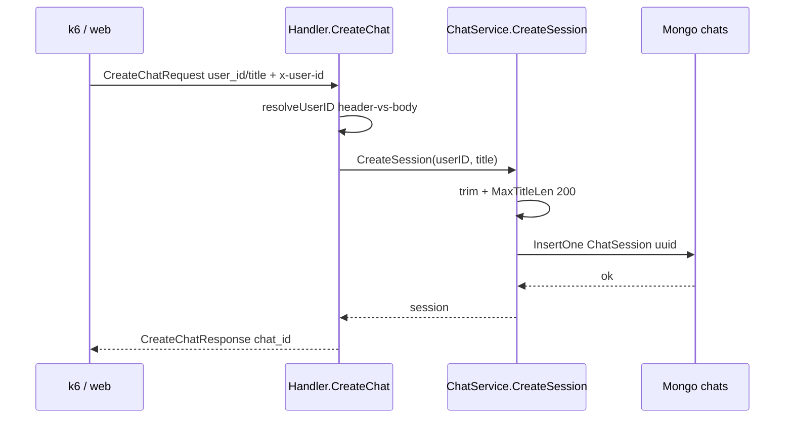
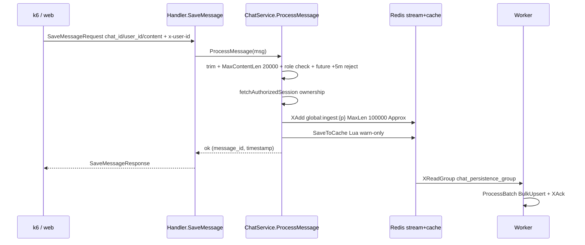
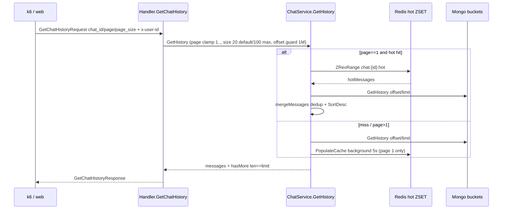

# Request Flows

## CreateChat (sync, mongo write)

Sync path — no redis involved. Failure in `InsertOne` → `IncDatabaseErrors(create_chat)` + `Internal`, except `DeadlineExceeded/Canceled` passthrough (`usecase/chat_service.go:99`).

## SaveMessage (async ingest via stream)

`Publish` partitions by `crc32(chat_id) % partitions` (`redis/stream_repo.go:43`). API returns after `XAdd`, not after mongo — worker persists async. `stream.Publish` failure → `IncStreamErrors(publish)` + `Internal`; cache failure only `Warn` (`usecase/chat_service.go:265`).

## GetHistory (hot/cold cache)

Page-1 hot merge returns `merged[:limit]` with `hasMore=true` on trim (`usecase/chat_service.go:313`). `nil` from persistence normalizes to `[]` so `hasMore` stays correct.

## Error branches

| Handler `mapError` (`handler.go:235`) | When |
|---|---|
| `InvalidArgument` | nil body, empty `chat_id/content/title`, `MaxTitleLen/ContentLen/RoleLen`, bad role, `limit` clamped not errored |
| `Unauthenticated` | missing `x-user-id` header and `user_id` field (`resolveUserID`) |
| `PermissionDenied` | header-vs-body `user_id` mismatch, or session `UserID != caller` (`ErrUnauthorized`) |
| `NotFound` | `ErrNotFound` from `GetChat/Update/Delete` |
| `DeadlineExceeded/Canceled` | ctx timeout (`RequestTimeout 10s`) passthrough |
| `Internal` | `IncDatabaseErrors/IncStreamErrors` paths, unexpected failure |
