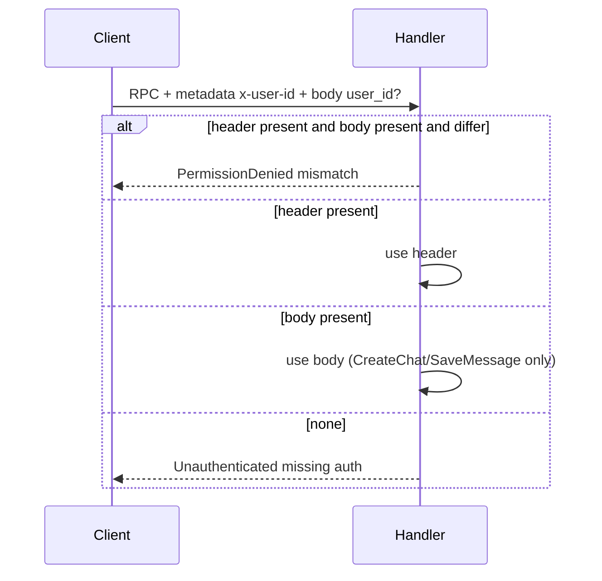
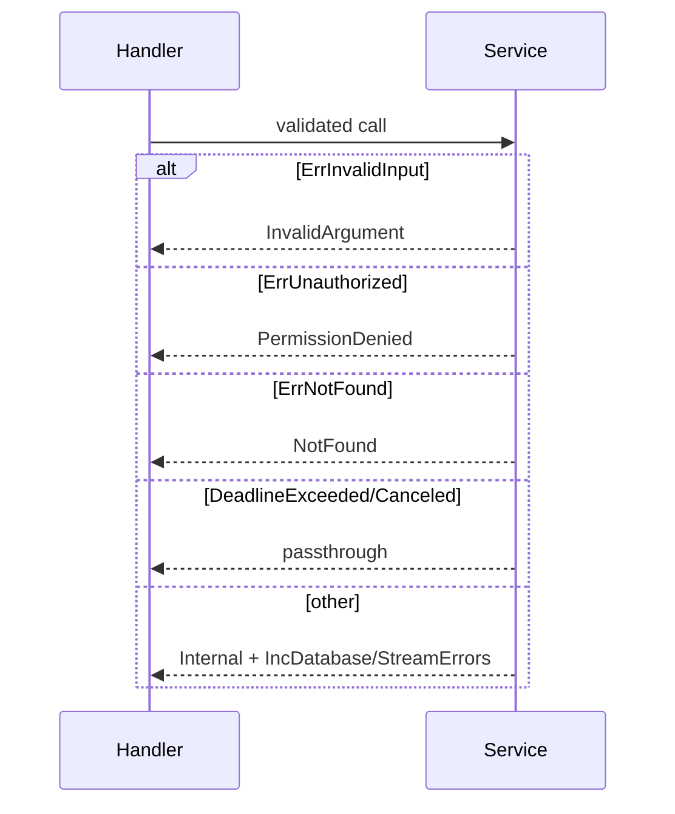

# Validation

## Auth (`x-user-id`)

* `requireAuth` (`GetChat/Rename/Delete/GetHistory`) needs header (`handler.go:266`).
* `resolveUserID` (`CreateChat/GetUserChats/SaveMessage`) prefers header, falls back to body, rejects mismatch (`handler.go:274`).
* Ownership re-checked in usecase via `fetchAuthorizedSession` (`UserID != session.UserID → ErrUnauthorized → PermissionDenied`).

## Limits (`domain/limits.go:5`)

| Field | Rule | Where |
|---|---|---|
| `title/new_title` | trim, non-empty, `<= MaxTitleLen 200` | `CreateSession/RenameSession` |
| `content` | trim, non-empty, `<= MaxContentLen 20000` | `ProcessMessage` |
| `role` | trim, `<= MaxRoleLen 20`, in `user/assistant/system/tool` (empty→`user`) | `ProcessMessage` |
| `chat_id/user_id` | trim, non-empty | all |
| `message_id` | trim, empty→`uuid.New()` server-side | `ProcessMessage` |
| `created_at` | zero→`now.UTC()`, future `>+5m`→`InvalidArgument`, ms (`>1e11`) vs s auto (`parseTimestamp`) | `handler.go:291` + usecase |
| `page/page_size` | `page<=0→1`, `size<=0→20`, `size>100→100`, `offset=(page-1)*size >1M`→`[]` no error | `GetHistory` |
| `limit` | `<=0→50`, `>100→100` | `GetUserChats` handler + usecase |
| `metadata/analysis` | passthrough `map<string,string>` + `AnalysisResult` (scores/model/verdict) | `SaveMessage` |

## Error branches

Nil request bodies fail fast (`request body is required`) before any I/O. `GetHistory`/`GetUserChats` normalize `nil → []` so empty is `OK`, not `NotFound`.
