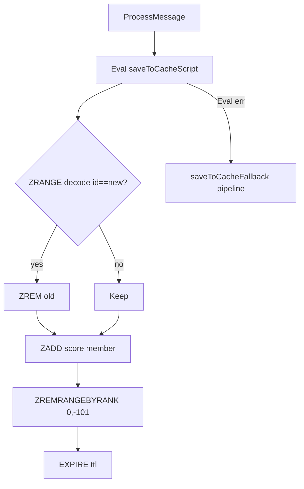
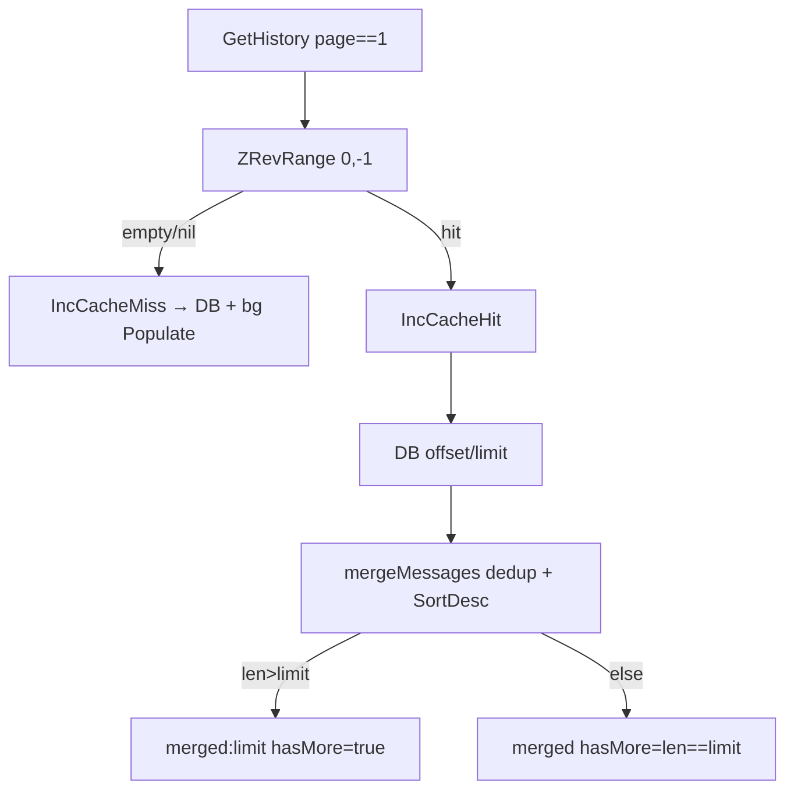
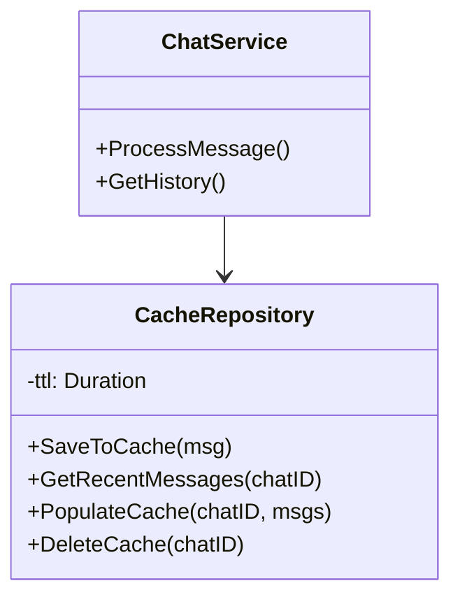

# Caching

Hot cache is redis ZSET `chat:{chat_id}:hot` (score = `CreatedAt` unix + nanos), capped at `MaxCacheSize 100`, TTL `CACHE_TTL 24h` (`redis/cache_repo.go:54`).

## Write path

* Lua is atomic dedup-by-`id` + insert + trim + expire; fallback does same via `ZRANGE` + pipeline (`ZRem/ZAdd/ZRemRangeByRank/Expire`).
* `SaveToCache` no-ops on `nil/empty chat_id/id`; marshal failure returns error (caller only `Warn`, never fails RPC).
* `DeleteCache` (`Del`) on `DeleteSession`; failure only `Warn`.

## Read path

* `GetRecentMessages` skips undecodable/empty-`id` members; `nil` on empty so caller falls back to DB.
* `PopulateCache` dedups input by `id`, diffs against existing (`ZRange` decode), pipeline `ZRem` stale + `ZAdd` + trim + `Expire`, runs in background `5s` (`CachePopulateTimeout`) only on page-1 miss.
* Pages `>1` never touch cache (cold mongo directly).

## Class view

Tuning: raise `CACHE_TTL` for read-heavy chats (memory), lower `MaxCacheSize` if ZSET decode dominates; misses are safe (DB fallback + bg fill).
