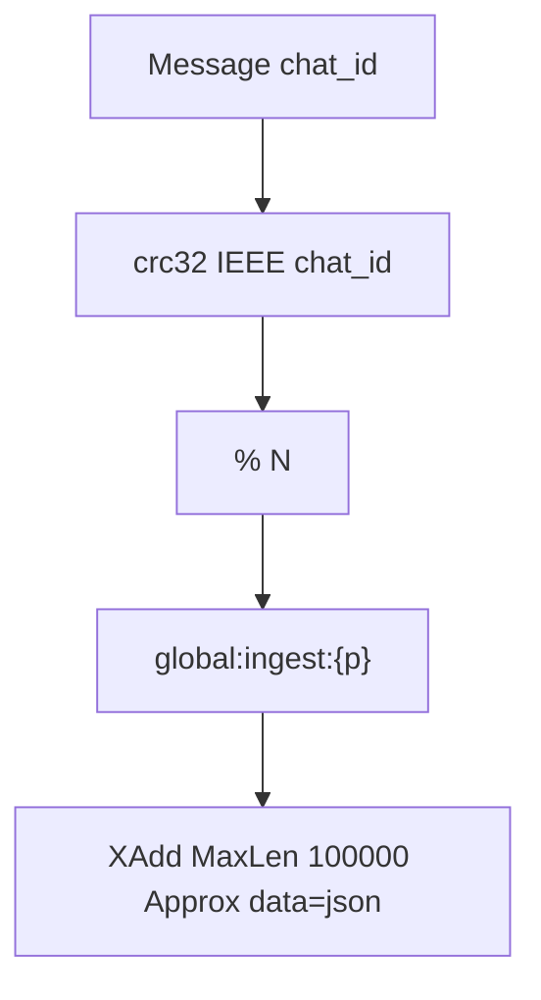
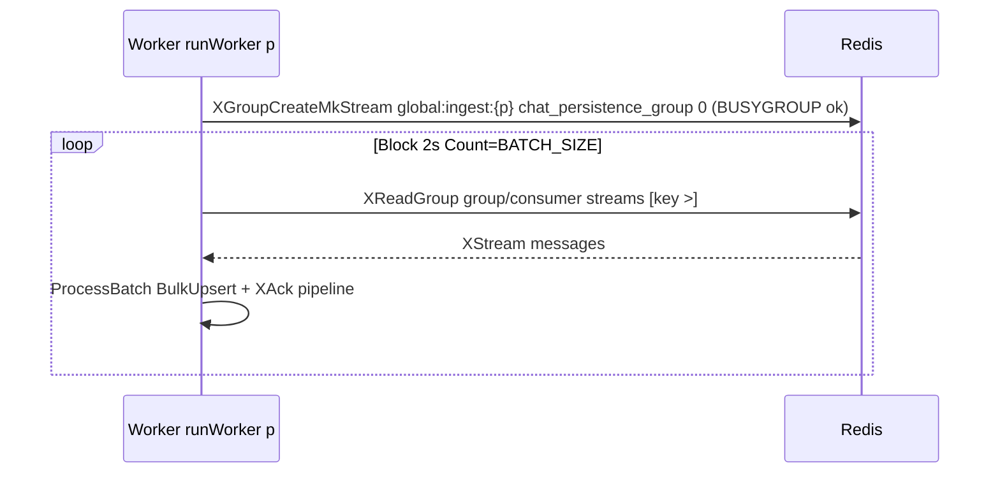

# Streaming

Redis Streams buffer writes between API and worker. `N = STREAM_PARTITION_COUNT` (`1..128`, default `16`) streams named `global:ingest:{partition}`.

## Partitioning

* Same `chat_id` always lands on same partition (`redis/stream_repo.go:43`) → per-chat ordering preserved without global ordering.
* `MaxLen 100000 Approx` (`StreamMaxLen/StreamApproxTrim` in `limits.go`) bounds memory; trim is approximate for throughput.
* `Publish` rejects `nil/empty chat_id`, marshals full `domain.Message` (incl. `Analysis`) as `data` field.

## Consume contract

* Group `chat_persistence_group`, consumer `<hostname>-p
-<rand>` (`consumer.go:77`); `ensureGroup` retries `2s`; `NOGROUP` re-creates.
* `XReadGroup` `Block = ReadBlockDuration 2s`, `Count = BATCH_SIZE` (default `50`); `redis.Nil` = idle poll, other errors `IncStreamErrors(read)` + `1s` backoff.
* Lag per stream via `XInfoGroups` every `LagReportInterval 5s` → `chat_redis_stream_lag{partition}`.

## Failure mapping

| Stage | Metric | Outcome |
|---|---|---|
| `XAdd` fail | `chat_stream_errors_total{publish}` | RPC `Internal` |
| `XReadGroup` fail | `{read}` | retry loop, no ack |
| `XAutoClaim` fail | `{autoclaim}` | recovery skips partition round |
| `XAck` pipe fail | `{ack}` | logged, may redeliver (idempotent upsert) |
| poison (`missing_data/unmarshal/invalid_message`) | same labels | acked immediately to unblock stream |

`UniversalClient` (`redis/client.go:11`) supports `standalone` (single addr) and `cluster` modes (`CHAT_REDIS_MODE`); pool `PoolSize 100 (1..500)`, `MinIdle 10`, `Read/Write 3s`, dial `Ping 5s`.
