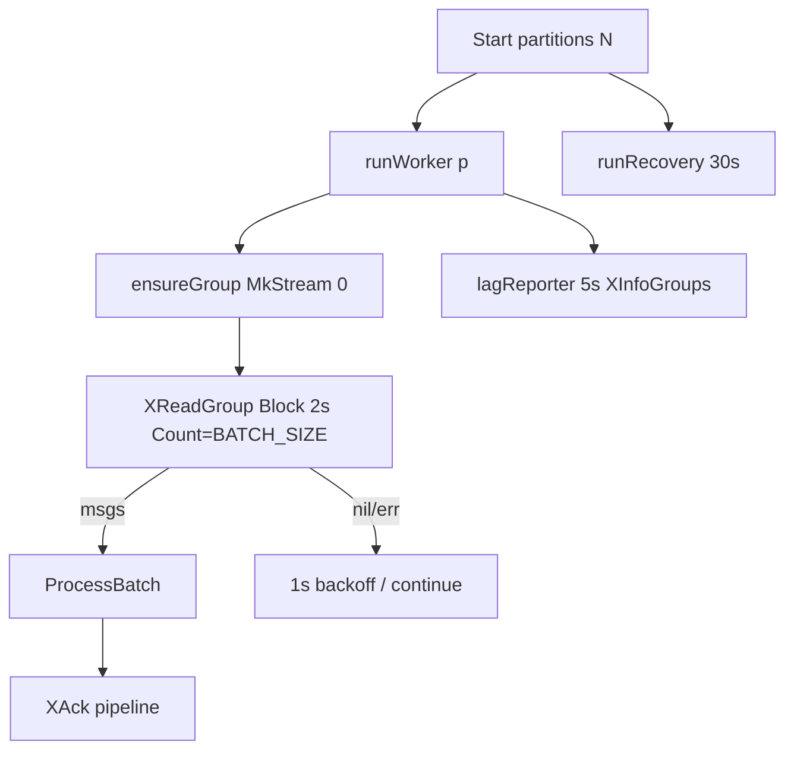
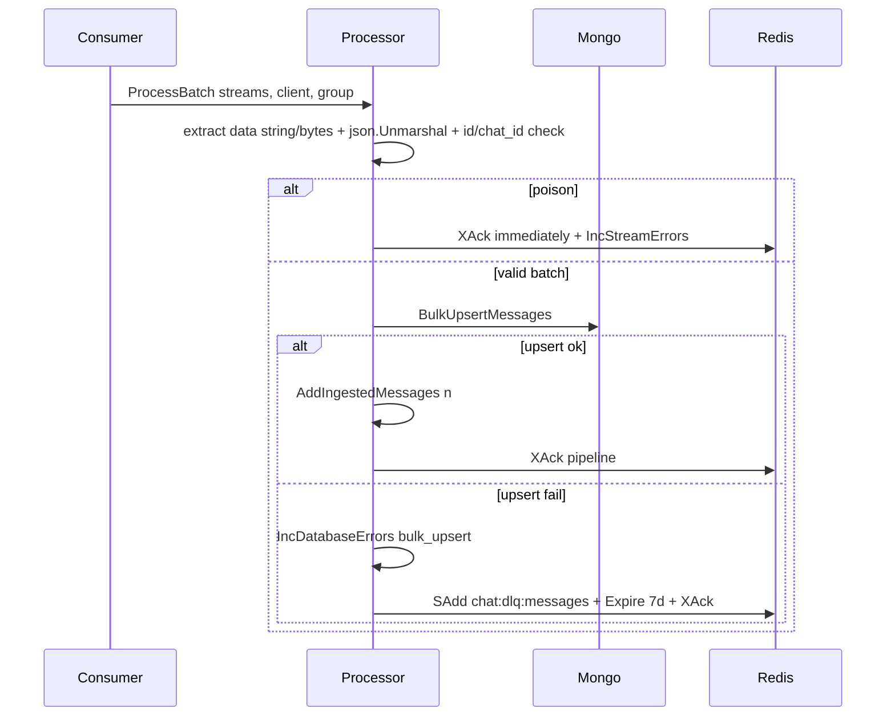

# Worker

`SERVICE_ROLE=worker` runs `Consumer.Start` — one goroutine per partition + one recovery loop (`consumer.go:48`).

## Consume loop

Consumer names are unique per restart (`hostname-p<id>-<rand>`) so crashed consumers leave PEL entries for recovery instead of blocking the group.

## ProcessBatch (`processor.go:32`)

* Empty batch with only poison still `XAck`s via pipeline so streams never wedge; `ack` failures only log + metric.
* `BulkUpsertMessages` skips `nil/empty id/chat_id`, fills zero `CreatedAt=now`, then per-message upsert into bucketed `messages` collection (see `03-internals` split: persistence lives in mongo buckets, capacity `50`, window `24h`).
* DLQ is a `SET chat:dlq:messages` (message stream-IDs, not payloads) with `DLQTTL 7d`; count via `chat_dlq_messages_total`.

## Recovery (`runRecovery`)

Every `RecoveryInterval 30s`, per partition `XAutoClaim MinIdle RecoveryIdle 60s Count 50` from `0-0` until cursor `0-0`, re-`ProcessBatch`ing claimed entries as `<host>-recover-
`. Handles worker crash/network blip where PEL entries outlive the consumer. `NOGROUP` during autoclaim is ignored (group recreated by `runWorker`).

Tuning: raise `BATCH_SIZE (1..500)` for throughput (memory + mongo bulk time), `STREAM_PARTITION_COUNT (1..128)` for parallelism (more goroutines + streams), lower `RecoveryIdle` for faster steal (duplicate-processing risk — upsert is idempotent by `message_id`).
