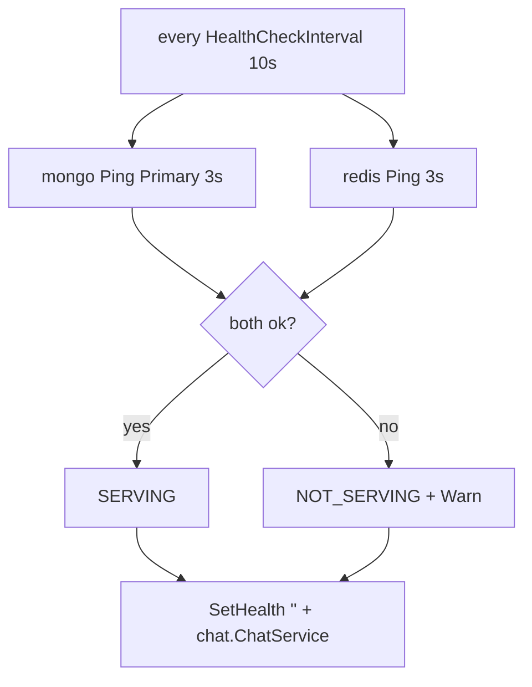

# Health

## Runtime health ticker (api only)

`main.go:70` — failures only `Warn`, never crash; `grpc.Server.SetHealth` flips both `""` and `chat.ChatService` (`server.go:76`). Reflection enabled only when `APP_ENV != production`.

## Probes

| Layer | Check | Interval |
|---|---|---|
| `mongo-chat` atom | `mongosh --eval db.adminCommand('ping')` | `10s/5s/10r/10s start` |
| `redis-chat` atom | `redis-cli -a $PASS ping` | `5s/3s/10r` |
| `chat-service/worker` compose | `wget .../localhost:9091|9099/metrics` | `30s/10s/3r/20s start` |
| gRPC | `health.v1.Health/Check` `SERVING/NOT_SERVING` | on demand |

Compose `depends_on: mongo-chat/redis-chat service_healthy` gates `chat-service/worker`; load `k6 depends_on chat-service service_healthy` (`infra/compose.load.yml:99`).

## Ports

* `mongo-chat 27018:27017`, `redis-chat 6381:6379` in `infra/compose.yml:10` (isolated from `postgres-users:5432 / redis-users:6379`); load internal-only (no host ports, `chat_loadnet`).
* `chat-service 50052:50051 + 9095:9091`, `chat-worker 9099:9099`; `/metrics` doubles as liveness, `/healthz → ok` in `prometheus.go:120` (metrics server, not gRPC health).
