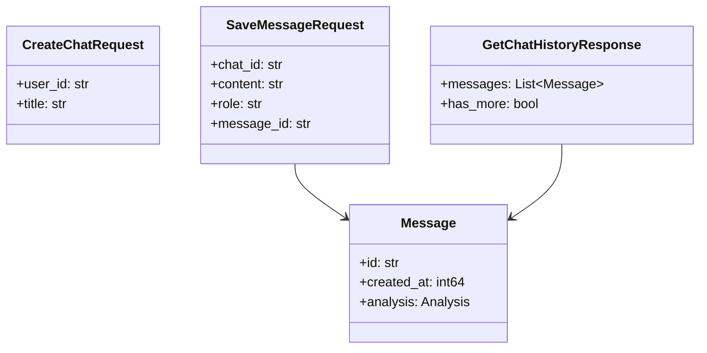

# API

Proto: `../api/proto/chat_service.proto` (`package chat;`).

## Proto

```protobuf
service ChatService {
  rpc CreateChat (CreateChatRequest) returns (CreateChatResponse);
  rpc GetChat (GetChatRequest) returns (GetChatResponse);
  rpc GetUserChats (GetUserChatsRequest) returns (GetUserChatsResponse);
  rpc RenameChat (RenameChatRequest) returns (RenameChatResponse);
  rpc DeleteChat (DeleteChatRequest) returns (DeleteChatResponse);
  rpc SaveMessage (SaveMessageRequest) returns (SaveMessageResponse);
  rpc GetChatHistory (GetChatHistoryRequest) returns (GetChatHistoryResponse);
}
message CreateChatRequest { string user_id = 1; string title = 2; }
message CreateChatResponse { string chat_id = 1; }
message GetChatResponse { string id = 1; string user_id = 2; string title = 3; int64 created_at = 4; int64 updated_at = 5; }
message GetUserChatsRequest { string user_id = 1; int32 limit = 2; }
message ChatSummary { string id = 1; string title = 2; int64 updated_at = 3; }
message SaveMessageRequest { string chat_id = 1; string user_id = 2; string role = 3; string content = 4; map<string,string> metadata = 5; Analysis analysis = 6; string message_id = 7; int64 created_at = 8; }
message Analysis { double human_score = 1; double ai_score = 2; string model_name = 3; string verdict = 4; }
message Message { string id = 1; string chat_id = 2; string user_id = 3; string role = 4; string content = 5; int64 created_at = 6; map<string,string> metadata = 7; Analysis analysis = 8; }
message GetChatHistoryRequest { string chat_id = 1; int32 page = 2; int32 page_size = 3; }
message GetChatHistoryResponse { repeated Message messages = 1; bool has_more = 2; }
```

## Endpoints

| Method | Request | Response | Notes |
|---|---|---|---|
| `ChatService/CreateChat` | `user_id, title` | `chat_id` (uuid) | Sync mongo `InsertOne` |
| `ChatService/GetChat` | `chat_id` + `x-user-id` | `id/user_id/title/created/updated` | Ownership checked |
| `ChatService/GetUserChats` | `user_id, limit` | `chats[]` desc `updated_at` | `limit 50 default/100 max` |
| `ChatService/RenameChat` | `chat_id, new_title` | `success` | Ownership + title len |
| `ChatService/DeleteChat` | `chat_id` + `x-user-id` | `success` | Deletes chats + messages + cache |
| `ChatService/SaveMessage` | `chat_id/user_id/role/content/metadata/analysis/message_id/created_at` | `message_id, timestamp` | Async: `XAdd` + cache, worker persists |
| `ChatService/GetChatHistory` | `chat_id, page, page_size` | `messages[] desc + has_more` | Page-1 hot merge, else cold |
| `grpc.health.v1.Health/Check` | `""` / `chat.ChatService` | `SERVING/NOT_SERVING` | Flipped by 10s ticker |
| `GET :9091|9099/metrics` | — | Prometheus text | scrape |
| `GET :9091|9099/healthz` | — | `ok` | metrics-server liveness |



## Status codes

| Code | When |
|---|---|
| `OK` | Valid response (empty history = `OK` with `[]`, not `NotFound`) |
| `INVALID_ARGUMENT` | nil body, empty `chat_id/content/title`, `>200/20000/20` lens, bad role, future `created_at>+5m` |
| `UNAUTHENTICATED` | missing `x-user-id` and `user_id` |
| `PERMISSION_DENIED` | header/body mismatch, or not owner |
| `NOT_FOUND` | `ErrNotFound` from mongo get/update/delete |
| `DEADLINE_EXCEEDED/CANCELED` | `RequestTimeout 10s` ctx passthrough |
| `INTERNAL` | DB/stream failure after metrics inc |

## Validation notes

* `message_id` empty→server `uuid.New()`; returned `Timestamp` is authoritative `msg.CreatedAt.Unix()` (not echo).
* `created_at` accepts seconds or millis (`>1e11`→`UnixMilli`), normalized UTC.
* `role` empty→`user`; unknown→`InvalidArgument`.
* History `has_more = len==limit` (trimmed merge forces `true`).

Generate code: `make proto` (`protoc --go_out --go-grpc_out paths=source_relative`). Files `api/proto/*.pb.go` committed.
