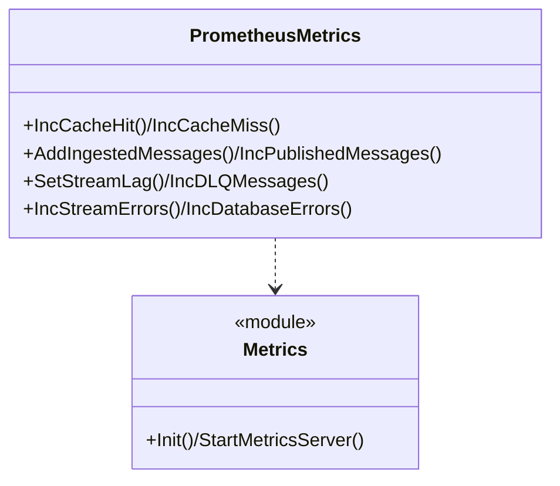

# Observability

Logs are `zap` JSON to stdout (`logger.Init(APP_ENV)`). Metrics at `GET :9091/metrics` (api) and `:9099/metrics` (worker) for Prometheus.

## Logs

* `pkg/logger/zap.go` — `APP_ENV=production` → JSON prod encoder, else dev console; `logger.Log` global used in `main.go`, usecase (`failed to create/publish`), processor (poison `Warn`, bulk fail `Error`), consumer (`XReadGroup failed`).
* Slow requests: `SlowRequestThreshold 500ms` in `limits.go` (search `LoggingInterceptor` in `grpc/middleware.go`).

## Metrics

All `prometheus/client_golang` at `:9091/:9099` (`StartMetricsServer` in `pkg/metrics/prometheus.go:117`, `Init()` once-guarded). Safe for tests via `NewPrometheusMetrics` wrapper.

| Metric | Type | Labels | Description |
|---|---|---|---|
| `chat_messages_ingested_total` | Counter | — | `BulkUpsert` success count (`AddIngestedMessages`) |
| `chat_messages_published_total` | Counter | — | `XAdd` success count |
| `chat_redis_stream_lag` | GaugeVec | `partition` (`global:ingest:{p}`) | `XInfoGroups Lag` every `5s` per worker |
| `chat_cache_hits_total` | Counter | — | page-1 hot hit |
| `chat_cache_misses_total` | Counter | — | page-1 miss / fallback |
| `grpc_request_duration_seconds` | HistogramVec `DefBuckets` | `method, status` | gRPC latency (`LoggingInterceptor`) |
| `chat_dlq_messages_total` | Counter | — | moved to `chat:dlq:messages` |
| `chat_stream_errors_total` | CounterVec | `operation` (`publish/read/ack/autoclaim/missing_data/unmarshal/invalid_message/dlq_push`) | stream failures |
| `chat_database_errors_total` | CounterVec | `operation` (`create_chat/get_chat/get_user_chats/update_chat_title/delete_chat/get_history/bulk_upsert`) | mongo failures |

Short version groups these as ingest/publish/lag/cache/latency/DLQ/errors.

## Dashboards and alerts

* Scrape `chat-service:9091`, `chat-worker:9099`; Grafana `07-chat-service-overview.json` + `08-chat-worker-overview.json` use `chat_redis_stream_lag`, `grpc_request_duration_seconds`, ingest/publish rates.
* Alerts derived:

| Alert | Expr |
|---|---|
| Chats down | `up{job=~"chats.*"}==0` for `2m` |
| High error rate | `rate(chat_stream_errors_total[5m])+rate(chat_database_errors_total[5m]) >0.05` |
| High latency | `histogram_quantile(0.95, grpc_request_duration_seconds) >0.5` for `10m` |
| Stream lag | `max(chat_redis_stream_lag) >100` for `5m` |
| DLQ growing | `increase(chat_dlq_messages_total[15m])>0` |
| Cache miss spike | `rate(chat_cache_misses_total[5m])/rate(chat_cache_hits_total[5m]+chat_cache_misses_total[5m]) >0.8` for `10m` |

## Class view

