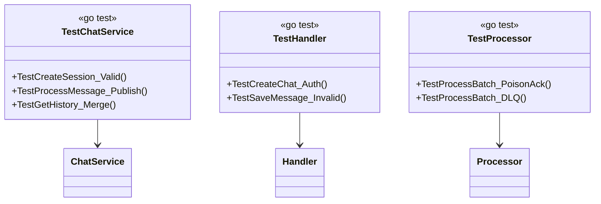

# Testing

## Commands

All `make` wrappers — see `../Makefile`:

```bash
# Generate gRPC code from proto
make proto

# Run unit tests (no Docker)
make test

# Run with coverage
make test-coverage

# Run standalone integration (testcontainers mongo:7 + redis:7-alpine)
make test-integration

# Run HA integration (same images, HA flags: RS + auth + primary-replica, -tags ha)
make test-ha

# Run all (integration + HA)
make test-all

# Build images (uses infra/compose.yml via docker compose)
make docker-build

# Self-contained load (mongo-chat + redis-chat + service + worker + k6)
make load-test SCENARIO=smoke VUS=1 DURATION=10s RPS=5
make load-down
```

## Unit

```
internal/adapters/grpc/handler_test.go
internal/core/usecase/chat_service_test.go
internal/adapters/mongo/repository_test.go
internal/adapters/redis/cache_repo_test.go
internal/adapters/redis/stream_repo_test.go
internal/adapters/worker/processor_test.go
```

`go test -v ./...` with `internal/mocks/*_mock.go` (`repository_mock`, `service_mock`, `metrics_mock`). Coverage via `go test -v ./... -cover`.

## Tiers

| Tier | Tag | Images | Topology | What it locks | When |
|---|---|---|---|---|---|
| **Unit** | *(none)* | no Docker | mocks (`redismock.NewClientMock` etc.) | handler/usecase validation, processor DLQ | every `make test` |
| **Integration** | `integration` | `mongo:7` + `redis:7-alpine` | single-node standalone | CRUD, streams, cache, worker happy paths | `make test-integration` (PR fast) |
| **HA** | `ha` | same `mongo:7` / `redis:7-alpine` | RS (`--replSet rs0`) / auth (`--requirepass`) / primary+replica (`--replicaof`) | auth/TLS, RS `replicaSet`/`retryWrites=false`/`15s` timeout, shard-key isolation (`chat_id`), `EnsureSharding` idempotent, Lua single-shard, failover `IsRedisConnError` + worker resilience | `make test-ha` (pre-ship, ~1 container each) |

Managed HA hosting (ElastiCache `1+1 primary-for-all` `cluster-disabled` in `infra/terraform/modules/elasticache/main.tf:1`; DocumentDB `standalone/elastic→MONGO_MODE` in `modules/docdb/main.tf:1`) is not re-hosted as Sentinel/mongos — HA suite tests *config + logic* (same binary, different `*config.Config`/`*redis.Client` flags) not infra.

## Integration

`tests/integration/chat_flow_test.go` + `internal/testutil/containers.go` (testcontainers mongo/redis) and `internal/adapters/worker/worker_integration_test.go`. Run via `make test-integration` (`-tags integration`); needs Docker.

## HA

`internal/testutil/containers_ha.go` provides HA fixtures on same images:

* `NewMongoRSFixture` — `mongod --replSet rs0` + `rs.initiate()` single-node RS, `?replicaSet=rs0&retryWrites=false&directConnection=true` URI, `15s` sharded timeout path.
* `NewRedisAuthFixture(password)` — `redis-server --requirepass` (ElastiCache `auth_token` via `CHAT_REDIS_ADDR` + `REDIS_PASSWORD`).
* `NewRedisPrimaryReplicaFixture` — primary `--requirepass` + replica `--replicaof redis-primary --masterauth` on isolated network, `primary.Addr` is `CHAT_REDIS_ADDR` (primary-for-all).

Tests (`-tags ha`, `TestHA_*`):

* `internal/adapters/mongo/ha_test.go` — `EnsureSharding` idempotent + soft-skip on RS, shard-key isolation (`GetHistory` never leaks cross-`chat_id`), `BulkUpsert` idempotent + large-batch bucketing on RS, `database.ConnectMongo` HA pool (`20/5/15s` sharded vs `100/10/5s` standalone).
* `internal/adapters/redis/ha_test.go` — `Publish`/`SaveToCache` under AUTH via `redis.NewClient`+`*config.Config`, primary-replica kill (replica termination → primary still serves), wrong-password rejection, Lua dedup single-shard, `IsRedisConnError` + partition `crc32` isolation.
* `internal/adapters/worker/ha_test.go` — worker on RS+auth (full path), resilience to `STOP` (no panic, `XReadGroup` error loop), poison + isolation under HA, large-batch (`60` msgs) on RS.
* Extra `Config` is test-only `&config.Config{RedisAddr, RedisPassword, MongoMode:"sharded", ...}` — never wired into `infra/compose*.yml`; prod code has no `if HA` branches.

## Load

See `../tests/load/README.md` for `VUS/DURATION/RPS` single knob:

| Scenario | File | Shape | Thresholds |
|---|---|---|---|
| `smoke` | `scenarios/smoke.js` | `1` VU `10s` | `rate==1.0` |
| `load` | `scenarios/load.js` | ramp `30s:10` + `2m:10` + down | `rate>=0.99 p95<100 p99<250 getHistory p95<200` |
| `stress` | `scenarios/stress.js` | `20%→50%→100% 50VUs 5m` | shed watch |
| `soak` | `scenarios/soak.js` | `5` VUs `10m` | `rate>=0.99` |

```bash
make load-test SCENARIO=smoke VUS=1 DURATION=10s
make load-test SCENARIO=load VUS=10 DURATION=2m RPS=50
```

Each VU does `CreateChat → SaveMessage ×N → GetHistory/GetUserChats`; e2e smoke polls `GetHistory` until `message_id` appears (`E2E_TIMEOUT 5000/POLL 200`).

## Class under test


