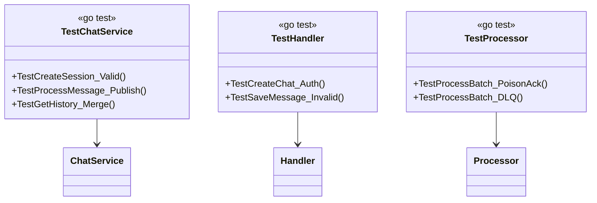

# Testing

## Commands

All `make` wrappers — see `../Makefile`:

```bash
# Generate gRPC code from proto
make proto

# Run unit tests
make test

# Run with coverage
make test-coverage

# Build images (uses infra/compose.yml via docker compose)
make docker-build

# Self-contained load (mongo-chat + redis-chat + service + worker + k6)
make load-test SCENARIO=smoke VUS=1 DURATION=10s RPS=5
make load-down
```

## Unit

```
internal/adapters/grpc/handler_test.go
internal/core/usecase/chat_service_test.go
internal/adapters/mongo/repository_test.go
internal/adapters/redis/cache_repo_test.go
internal/adapters/redis/stream_repo_test.go
internal/adapters/worker/processor_test.go
```

`go test -v ./...` with `internal/mocks/*_mock.go` (`repository_mock`, `service_mock`, `metrics_mock`). Coverage via `go test -v ./... -cover`.

## Integration

`tests/integration/chat_flow_test.go` + `internal/testutil/containers.go` (testcontainers mongo/redis) and `internal/adapters/worker/worker_integration_test.go`. Run via `go test -v ./...` (build tags as configured); needs Docker.

## Load

See `../tests/load/README.md` for `VUS/DURATION/RPS` single knob:

| Scenario | File | Shape | Thresholds |
|---|---|---|---|
| `smoke` | `scenarios/smoke.js` | `1` VU `10s` | `rate==1.0` |
| `load` | `scenarios/load.js` | ramp `30s:10` + `2m:10` + down | `rate>=0.99 p95<100 p99<250 getHistory p95<200` |
| `stress` | `scenarios/stress.js` | `20%→50%→100% 50VUs 5m` | shed watch |
| `soak` | `scenarios/soak.js` | `5` VUs `10m` | `rate>=0.99` |

```bash
make load-test SCENARIO=smoke VUS=1 DURATION=10s
make load-test SCENARIO=load VUS=10 DURATION=2m RPS=50
```

Each VU does `CreateChat → SaveMessage ×N → GetHistory/GetUserChats`; e2e smoke polls `GetHistory` until `message_id` appears (`E2E_TIMEOUT 5000/POLL 200`).

## Class under test


