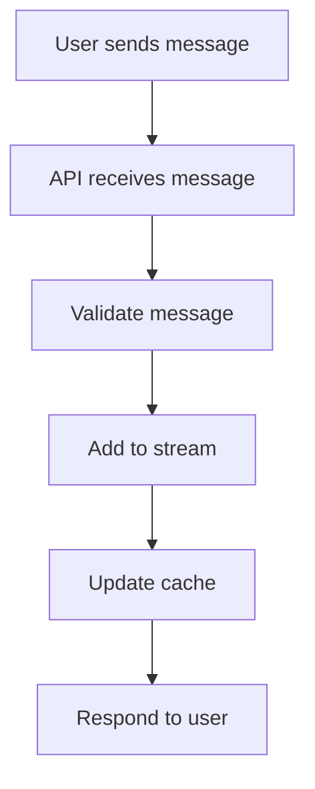
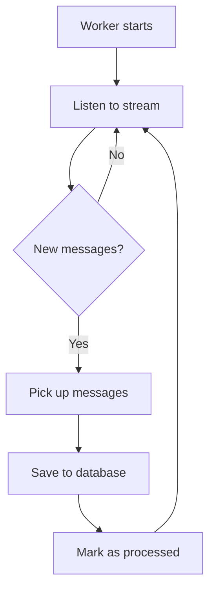
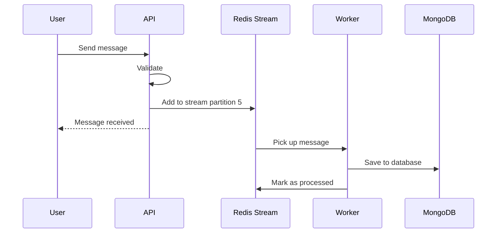

# Streaming

This document explains how the Chats service uses streams to handle messages efficiently.

## What is Streaming?

Streaming is like a conveyor belt in a factory. Instead of processing each item one at a time (which could be slow), you put items on the belt and process them in batches later.

The Chats service uses **Redis Streams** as this conveyor belt to handle messages.

## Why Use Streams?

When a user sends a message, we want to respond quickly. But saving to the database takes time. Streams solve this problem:

**Without streams:**
1. User sends message
2. Wait for database save (slow)
3. Tell user "message saved"

**With streams:**
1. User sends message
2. Put message on stream (fast)
3. Tell user "message received"
4. Later: Worker saves to database

The user gets a fast response, and the message is saved reliably in the background.

## How Streaming Works

### Sending Messages



**What happens:**
1. User sends a message
2. API validates the message
3. API adds the message to a Redis Stream
4. API updates the cache
5. API immediately responds to the user

### Receiving Messages (Worker)



**What happens:**
1. Worker starts and connects to the stream
2. Worker waits for new messages
3. When messages arrive, worker picks them up
4. Worker saves messages to the database
5. Worker marks messages as processed
6. Worker continues listening

## Stream Organization

### Partitions

The service splits messages into multiple streams called **partitions**. This helps with performance:

```
Stream 1: global:ingest:0
Stream 2: global:ingest:1
Stream 3: global:ingest:2
...
Stream 16: global:ingest:15
```

**How messages are assigned:**
- Each message has a `chat_id`
- The service calculates `crc32(chat_id) % 16`
- This determines which stream the message goes to

**Why partitions help:**
- Multiple workers can process different streams simultaneously
- Messages from the same chat stay in order
- Better performance under heavy load

### Stream Limits

| Setting | Value | Why |
|---------|-------|-----|
| Maximum messages per stream | 100,000 | Prevents memory issues |
| Trim mode | Approximate | Better performance |

The stream automatically removes old messages when it gets too full.

## Message Flow Example

Let's trace a message from user to database:



## Failure Handling

What happens when something goes wrong?

| Failure | What Happens | Recovery |
|---------|--------------|----------|
| Stream write fails | API returns error | User retries |
| Worker crashes | Messages stay in stream | Worker restarts and processes them |
| Database write fails | Message stays in stream | Worker retries |
| Message is corrupted | Message is acknowledged | Skipped (logged as error) |

**Key point:** Messages are only removed from the stream after they're successfully saved to the database.

## Monitoring

The service tracks stream health:

| Metric | What It Tells You |
|--------|-------------------|
| `chat_redis_stream_lag` | How many messages are waiting to be processed |
| `chat_stream_errors_total` | How many stream operations failed |
| `chat_messages_published_total` | How many messages were added to streams |

## Configuration

You can adjust streaming behavior:

```bash
# Number of partitions (streams)
STREAM_PARTITION_COUNT=16

# How many messages to process at once
BATCH_SIZE=50

# How long to wait for new messages
ReadBlockDuration=2s
```

## Troubleshooting

**Messages not appearing in database?**
- Check if worker is running
- Look at stream lag metric
- Check worker logs for errors

**High stream lag?**
- Worker might be slow (check database performance)
- Increase `BATCH_SIZE` for faster processing
- Add more partitions for better parallelism

**Stream errors?**
- Check Redis connectivity
- Verify Redis has enough memory
- Look at error logs for specific failures

## Next Steps

- [Worker](worker.md) - How the worker processes messages
- [Health](../operations/health.md) - How to monitor the service
- [Observability](../operations/observability.md) - Metrics and alerts
