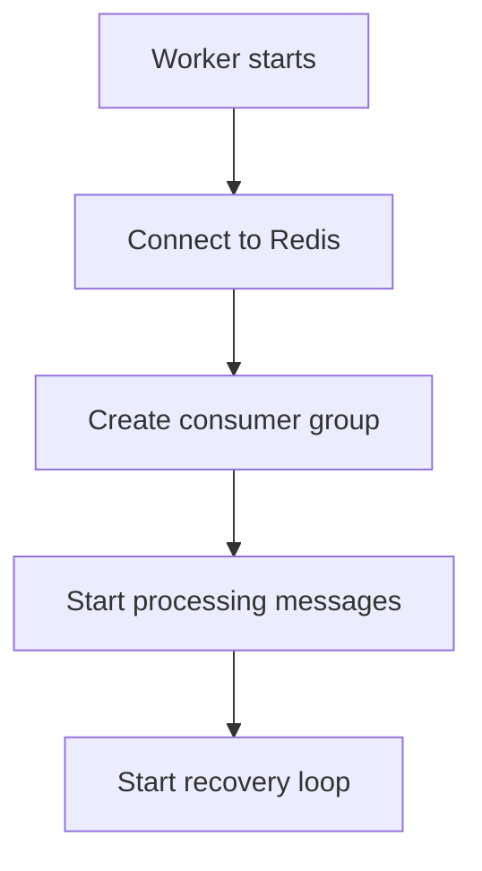
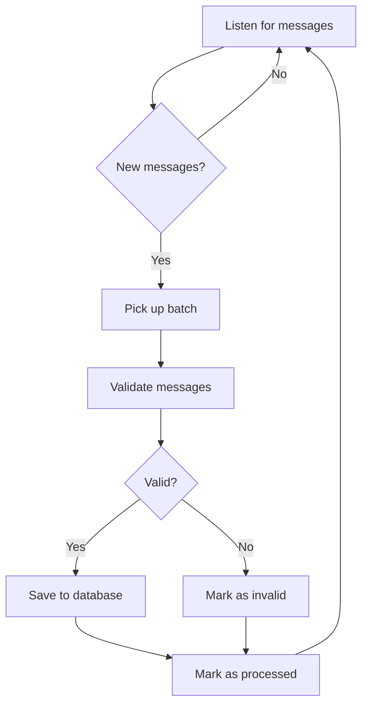
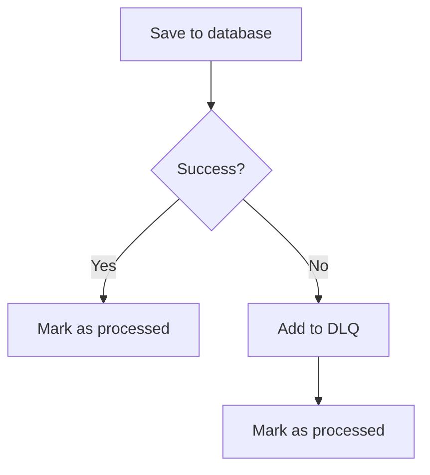

# Worker

This document explains how the Worker processes messages in the background.

## What is the Worker?

The Worker is a background process that picks up messages from the stream and saves them to the database. Think of it as a diligent assistant that handles tasks while the main service focuses on responding to users.

## Why Have a Worker?

The Worker exists to:
- **Keep the API fast** - Users don't wait for database operations
- **Handle failures gracefully** - If the database is slow, messages queue up
- **Process messages in batches** - More efficient than one at a time
- **Ensure reliability** - Messages are saved even if the API restarts

## How the Worker Works

### Starting Up

When the Worker starts:



1. Connects to Redis
2. Creates a "consumer group" (a way to track which messages have been processed)
3. Starts listening for new messages
4. Starts a recovery loop to handle missed messages

### Processing Messages

The Worker processes messages in batches:



**What happens:**
1. Worker listens for new messages
2. When messages arrive, Worker picks up a batch (up to 50 messages)
3. Worker validates each message
4. Valid messages are saved to MongoDB
5. Invalid messages are marked and skipped
6. Worker marks messages as processed
7. Worker continues listening

### Batch Processing

Why process messages in batches?

| Approach | Pros | Cons |
|----------|------|------|
| One at a time | Simple | Slow, many database calls |
| In batches | Fast, fewer database calls | More complex |

The Worker uses batch processing for better performance.

## Error Handling

What happens when something goes wrong?

### Database Failures



If saving to the database fails:
1. Message is added to the Dead Letter Queue (DLQ)
2. Message is marked as processed (so it doesn't block other messages)
3. Error is logged for investigation

### Invalid Messages

Messages that can't be processed are:
- Marked as invalid
- Added to the DLQ
- Skipped so other messages can be processed

### Recovery

If the Worker crashes and restarts:
1. It checks for messages that were picked up but not processed
2. It reprocesses these messages
3. This ensures no messages are lost

## Dead Letter Queue (DLQ)

The DLQ is a safety net for messages that can't be processed:

| Aspect | Details |
|--------|---------|
| What it stores | Message IDs (not full messages) |
| How long kept | 7 days |
| When messages are added | Processing fails |
| How to check | `chat_dlq_messages_total` metric |

**Why store only IDs?**
- Saves memory
- Full messages are in the database or stream
- IDs are enough to investigate issues

## Monitoring the Worker

| Metric | What It Tells You |
|--------|-------------------|
| `chat_messages_ingested_total` | How many messages were saved |
| `chat_stream_errors_total` | How many stream operations failed |
| `chat_database_errors_total` | How many database operations failed |
| `chat_dlq_messages_total` | How many messages are in the DLQ |
| `chat_redis_stream_lag` | How many messages are waiting to be processed |

## Configuration

You can adjust Worker behavior:

```bash
# How many messages to process at once
BATCH_SIZE=50

# How many partitions to listen to
STREAM_PARTITION_COUNT=16

# How long to wait for new messages
ReadBlockDuration=2s

# How often to check for missed messages
RecoveryInterval=30s
```

## Troubleshooting

**Worker not processing messages?**
- Check if Worker is running
- Verify Redis connectivity
- Look at Worker logs for errors

**High stream lag?**
- Worker might be slow (check database performance)
- Increase `BATCH_SIZE` for faster processing
- Add more partitions for better parallelism

**Many messages in DLQ?**
- Check database health
- Look at error logs for specific failures
- Investigate invalid messages

**Worker crash loop?**
- Check Redis and MongoDB connectivity
- Verify configuration is correct
- Look at logs for startup errors

## Next Steps

- [Health](../operations/health.md) - How to monitor the service
- [Observability](../operations/observability.md) - Metrics and alerts
- [Testing](../testing/overview.md) - How to test the Worker
