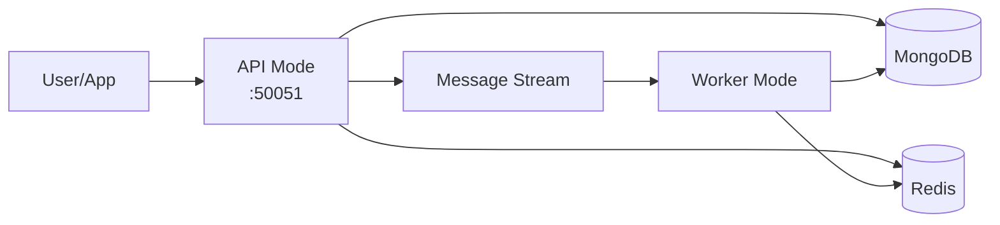
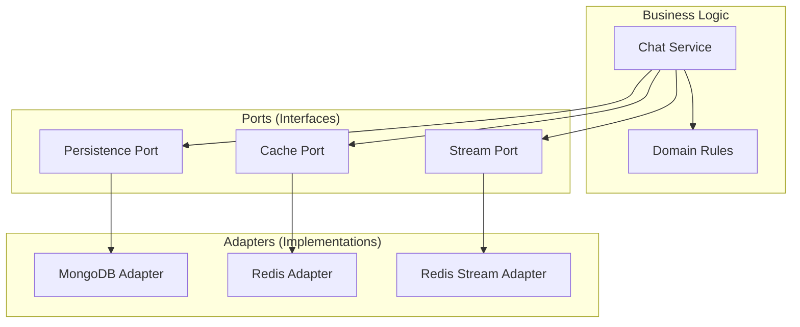
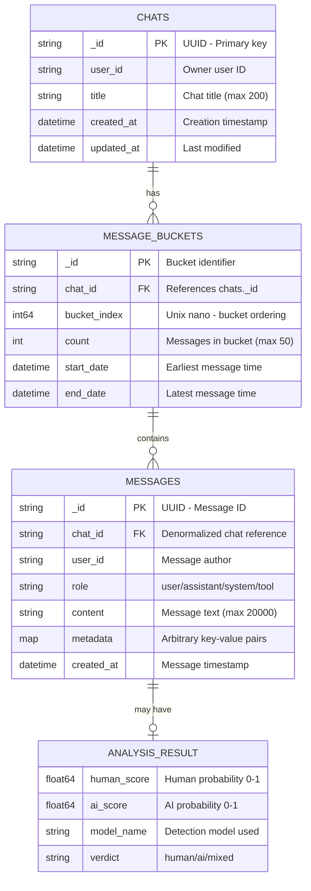
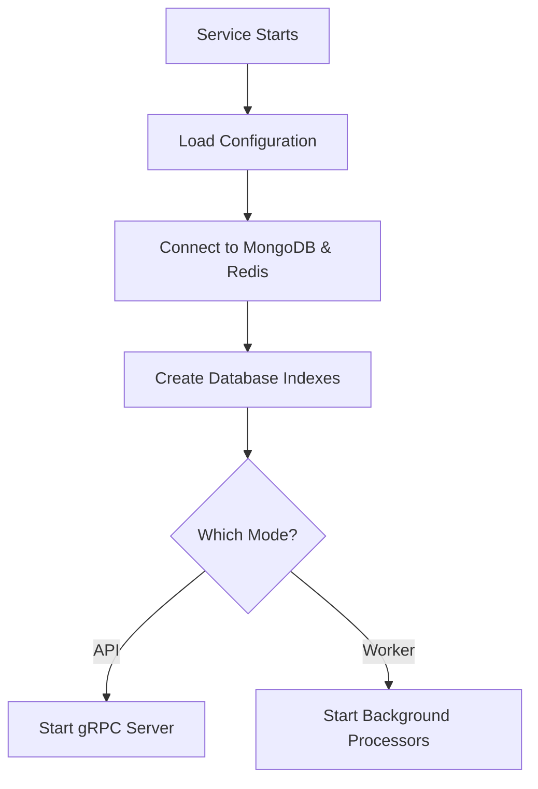

# Architecture

This document explains how the Chats service is structured and why it's designed this way.

## Overview

The Chats service stores chat conversations. It's built as a single program that can run in two different modes:

1. **API Mode** - Handles requests from users (like creating chats and saving messages)
2. **Worker Mode** - Processes messages in the background (saving them to the database)



**Why two modes?**
- **API mode** needs to respond quickly to users
- **Worker mode** can take time to process many messages
- Separating them lets each do its job well

## How the Code is Organized

The service uses "hexagonal architecture" (also called "ports and adapters"). This means:

- **Business logic** is in the center (the "hexagon")
- **External systems** (databases, caches, APIs) connect through "ports"
- Each external system has an "adapter" that connects it to the business logic



**Why this pattern?**
- Easy to test (can swap real databases with fakes)
- Easy to change external systems (swap MongoDB for PostgreSQL)
- Business logic stays clean and focused

## Project Structure

```
chats/
├── api/proto/              # API definition (what the service can do)
├── internal/
│   ├── config/            # Configuration (settings)
│   ├── core/
│   │   ├── domain/        # Business rules and data structures
│   │   ├── ports/         # Interfaces for external systems
│   │   └── usecase/       # Business logic
│   ├── adapters/          # Connections to external systems
│   │   ├── grpc/          # gRPC API handler
│   │   ├── mongo/         # MongoDB connection
│   │   ├── redis/         # Redis connection (cache + streams)
│   │   └── worker/        # Background worker
│   └── mocks/             # Test doubles
├── tests/                 # Test files
└── docs/                  # This documentation
```


## Data Model

The Chats service uses MongoDB with two collections. Messages use a **bucket pattern** for efficient storage and retrieval.

### ER Diagram



### Collections

#### `chats`
Stores chat session metadata. One document per chat.

| Field | Type | Description |
|-------|------|-------------|
| `_id` | string | UUID primary key |
| `user_id` | string | Owner of the chat |
| `title` | string | Chat title (max 200 characters) |
| `created_at` | datetime | When the chat was created |
| `updated_at` | datetime | Last modification timestamp |

**Indexes:**
- `(user_id ASC, updated_at DESC)` - Fetch user's chats sorted by recent activity

#### `messages`
Stores messages using the **bucket pattern**. Messages are grouped into buckets of up to 50, not stored as individual documents.

| Field | Type | Description |
|-------|------|-------------|
| `_id` | string | Bucket identifier |
| `chat_id` | string | Foreign key to `chats._id` |
| `bucket_index` | int64 | Unix nano timestamp for bucket ordering |
| `count` | int | Current message count (max 50) |
| `start_date` | datetime | Timestamp of earliest message |
| `end_date` | datetime | Timestamp of latest message |

**Indexes:**
- `(chat_id ASC, bucket_index DESC)` - Primary query: fetch buckets for a chat
- `(chat_id ASC, messages._id ASC)` - Upsert: check if message exists
- `(chat_id ASC, count ASC, end_date ASC)` - Upsert: find bucket with room

**Sharding:** When `MONGO_MODE=sharded`, sharded on `chat_id` (hashed) for targeted queries.

#### Embedded `Message` Sub-document

Each bucket contains an array of Message sub-documents:

| Field | Type | Description |
|-------|------|-------------|
| `_id` | string | UUID message ID |
| `chat_id` | string | Denormalized chat reference |
| `user_id` | string | Who sent the message |
| `role` | string | `user`, `assistant`, `system`, or `tool` |
| `content` | string | Message text (max 20,000 characters) |
| `metadata` | map | Arbitrary key-value pairs |
| `analysis` | object | Optional AI detection results |
| `created_at` | datetime | Message timestamp |

#### Embedded `AnalysisResult` Sub-document

Optional AI detection analysis attached to messages:

| Field | Type | Description |
|-------|------|-------------|
| `human_score` | float64 | Probability text is human-written (0.0-1.0) |
| `ai_score` | float64 | Probability text is AI-generated (0.0-1.0) |
| `model_name` | string | Which detection model was used |
| `verdict` | string | `human`, `ai`, or `mixed` |

### Bucket Pattern Explained

Instead of storing one document per message (which creates millions of small documents), messages are grouped into **buckets**:

- **Max 50 messages per bucket** (`BucketCapacity = 50`)
- **24-hour time window** (`BucketWindow = 24h`)
- **Embedded array** of messages within each bucket

**Benefits:**
- Fewer documents to scan (50 messages = 1 document)
- Better read performance (single document fetch for 50 messages)
- Reduced index size
- Atomic updates within a bucket

**How upserting works:**
1. Try to update existing message (idempotent)
2. Find bucket with room (`count < 50`) and within time window
3. If no bucket exists, create new bucket

**How reading works:**
1. Fetch buckets sorted by `bucket_index DESC` (newest first)
2. Flatten embedded messages into a single list
3. Sort in-memory by `created_at DESC`
4. Apply offset/limit for pagination

## How the Service Starts

When the service starts, it:

1. **Loads configuration** - Reads settings from environment variables
2. **Connects to databases** - Connects to MongoDB and Redis
3. **Creates indexes** - Ensures database indexes exist for fast queries
4. **Starts based on role**:
   - **API mode**: Starts gRPC server to handle requests
   - **Worker mode**: Starts background processors to handle messages



## Key Components

### API Handler
- Receives requests from users
- Validates input
- Calls business logic
- Returns responses

### Chat Service
- Contains business logic
- Coordinates between cache, database, and streams
- Enforces rules (like user permissions)

### Cache Repository
- Stores recent messages in Redis (fast)
- Helps retrieve history quickly
- Automatically updates when new messages arrive

### Stream Repository
- Buffers messages temporarily
- Decouples API from worker
- Ensures messages aren't lost

### Worker
- Processes messages in the background
- Saves messages permanently to MongoDB
- Handles failures gracefully

## Why This Design?

| Benefit | Explanation |
|---------|-------------|
| **Testability** | Can test business logic without real databases |
| **Flexibility** | Can swap external systems without changing business logic |
| **Scalability** | Can scale API and worker independently |
| **Maintainability** | Clear separation of concerns |

## Next Steps

- [Request Flows](request-flows.md) - See how requests are processed
- [Configuration](../getting-started/configuration.md) - Learn about settings
- [API Reference](../components/api.md) - See the complete API
