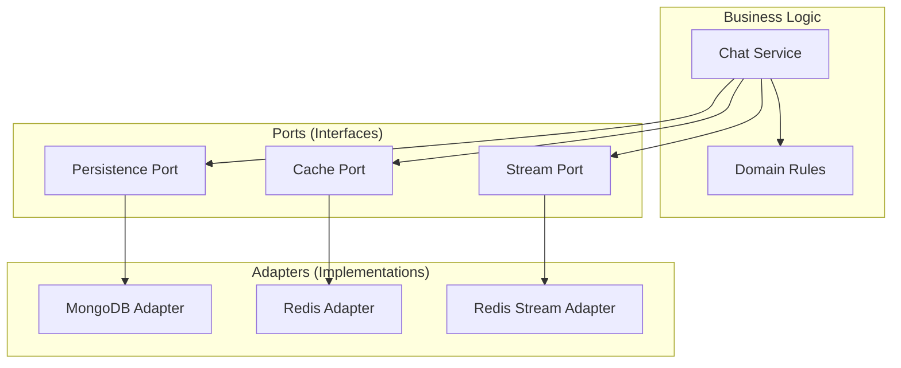
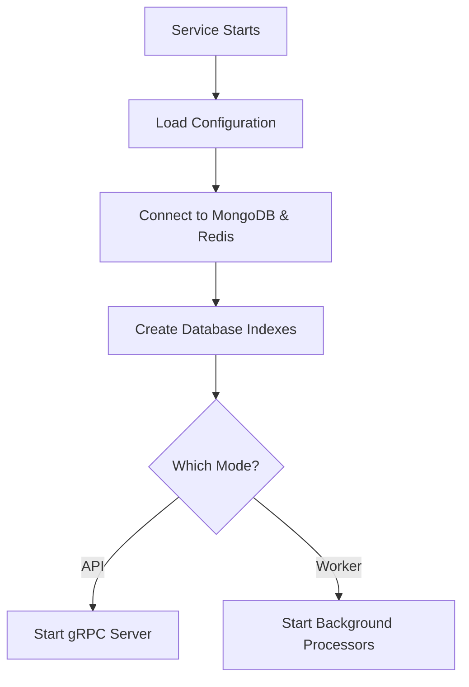

# Architecture

This document explains how the Chats service is structured and why it's designed this way.

## Overview

The Chats service stores chat conversations. It's built as a single program that can run in two different modes:

1. **API Mode** - Handles requests from users (like creating chats and saving messages)
2. **Worker Mode** - Processes messages in the background (saving them to the database)


**Why two modes?**
- **API mode** needs to respond quickly to users
- **Worker mode** can take time to process many messages
- Separating them lets each do its job well

## How the Code is Organized

The service uses "hexagonal architecture" (also called "ports and adapters"). This means:

- **Business logic** is in the center (the "hexagon")
- **External systems** (databases, caches, APIs) connect through "ports"
- Each external system has an "adapter" that connects it to the business logic



**Why this pattern?**
- Easy to test (can swap real databases with fakes)
- Easy to change external systems (swap MongoDB for PostgreSQL)
- Business logic stays clean and focused

## Project Structure

```
chats/
├── api/proto/              # API definition (what the service can do)
├── internal/
│   ├── config/            # Configuration (settings)
│   ├── core/
│   │   ├── domain/        # Business rules and data structures
│   │   ├── ports/         # Interfaces for external systems
│   │   └── usecase/       # Business logic
│   ├── adapters/          # Connections to external systems
│   │   ├── grpc/          # gRPC API handler
│   │   ├── mongo/         # MongoDB connection
│   │   ├── redis/         # Redis connection (cache + streams)
│   │   └── worker/        # Background worker
│   └── mocks/             # Test doubles
├── tests/                 # Test files
└── docs/                  # This documentation
```

## How the Service Starts

When the service starts, it:

1. **Loads configuration** - Reads settings from environment variables
2. **Connects to databases** - Connects to MongoDB and Redis
3. **Creates indexes** - Ensures database indexes exist for fast queries
4. **Starts based on role**:
   - **API mode**: Starts gRPC server to handle requests
   - **Worker mode**: Starts background processors to handle messages



## Key Components

### API Handler
- Receives requests from users
- Validates input
- Calls business logic
- Returns responses

### Chat Service
- Contains business logic
- Coordinates between cache, database, and streams
- Enforces rules (like user permissions)

### Cache Repository
- Stores recent messages in Redis (fast)
- Helps retrieve history quickly
- Automatically updates when new messages arrive

### Stream Repository
- Buffers messages temporarily
- Decouples API from worker
- Ensures messages aren't lost

### Worker
- Processes messages in the background
- Saves messages permanently to MongoDB
- Handles failures gracefully

## Why This Design?

| Benefit | Explanation |
|---------|-------------|
| **Testability** | Can test business logic without real databases |
| **Flexibility** | Can swap external systems without changing business logic |
| **Scalability** | Can scale API and worker independently |
| **Maintainability** | Clear separation of concerns |

## Next Steps

- [Request Flows](request-flows.md) - See how requests are processed
- [Configuration](../getting-started/configuration.md) - Learn about settings
- [API Reference](../components/api.md) - See the complete API
