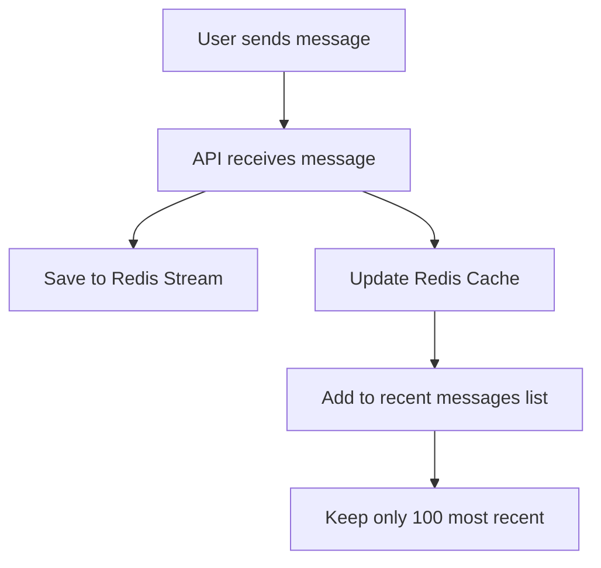
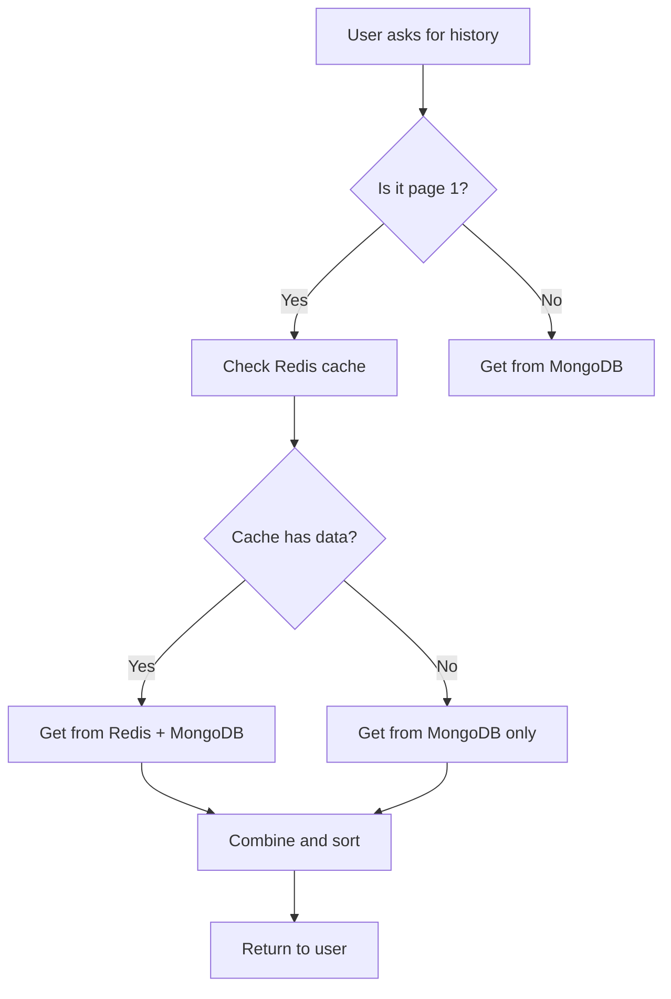

# Caching

This document explains how the Chats service uses caching to make responses faster.

## What is Caching?

Caching is like keeping frequently used items on your desk instead of in a filing cabinet. The filing cabinet (database) is reliable but slow. Your desk (cache) is fast but limited in space.

The Chats service uses **Redis** as its cache to store recent messages.

## Why Cache Messages?

When you open a chat, you usually want to see the most recent messages first. Without caching, every request would need to read from the database, which is slower.

**With caching:**
- Recent messages are served from Redis (fast)
- Older messages come from MongoDB (slower)
- Users get a better experience

## How Caching Works

### When Messages Are Saved



**What happens:**
1. User sends a message
2. API saves it to the stream (for the worker to process later)
3. API also updates the cache with the new message
4. Cache keeps only the 100 most recent messages
5. Old messages are automatically removed

### When Messages Are Retrieved



**What happens:**
1. User asks for chat history
2. If it's the first page, check the cache
3. If cache has recent messages, get them along with older messages from MongoDB
4. Combine everything and remove duplicates
5. Return to user

## Cache Details

### Storage Structure

The cache uses a **sorted set** in Redis:
- **Key**: `chat:{chat_id}:hot`
- **Score**: When the message was created (timestamp)
- **Value**: The message data

This keeps messages ordered by time automatically.

### Size Limits

| Setting | Value | Why |
|---------|-------|-----|
| Maximum messages per chat | 100 | Balance speed vs. memory |
| Cache lifetime | 24 hours | Auto-cleanup of old data |

### What Gets Cached

- ✅ All new messages (added when saved)
- ✅ Recent message history (for page 1)
- ❌ Old messages (older than 100 messages)
- ❌ Deleted chats (cache is cleared)

## Cache Behavior

### Cache Hit (Fast Path)

When the cache has what you need:
1. Get recent messages from Redis (milliseconds)
2. Get older messages from MongoDB
3. Combine and return

### Cache Miss (Slow Path)

When the cache doesn't have what you need:
1. Get all messages from MongoDB
2. Update the cache in the background
3. Return to user

**Cache misses are normal** - they happen when:
- First time viewing a chat
- Cache expired (after 24 hours)
- Chat has fewer than 100 messages

## Performance Impact

| Scenario | Without Cache | With Cache |
|----------|---------------|------------|
| View recent messages | ~50ms | ~5ms |
| View older messages | ~50ms | ~50ms |
| First page load | ~100ms | ~20ms |

## Configuration

You can adjust caching behavior:

```bash
# How long to keep cached messages
CACHE_TTL=24h

# Maximum messages per chat (in code)
MaxCacheSize = 100
```

## Troubleshooting

**Slow response times?**
- Check if cache is working (look for cache hit metrics)
- Verify Redis is running and accessible

**Cache not updating?**
- Check if messages are being saved correctly
- Look at logs for cache-related errors

**Memory issues?**
- Reduce `CACHE_TTL` to expire cache sooner
- Reduce `MaxCacheSize` in the code

## Next Steps

- [Streaming](../components/streaming.md) - How messages flow through the system
- [Worker](../components/worker.md) - Background processing details
- [Observability](../operations/observability.md) - Monitor cache performance
