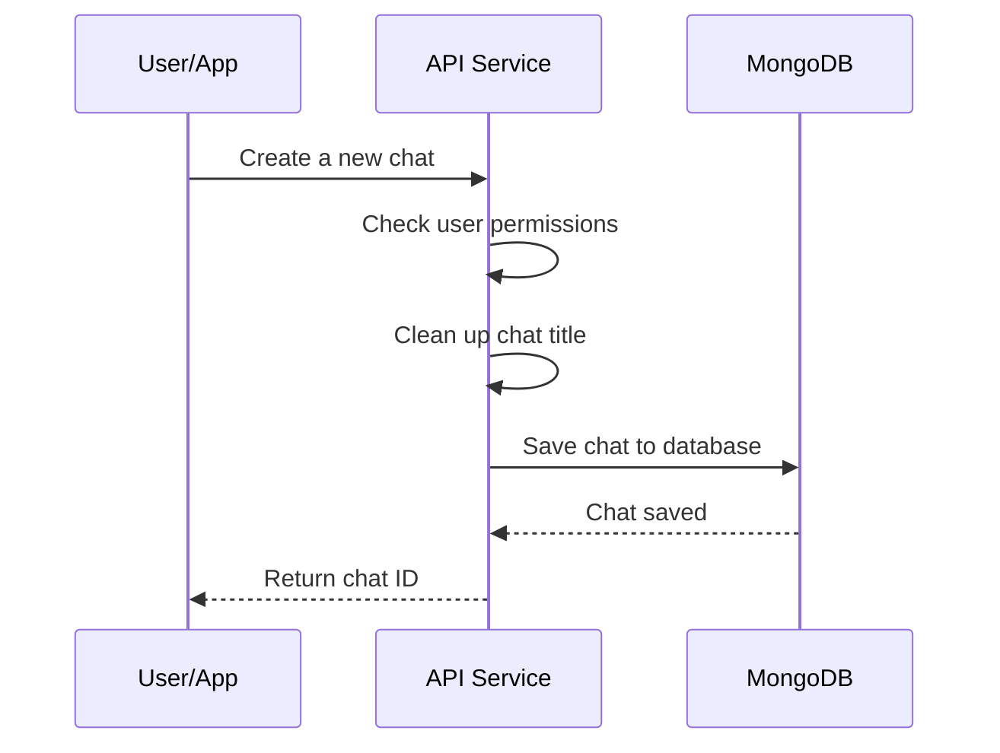
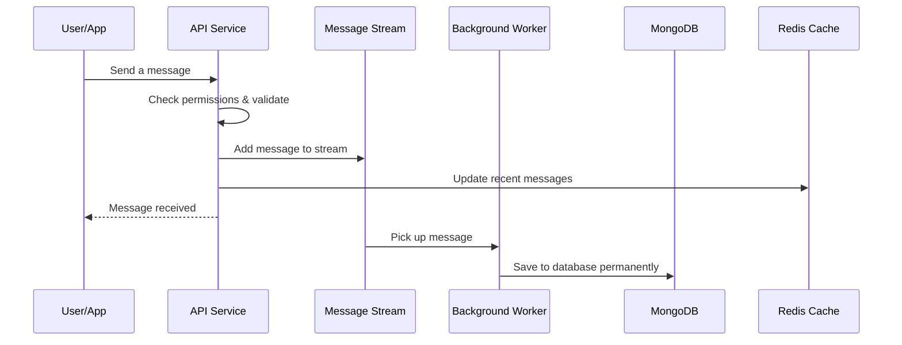
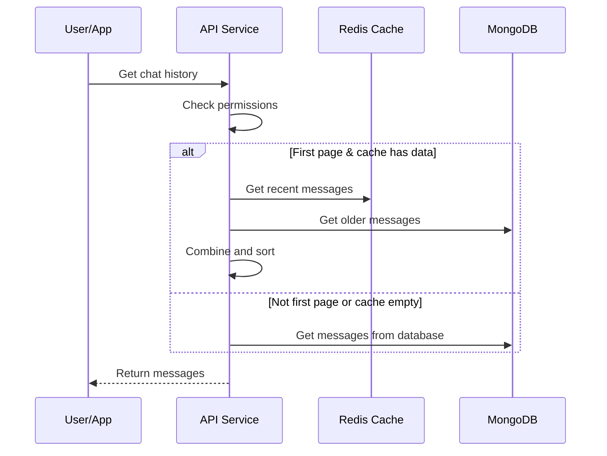

# Request Flows

This document explains how user requests are processed by the Chats service. We'll look at each main operation and see what happens step by step.

## Create a New Chat

When a user creates a new chat, it's saved directly to the database.

**What happens:**
1. User sends a request with their user ID and chat title
2. API checks that the user is allowed to create chats
3. API cleans up the title (removes extra spaces, checks length)
4. API saves the chat to MongoDB
5. API returns the new chat ID

**Why it's fast:** This is a simple database write, no background processing needed.

## Save a Message

When a user sends a message, it goes through a two-step process:

**What happens:**
1. User sends a message with chat ID, user ID, and content
2. API checks that the user owns this chat
3. API validates the message (not too long, valid role, etc.)
4. API adds the message to a temporary stream (Redis Stream)
5. API updates the cache with the new message
6. API immediately responds to the user ("message received")
7. Later, a background worker picks up the message
8. Worker saves the message permanently to MongoDB

**Why two steps?**
- User gets a fast response (step 6)
- Message is saved reliably in the background (step 8)
- If the database is slow, the user doesn't wait

## Get Chat History

When a user asks for chat history, the service tries to get it from the fast cache first:

**What happens:**
1. User asks for chat history (with page number and size)
2. API checks that the user owns this chat
3. **If it's the first page and cache has data:**
   - Get recent messages from Redis (fast)
   - Get older messages from MongoDB
   - Combine them and remove duplicates
4. **Otherwise:**
   - Get messages directly from MongoDB
5. Return the messages to the user

**Why the cache helps:**
- Most users want to see recent messages first
- Redis is much faster than MongoDB
- Cache is automatically updated when new messages arrive

## Error Handling

When something goes wrong, the service returns clear error messages:

| Error | What It Means | Example |
|-------|---------------|---------|
| **Invalid Argument** | Bad input | Missing chat ID, message too long |
| **Unauthenticated** | Not logged in | No user ID provided |
| **Permission Denied** | Not allowed | Trying to access someone else's chat |
| **Not Found** | Doesn't exist | Chat was deleted |
| **Internal Error** | Something broke | Database connection failed |

## Summary

| Operation | How It Works | Speed |
|-----------|--------------|-------|
| Create Chat | Direct database write | Fast |
| Save Message | Stream → Worker → Database | Fast response, async save |
| Get History | Cache first, database fallback | Fast for recent messages |

## Next Steps

- [Validation](../components/validation.md) - Learn about input validation
- [Caching](caching.md) - How the cache works
- [Streaming](../components/streaming.md) - How messages flow through the system
