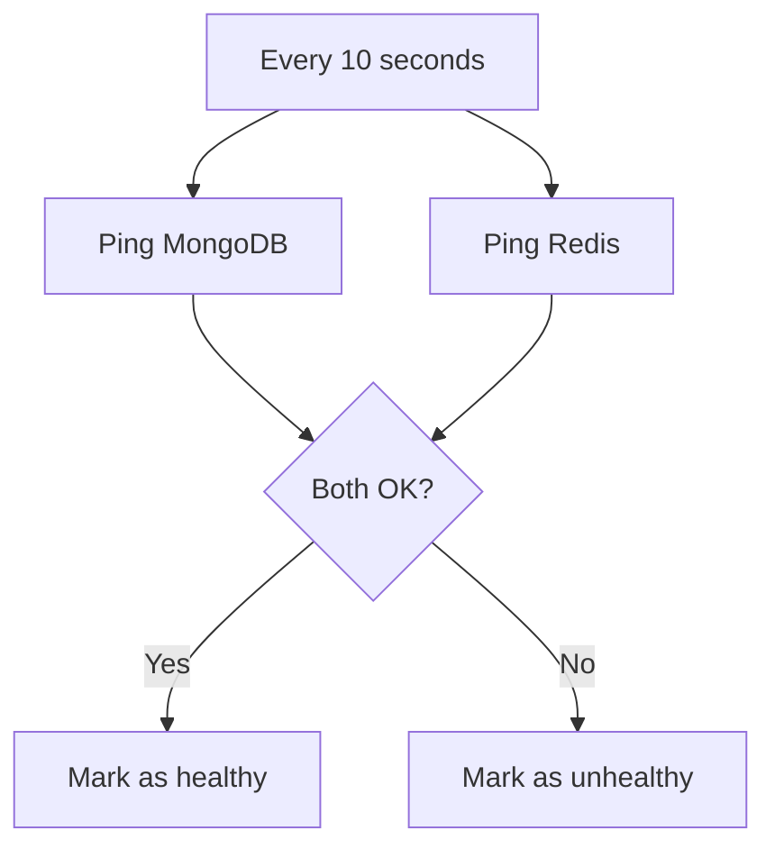

# Health Checks

This document explains how the Chats service monitors its own health and how you can check if it's working properly.

## Why Health Checks Matter

Health checks help you know:
- Is the service running?
- Can it connect to its databases?
- Is it ready to handle requests?

This is important for:
- **Monitoring** - Know when something goes wrong
- **Load balancing** - Route traffic only to healthy instances
- **Debugging** - Quickly identify what's broken

## How Health Checks Work

The service has two types of health checks:

### 1. Internal Health Check

The API service periodically checks its own dependencies:



**What it checks:**
- MongoDB connection (3 second timeout)
- Redis connection (3 second timeout)

**What happens:**
- If both are healthy → Service reports "SERVING"
- If either fails → Service reports "NOT_SERVING"

### 2. External Health Check

You can check the service health from outside:

```bash
# Check gRPC health
grpcurl -plaintext localhost:50051 grpc.health.v1.Health/Check

# Check HTTP health (for monitoring)
curl http://localhost:9091/healthz
```

## Health Endpoints

| Endpoint | Port | What It Does |
|----------|------|--------------|
| `grpc.health.v1.Health/Check` | 50051 | gRPC health check |
| `/healthz` | 9091 | HTTP health check (returns "ok") |
| `/metrics` | 9091 | Prometheus metrics |

## Docker Health Checks

When running with Docker, the service includes health checks:

```yaml
# In docker-compose.yml
healthcheck:
  test: ["CMD", "wget", "-q", "http://localhost:9091/healthz"]
  interval: 30s
  timeout: 10s
  retries: 3
  start_period: 20s
```

**What this means:**
- Check every 30 seconds
- Timeout after 10 seconds
- Fail after 3 consecutive failures
- Wait 20 seconds before first check (startup time)

## Port Layout

| Service | Host Port | Container Port | Purpose |
|---------|-----------|----------------|---------|
| mongo-chat | 27018 | 27017 | MongoDB |
| redis-chat | 6381 | 6379 | Redis |
| chat-service | 50052 | 50051 | gRPC API |
| chat-service | 9095 | 9091 | Metrics |
| chat-worker | 9099 | 9099 | Metrics |

## Monitoring Health

### What to Monitor

| Metric | Warning | Critical |
|--------|---------|----------|
| Service up | Down > 1 min | Down > 2 min |
| MongoDB connection | Slow > 1s | Failed |
| Redis connection | Slow > 1s | Failed |
| Stream lag | > 100 messages | > 1000 messages |

### Health Check Commands

```bash
# Check if service is responding
grpcurl -plaintext localhost:50051 grpc.health.v1.Health/Check

# Check metrics
curl http://localhost:9091/metrics

# Check Docker health status
docker ps --format "table {{.Names}}\t{{.Status}}"
```

## Troubleshooting

**Service reports NOT_SERVING?**
- Check if MongoDB is running
- Check if Redis is running
- Verify network connectivity

**Health check timeout?**
- Check database performance
- Verify no network issues
- Look at service logs

**Docker health check failing?**
- Check container logs
- Verify health check command works
- Ensure ports are correctly mapped

## Related Documentation

- [Configuration](../getting-started/configuration.md) - Health check settings
- [Observability](observability.md) - Metrics and alerts
- [Architecture](../concepts/architecture.md) - How components connect
