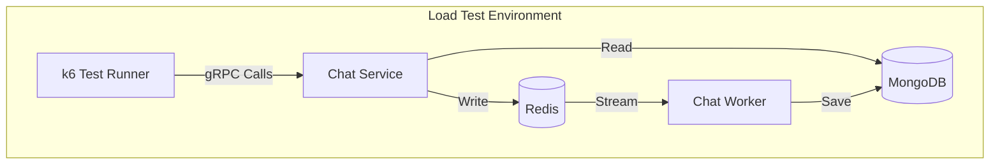
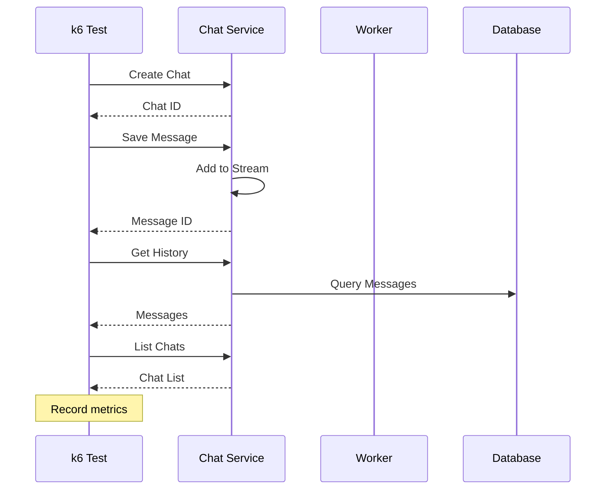

# Load Testing

This document explains how to run load tests for the Chats service. Load tests help you understand how the service performs under different levels of traffic.

## What is Load Testing?

Load testing simulates real-world traffic to:
- **Find performance limits** - How much traffic can the service handle?
- **Identify bottlenecks** - What slows down under pressure?
- **Verify reliability** - Does the service stay stable during high traffic?
- **Plan capacity** - How many users can the service support?

## Quick Start

### Run Your First Test

```bash
# Navigate to the chats service
cd services/chats

# Run a quick smoke test (1 user for 10 seconds)
make load-test SCENARIO=smoke VUS=1 DURATION=10s
```

### Run Different Test Types

```bash
# Smoke test - Quick sanity check
make load-test SCENARIO=smoke VUS=1 DURATION=10s

# Load test - Realistic traffic
make load-test SCENARIO=load VUS=10 DURATION=2m RPS=50

# Stress test - Find the breaking point
make load-test SCENARIO=stress VUS=50 DURATION=5m

# Soak test - Long-running stability
make load-test SCENARIO=soak VUS=5 DURATION=10m
```

### Stop Tests

```bash
# Stop all test containers
make load-down
```

## Test Types

| Test | What It Does | When to Use |
|------|--------------|-------------|
| **Smoke** | Quick check with 1 user | Before deploying to production |
| **Load** | Realistic traffic with multiple users | Verifying performance requirements |
| **Stress** | Push the service to its limits | Finding breaking points |
| **Soak** | Run for extended time | Catching memory leaks or slow issues |

## Test Scenarios Explained

### Smoke Test

**Purpose:** Verify the service works correctly with minimal traffic.

**What it does:**
1. Creates a new chat
2. Saves a message
3. Retrieves chat history
4. Lists user chats

**When to run:** Before every deployment

```bash
make load-test SCENARIO=smoke VUS=1 DURATION=10s
```

**Expected results:**
- 100% success rate
- All checks pass
- Response times under 100ms

### Load Test

**Purpose:** Verify the service handles realistic traffic.

**What it does:**
1. Ramps up to 10 virtual users
2. Maintains steady traffic for 2 minutes
3. Creates chats and saves multiple messages
4. Retrieves history and lists chats

**When to run:** Before major releases or after changes

```bash
make load-test SCENARIO=load VUS=10 DURATION=2m RPS=50
```

**Expected results:**
- 99%+ success rate
- 95% of requests under 100ms
- 99% of requests under 250ms

### Stress Test

**Purpose:** Find the service's breaking point.

**What it does:**
1. Gradually increases traffic to maximum
2. Maintains high traffic for several minutes
3. Creates chats and saves messages rapidly

**When to run:** When planning for growth or finding limits

```bash
make load-test SCENARIO=stress VUS=50 DURATION=5m
```

**What to watch for:**
- Response times increasing
- Errors appearing
- Stream lag growing
- DLQ messages increasing

### Soak Test

**Purpose:** Catch long-running issues like memory leaks.

**What it does:**
1. Runs with moderate traffic for 10 minutes
2. Creates and retrieves messages continuously
3. Tests database and cache stability

**When to run:** Overnight or before major events

```bash
make load-test SCENARIO=soak VUS=5 DURATION=10m
```

**What to watch for:**
- Memory usage growing
- Response times degrading
- Database connections failing

## How Load Tests Work

### Architecture



The load test runs in an isolated environment with its own databases, so it doesn't affect your development or production systems.

### Test Flow



## Configuration

### Environment Variables

You can customize test behavior with environment variables:

| Variable | What It Does | Default |
|----------|--------------|---------|
| `VUS` | Number of virtual users | Depends on scenario |
| `DURATION` | How long to run | Depends on scenario |
| `RPS` | Requests per second (0 = unlimited) | 0 |
| `CHAT_SERVICE_TIMEOUT` | Connection timeout | 5s |
| `RPC_TIMEOUT_MS` | Per-request timeout | 2000ms |

### Scenario Defaults

| Scenario | Virtual Users | Duration |
|----------|---------------|----------|
| `smoke` | 1 | 10 seconds |
| `load` | 10 | 2 minutes |
| `stress` | 50 | 5 minutes |
| `soak` | 5 | 10 minutes |

### Custom Settings

```bash
# Override default settings
make load-test SCENARIO=load VUS=20 DURATION=5m RPS=100

# Run with specific thresholds
THRESHOLD_SUCCESS_RATE=0.95 make load-test SCENARIO=load
```

## Interpreting Results

### Success Rate

| Rate | Meaning |
|------|---------|
| 100% | Perfect - all requests succeeded |
| 99%+ | Good - minor issues, acceptable for most cases |
| 95-99% | Warning - investigate failures |
| <95% | Critical - service has problems |

### Response Times

| Metric | Good | Warning | Critical |
|--------|------|---------|----------|
| p50 (median) | <50ms | 50-100ms | >100ms |
| p95 | <100ms | 100-200ms | >200ms |
| p99 | <250ms | 250-500ms | >500ms |

### Common Issues

**High response times:**
- Check database performance
- Verify cache is working
- Look at worker processing speed

**Failed requests:**
- Check service logs
- Verify database connectivity
- Look at stream errors

**Stream lag growing:**
- Worker can't keep up
- Database is slow
- Too many messages at once

## Running Tests

### Prerequisites

- Docker and Docker Compose
- Make (optional, for convenience commands)

### Step-by-Step

1. **Navigate to the chats service:**
   ```bash
   cd services/chats
   ```

2. **Run a smoke test first:**
   ```bash
   make load-test SCENARIO=smoke VUS=1 DURATION=10s
   ```

3. **If smoke passes, run load test:**
   ```bash
   make load-test SCENARIO=load VUS=10 DURATION=2m RPS=50
   ```

4. **Check the results:**
   - Look for success rate
   - Check response times
   - Verify all checks passed

5. **Clean up:**
   ```bash
   make load-down
   ```

### Without Make

```bash
# Run directly with Docker Compose
SCENARIO=smoke VUS=1 DURATION=10s \
  docker compose -f infra/compose.load.yml up \
  --build --abort-on-container-exit --exit-code-from k6

# Clean up
docker compose -f infra/compose.load.yml down -v --remove-orphans
```

## Troubleshooting

### "Connection refused"

- Wait for services to start (health checks take time)
- Check if Docker is running
- Verify no port conflicts

### "Tests are slow"

- Check Docker resources (CPU, memory)
- Verify network connectivity
- Look at container logs

### "High error rate"

- Check service logs for errors
- Verify database is healthy
- Look at stream lag metrics

### "Tests fail to start"

- Verify Docker Compose file exists
- Check for syntax errors
- Ensure sufficient disk space

## Related Documentation

- [Testing Overview](../../docs/testing/overview.md) - All testing types
- [Configuration](../../docs/getting-started/configuration.md) - Service settings
- [Observability](../../docs/operations/observability.md) - Monitor during tests
