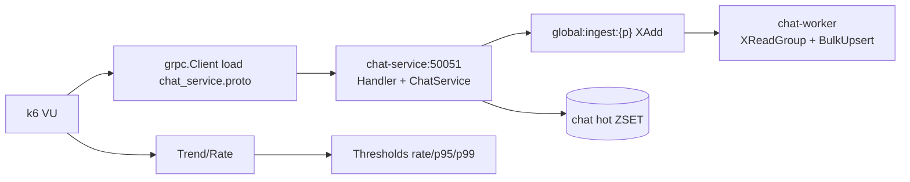
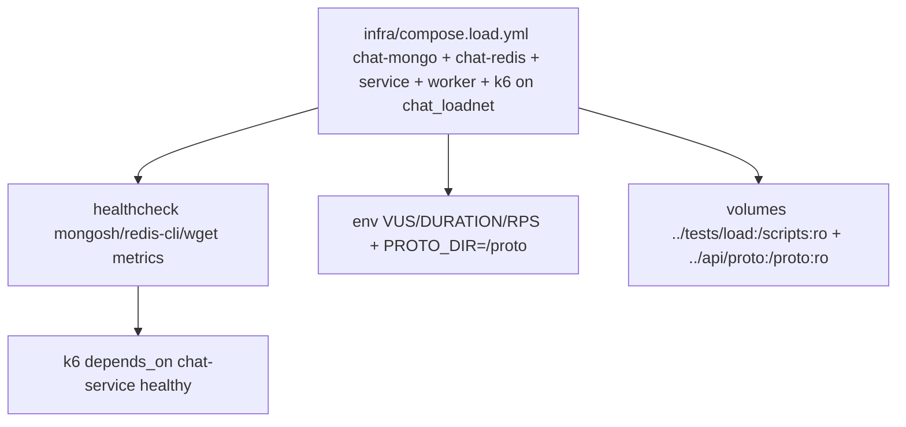
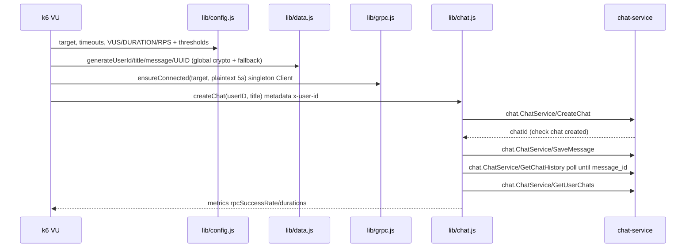

# Load Testing

Simple k6 gRPC load tests for the chats service. Uses `infra/compose.load.yml` to spin `chat-mongo + chat-redis + service + worker + k6` isolated on `chat_loadnet` (`name: chats-load`), no dependency on the main stack or local k6 binary. Proto mounted at `/proto` (`PROTO_DIR`), target `chat-service:50051`.

## Scenarios

| Scenario | File | Shape | Thresholds | Payload |
|---|---|---|---|---|
| `smoke` | `scenarios/smoke.js` | `1` VU `10s` | `rate==1.0` | `CreateChat → SaveMessage → E2E poll → GetUserChats` |
| `load` | `scenarios/load.js` | ramp `30s:10` + steady `DURATION:10VUs` + `30s:0` | `rate>=0.99 p95<100 p99<250 history p95<200` | `CreateChat → 3× SaveMessage + sleep 1-3s → History + UserChats` |
| `stress` | `scenarios/stress.js` | `1m:20% → 1m:50% → 2m:100% 50VUs 5m → 1m:0` | shed watch | `CreateChat → SaveMessage` tight `0.5s` |
| `soak` | `scenarios/soak.js` | `5` VUs `10m` (`10s` + `5×Save 10s` + `30s`) | `rate>=0.99` | sustained writes + history |

All use `x-user-id` metadata and check `chat created` + `rpc_success_rate` + durations (`chat_create/save/get_history/get_user_chats/e2e` Trends). `rps` throttle applies when `RPS>0`.

## Quick Start

```bash
# from services/chats - self-contained (mongo + redis + service + worker + k6)
make load-test SCENARIO=smoke VUS=1 DURATION=10s
make load-test SCENARIO=smoke VUS=1 DURATION=10s RPS=5
make load-test SCENARIO=load VUS=10 DURATION=2m RPS=50
make load-test SCENARIO=stress VUS=50 DURATION=5m
make load-test SCENARIO=soak VUS=5 DURATION=10m
make load-down                                      # down -v
```

Or directly:

```bash
SCENARIO=smoke VUS=1 DURATION=10s docker compose -f infra/compose.load.yml up --build --abort-on-container-exit --exit-code-from k6
SCENARIO=load VUS=10 DURATION=2m RPS=50 docker compose -f infra/compose.load.yml up --build --abort-on-container-exit --exit-code-from k6
docker compose -f infra/compose.load.yml down -v --remove-orphans
```

Tiny smoke verified: `1 VU 10s → 10 iter, checks 30/30, rpc 40/40 100%, exit 0`.

## Env

| Var | Default | Used |
|---|---|---|
| `CHAT_SERVICE_ADDR` | `chat-service:50051` (compose) or `localhost:50051` (host) | `lib/grpc.js` connect |
| `PROTO_DIR` | `/proto` (compose) | `grpc.js` `client.load([PROTO_DIR, '../../../api/proto'])` |
| `VUS` | *(empty → per-scenario)* | generic override wins (`config.js`) |
| `DURATION` | *(empty → per-scenario)* | generic override wins |
| `RPS` | `0` (off) | `options.rps` throttle when `>0` |
| `SMOKE_VUS` / `SMOKE_DURATION` | `1` / `10s` | `smoke` fallback |
| `LOAD_VUS` / `LOAD_DURATION` | `10` / `2m` | `load` fallback |
| `STRESS_VUS` / `STRESS_DURATION` | `50` / `5m` | `stress` fallback |
| `SOAK_VUS` / `SOAK_DURATION` | `5` / `10m` | `soak` fallback |
| `CHAT_SERVICE_TIMEOUT` | `5s` | grpc connect |
| `RPC_TIMEOUT_MS` | `2000` | per-RPC `invoke` timeout |
| `E2E_TIMEOUT_MS` / `E2E_POLLING_INTERVAL_MS` | `5000` / `200` | `verifyE2ELatency` poll `GetHistory` for `message_id` |
| `THRESHOLD_SUCCESS_RATE` | `0.99` (`1.0` smoke) | `rate>=` |
| `THRESHOLD_SAVE_MESSAGE_P95/P99` | `100` / `250` | `load` |
| `THRESHOLD_GET_HISTORY_P95` | `200` | `load` |
| `THRESHOLD_E2E_LATENCY_P95` | `1000` | smoke e2e Trend (informational) |

Elegant `VUS/DURATION/RPS` map generically (see `../infra/compose.load.yml:93` + `lib/config.js:10`); specific `*_VUS/*_DURATION` still work as fallback.

## Architecture





## How it Works



- `lib/config.js:1` parses `VUS/RPS` via `intOr` (`>0` else fallback), `DURATION` via `strOr`.
- `lib/grpc.js:9` loads `[/proto, ../../../api/proto]`, singleton `grpc.Client`, `x-user-id` metadata.
- `lib/chat.js` wraps `CreateChat/SaveMessage/GetHistory/GetUserChats/verifyE2ELatency` with `chatMetrics` (`Rate chat_rpc_success_rate`, Trends).
- `lib/data.js` uses global `crypto.randomUUID()` with manual `v4` fallback (no `k6/experimental/webcrypto` — removed in latest k6).
- Custom k6 metrics: `chat_create_duration`, `chat_save_message_duration`, `chat_get_history_duration`, `chat_get_user_chats_duration`, `chat_e2e_message_latency`, `chat_rpc_success_rate`.

## When to Run

* **Smoke** (`SCENARIO=smoke VUS=1 DURATION=10s`) before deploy — fail fast `rate==1.0`, verifies E2E `Save→History` visibility through worker.
* **Load** (`VUS=10 DURATION=2m RPS=50`) to verify `p95<100/p99<250` under steady writes + cache merge + `BulkUpsert` keep-up (watch `chat_redis_stream_lag`).
* **Stress** (`VUS=50`) to find shed point — watch `grpc_req_duration`, `stream_errors`, `database_errors`, DLQ growth.
* **Soak** (`VUS=5 DURATION=10m`) overnight to catch mongo bucket growth, redis AOF, consumer PEL leaks (`XAutoClaim` recovery).
* Use `RPS` cap to isolate service latency from open-loop overload.

See `../../docs/` for service config and `../../infra/compose.load.yml` for full env defaults.
