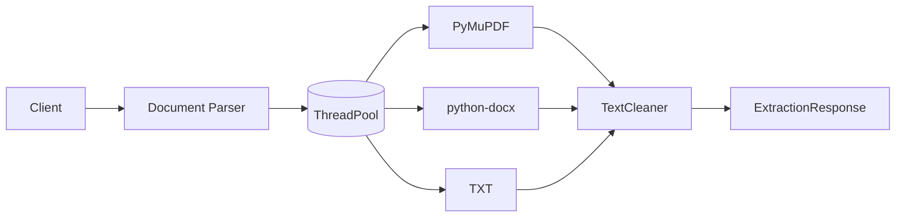

# Document Parser

Stateless Python service that extracts clean text from PDF, DOCX and TXT via ThreadPool and returns normalized output. No DB — MIME-sniff validation with temp-file isolation and timeout.

## Overview

Stateless service handling `POST /extract` (multipart `file` + `python-magic` sniff) with `10 MiB` limit, `30s` timeout, `1M` char cap and `1000` page / `100 MB` uncompressed guards, via `ThreadPoolExecutor` with pool-aware readiness.

## Packages

| Package | Purpose |
|---|---|
| `fastapi`, `uvicorn`, `gunicorn` | HTTP server |
| `pymupdf` | PDF extraction |
| `python-docx`, `python-magic` | DOCX / MIME sniff |
| `pydantic-settings` | Config |
| `prometheus-client` | Metrics |
| `opentelemetry-api`, `opentelemetry-sdk`, `opentelemetry-exporter-otlp-proto-http`, `opentelemetry-instrumentation-fastapi` | Tracing |
| `python-multipart` | Multipart |
| `httpx`, `pytest`, `pytest-cov`, `pytest-mock` | Tests |
| `ruff` | Lint |

See `pyproject.toml` for full list.

## Architecture



Pool-aware readiness (`busy < max` and `queued < 50`). See [Architecture](docs/01-architecture.md) for sequence and class view.

## Configuration

```ini
MAX_UPLOAD_SIZE_BYTES=10485760        # optional, 10 MiB
MAX_TEXT_LENGTH=1000000               # optional, 1M chars
MAX_PDF_PAGES=1000                    # optional
MAX_DOCX_UNCOMPRESSED_BYTES=104857600 # optional, 100 MB
EXTRACTION_TIMEOUT_SECONDS=30.0       # optional
READINESS_MAX_QUEUE_DEPTH=50          # optional
WORKER_THREADS=4                      # optional, cpu_count fallback
PORT=8000                             # optional
OTEL_EXPORTER_OTLP_ENDPOINT=          # optional, disables tracing
```

See `docs/08-configuration.md` for full reference.

## API

```text
GET  /health          -> 200 {"status":"ok"} | 503 {"status":"unavailable"}
GET  /ready           -> 200 {"status":"ready"} | 503 {"status":"not_ready"}
GET  /metrics         -> Prometheus
POST /extract         (multipart file) -> 200 ExtractionResponse | 413 415 422 504
```

See `docs/09-api.md` for request flow and error codes.

## Observability

Logs are JSON to stdout. Tracing is OTel if an OTLP endpoint is set. Metrics at GET /metrics for Prometheus.

Metrics configured:

- HTTP requests total — counts every request by method, route and status code
- HTTP request duration — measures how long each request takes
- Parsed documents total — counts extractions by mime type and status
- Extraction failures — counts failures by mime type and error type
- Rejected uploads — counts rejections by reason (too_large, unsupported_type)
- Extraction pool — gauges active threads, queue depth and max workers

Alerts configured:

- Parser down — parser not up for more than 2 minutes
- High error rate — error rate above 5% for 10 minutes
- High latency — p95 request latency above 2 seconds for 10 minutes
- Extraction failures — more than 0.1 failures per second for 10 minutes
- High rejection rate — more than 1 rejection per second for 15 minutes
- Pool saturation — pool saturated and queue depth >10 for 10 minutes

See `docs/10-observability.md` for PromQL.

## Testing

All test commands are wrapped with `make` — check `Makefile` for details.

```bash
# Run unit tests
make test

# Run tests with coverage report
make test-coverage

# Run integration tests
make test-integration

# Run load tests
make load-test
```

See `docs/11-testing.md` and `load/README.md` for scenarios.

## Docker

All Docker commands are wrapped with `make` for simplicity.

```bash
# Build the parser image
make parser-build

# Start the service
make parser-up

# View live logs and running containers
make parser-logs
make parser-ps

# Stop and clean up
make parser-down
make parser-down-v
```

## Documentation

| Guide | What |
|---|---|
| [Architecture](docs/01-architecture.md) | High-level, sequence, readiness, class view |
| [Validation](docs/02-validation.md) | Size, MIME sniff, limits |
| [Internals](docs/03-internals.md) | Strategies, factory, pool, temp files |
| [Configuration](docs/08-configuration.md) | Full env reference |
| [API](docs/09-api.md) | Endpoints, status codes |
| [Observability](docs/10-observability.md) | Metrics, alerts, dashboards |
| [Testing](docs/11-testing.md) | Unit, integration, load |

Full index: [docs/README.md](docs/README.md).
