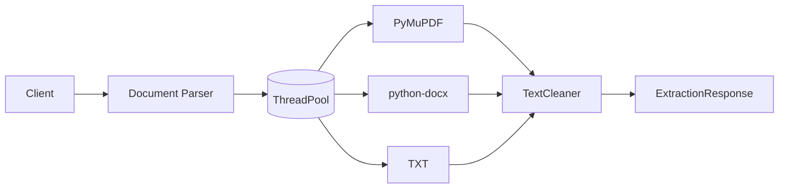
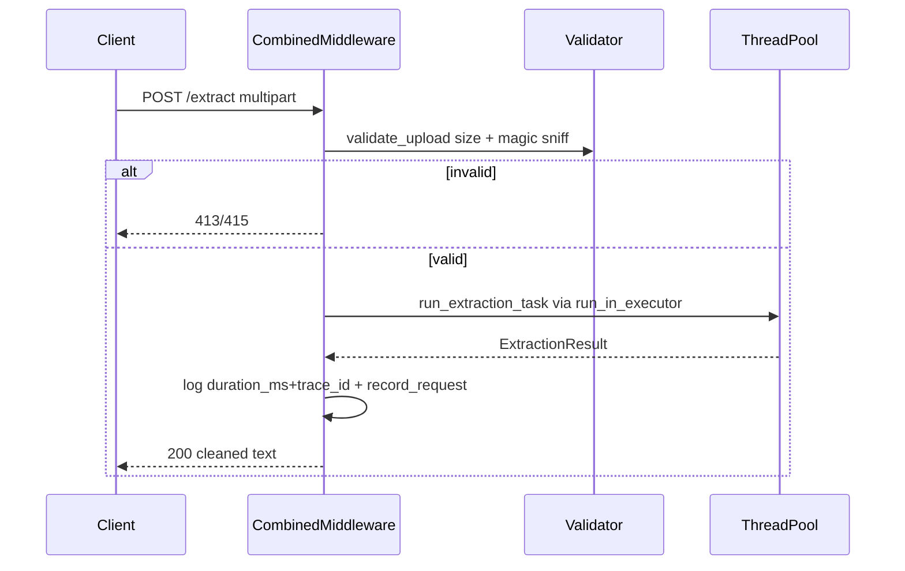
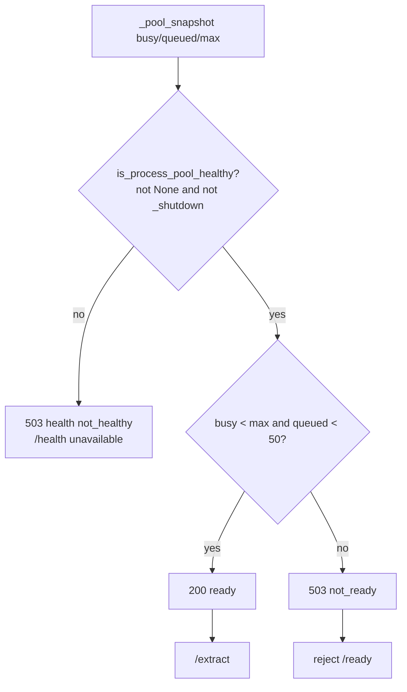
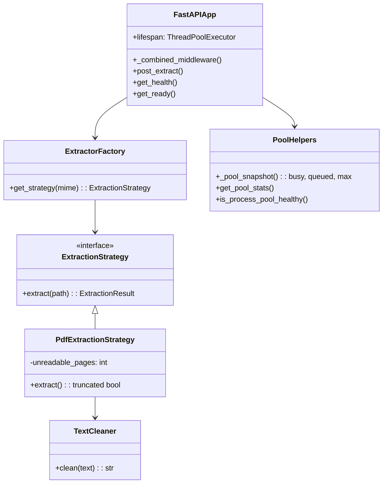

# Architecture

## High-level

Stateless `FastAPI` + `ThreadPoolExecutor` (default `WORKER_THREADS=4`, fallback `cpu_count`). No DB. `app/main.py:28` registers `document_parser_exception_handler` directly (no wrapper) and single `_combined_middleware` centralises JSON logging + `in_flight_requests` + `record_request` with one `perf_counter()`.

## Sequence

Timeout via `asyncio.wait_for(..., EXTRACTION_TIMEOUT_SECONDS=30)` in `app/api/v1/endpoints/extract.py`.

## Readiness

Pool-aware via `app/core/metrics.py:_pool_snapshot` (hides `_work_queue.qsize()`, `_max_workers`, `_shutdown`). `GET /health` checks `is_process_pool_healthy()` only; `GET /ready` checks healthy + `busy >= max` or `queued >= READINESS_MAX_QUEUE_DEPTH (50)` plus race guard `stats is None`. See `app/api/v1/endpoints/health.py`.

## Class view

`app/main.py` wires `ExtractorFactory` + `TextCleaner` + `PoolHelpers`; `python-magic` sniff in `app/api/deps.py` picks strategy. Dead `total_pages` counter removed; error taxonomy unified via `_REJECTED_REASON_MAP`/`_ERROR_TYPE_MAP`.

See `02-validation.md` for sniff and `03-internals.md` for pool details.
