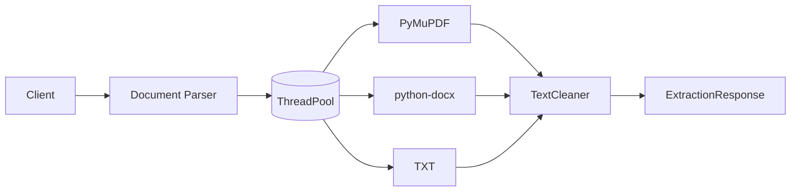
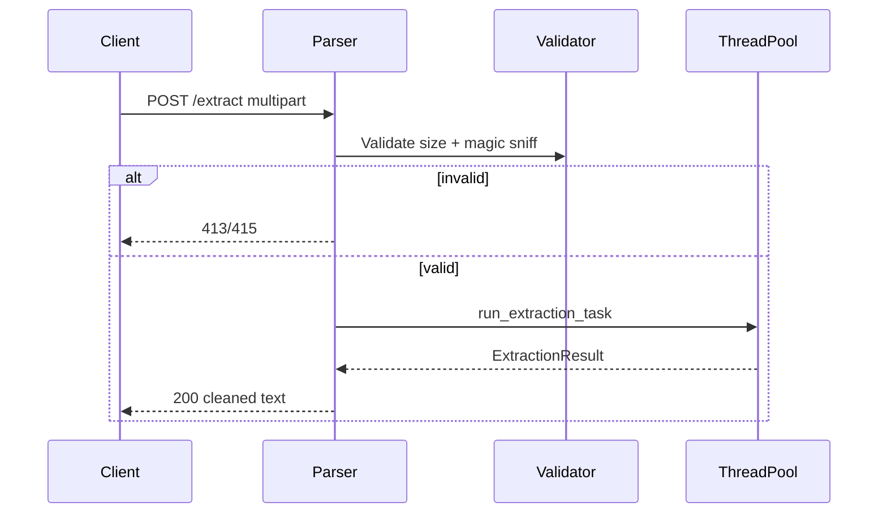
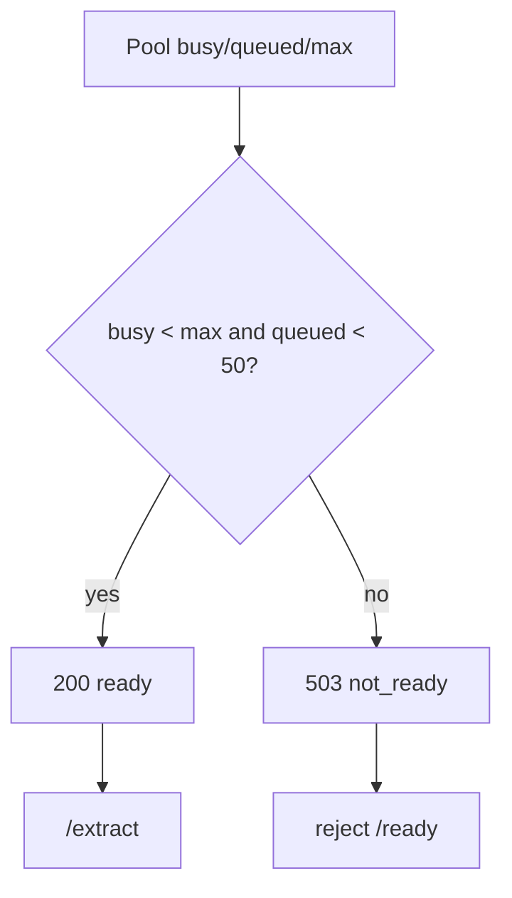
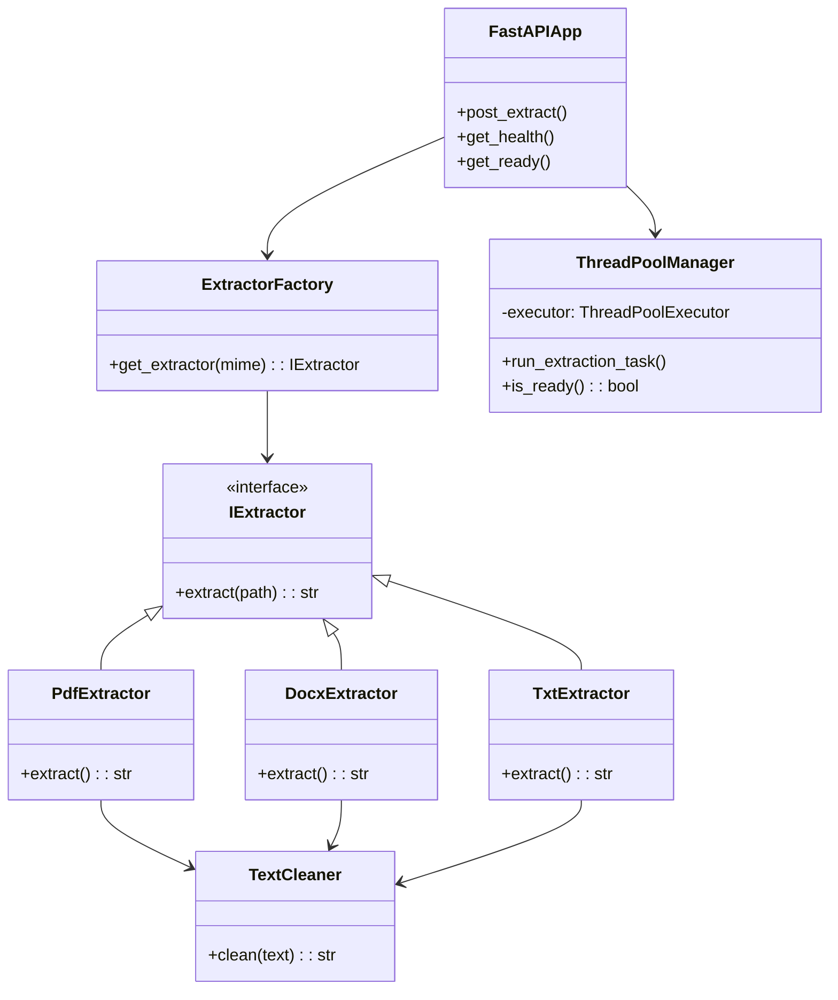

# Architecture

## High-level

Stateless `FastAPI` + `ThreadPoolExecutor` (default `WORKER_THREADS=4`, fallback `cpu_count`). No DB.

## Sequence

## Readiness

Pool-aware: `busy >= max` or `queued >= 50` → `503` at `GET /ready`; `GET /health` checks pool not saturated.

## Class view

`app/main.py` wires `ExtractorFactory` + `TextCleaner` + `ThreadPoolManager`; `python-magic` sniff picks strategy.

See `02-validation.md` for sniff and `03-internals.md` for pool details.
