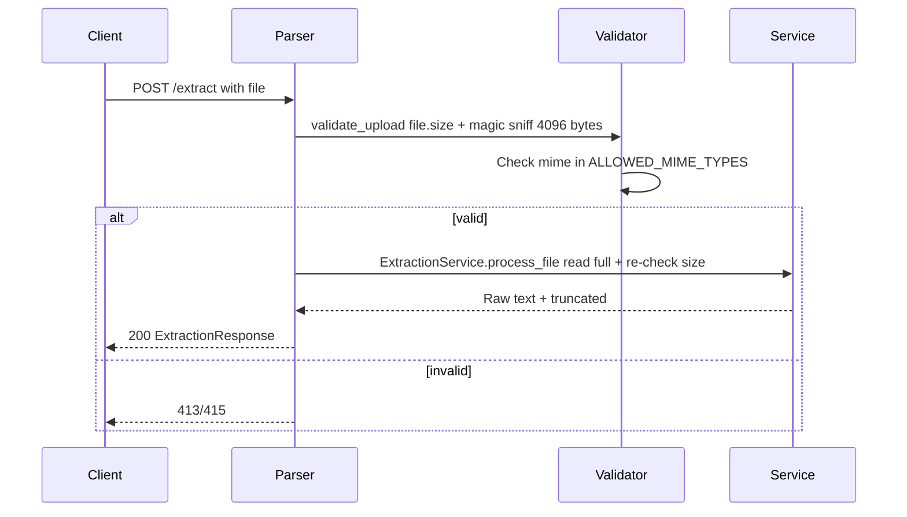

# Validation

## Flow

Code at `app/api/deps.py:validate_upload` + `app/domain/extraction/service.py:ExtractionService` + `app/core/exceptions.py`.

* `validate_upload` — if `file.size > MAX_UPLOAD_SIZE_BYTES (10 MiB)` → `413 FileTooLargeError` (fail-fast, client-supplied header), then `await file.read(4096)` + `magic.from_buffer(raw, mime=True)` → `mime` in `ALLOWED_MIME_TYPES {pdf, vnd.openxml..., text/plain}` else `415 UnsupportedFileTypeError`.
* `ExtractionService.process_file` — `content = b""` init (fixes prior `dir()` guard), `content = file.file.read()`, `len(content) > MAX_UPLOAD_SIZE_BYTES` → `413` defense-in-depth (executor trust boundary), then `ExtractorFactory.get_strategy(mime)` else `422`.
* `ALLOWED` via `app/core/config.py:Settings.ALLOWED_MIME_TYPES`.

## Limits

| Guard | Default | Code | Where |
|---|---|---|---|
| `MAX_UPLOAD_SIZE_BYTES` | `10485760` (10 MiB) | `413` | `deps.py` + `service.py` |
| `MAX_TEXT_LENGTH` | `1000000` (1M chars) | truncate loop break | `strategies.py` |
| `MAX_PDF_PAGES` | `1000` | `422` | `PdfExtractionStrategy` |
| `MAX_DOCX_UNCOMPRESSED_BYTES` | `104857600` (100 MB) | `422` | `DocxExtractionStrategy._guard` |
| `EXTRACTION_TIMEOUT_SECONDS` | `30.0` | `504` | `extract.py:asyncio.wait_for` |

Temp file isolated via `tempfile.NamedTemporaryFile(delete=False)` + `os.unlink` in `finally`; `text_bytes` via `len(cleaned_text.encode("utf-8"))`.

## Error branches

| Invalid | Status | Metrics label |
|---|---|---|
| `size > 10 MiB` | `413` | `rejected_uploads{reason="too_large"}` collapsed via `_REJECTED_REASON_MAP`, `error_type="file_too_large"` |
| `mime not in ALLOWED` | `415` | `unsupported_type` / `unsupported_file_type` |
| `timeout 30s` | `504` | `timeout` |
| `page >1000` or `uncompressed >100 MB` | `422` | `document_too_large` |
| unreadable pages | `422` if all unreadable else `200 truncated=true` | `corrupt_document` |

See `03-internals.md` for strategy factory and unified `_ERROR_TYPE_MAP`.
