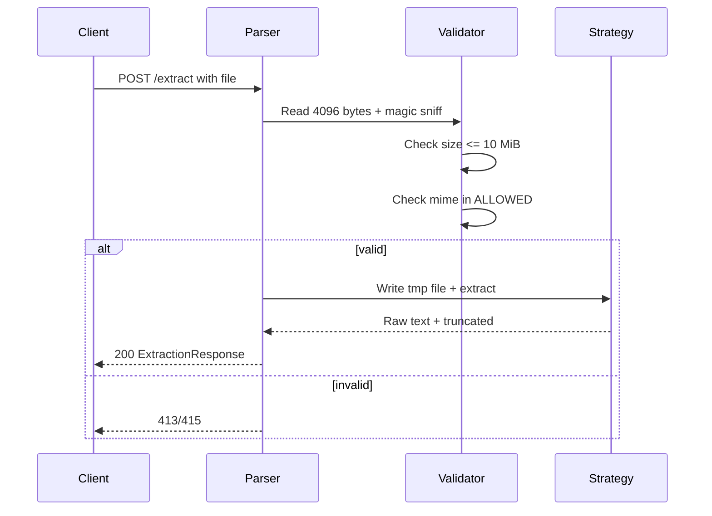

# Validation

## Flow

Code at `app/validator.py` + `app/main.py`.

* Read first `4096` bytes, `python-magic` → `mime` (`application/pdf`, `application/vnd.openxml...`, `text/plain`).
* Check `size <= MAX_UPLOAD_SIZE_BYTES` (`10 MiB`) → `413 Payload Too Large` else `415 Unsupported Media Type`.
* `ALLOWED = {pdf, docx, txt}`; `mimetype` vs `go-urn` style.

## Limits

| Guard | Default | Code |
|---|---|---|
| `MAX_UPLOAD_SIZE_BYTES` | `10485760` (10 MiB) | `413` |
| `MAX_TEXT_LENGTH` | `1000000` (1M chars) | truncate |
| `MAX_PDF_PAGES` | `1000` | `422` |
| `MAX_DOCX_UNCOMPRESSED_BYTES` | `104857600` (100 MB) | `422` |
| `EXTRACTION_TIMEOUT_SECONDS` | `30.0` | `504` |

Temp file isolated via `tempfile.NamedTemporaryFile(delete=False)` + `unlink` after.

## Error branches

| Invalid | Status |
|---|---|
| `size > 10 MiB` | `413` |
| `mime not in ALLOWED` | `415` |
| `timeout 30s` | `504` |
| `page >1000` or `uncompressed >100 MB` | `422` |

See `03-internals.md` for strategy factory.
