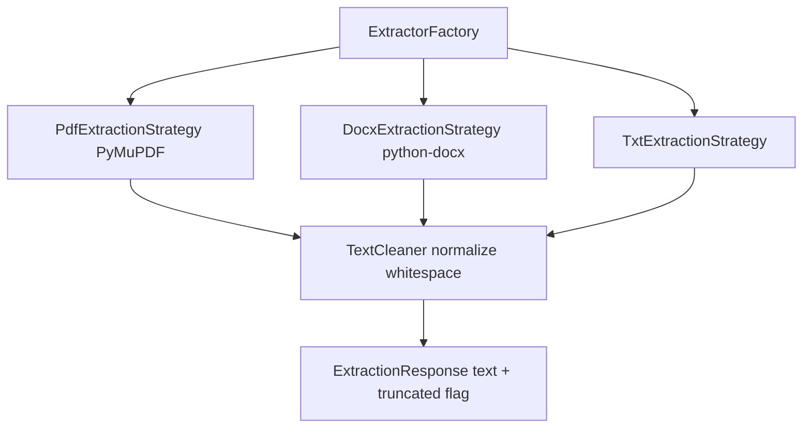
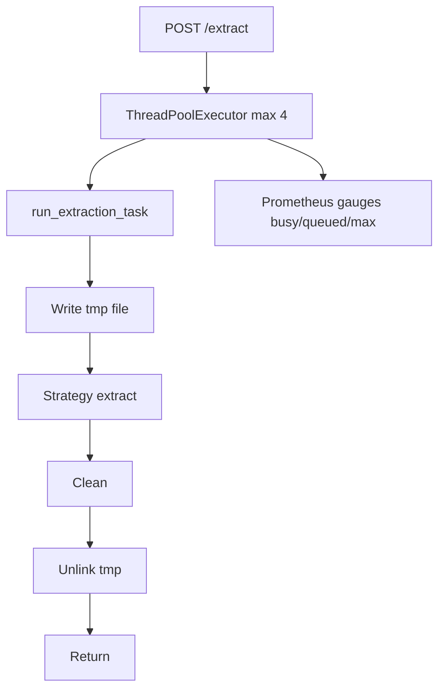
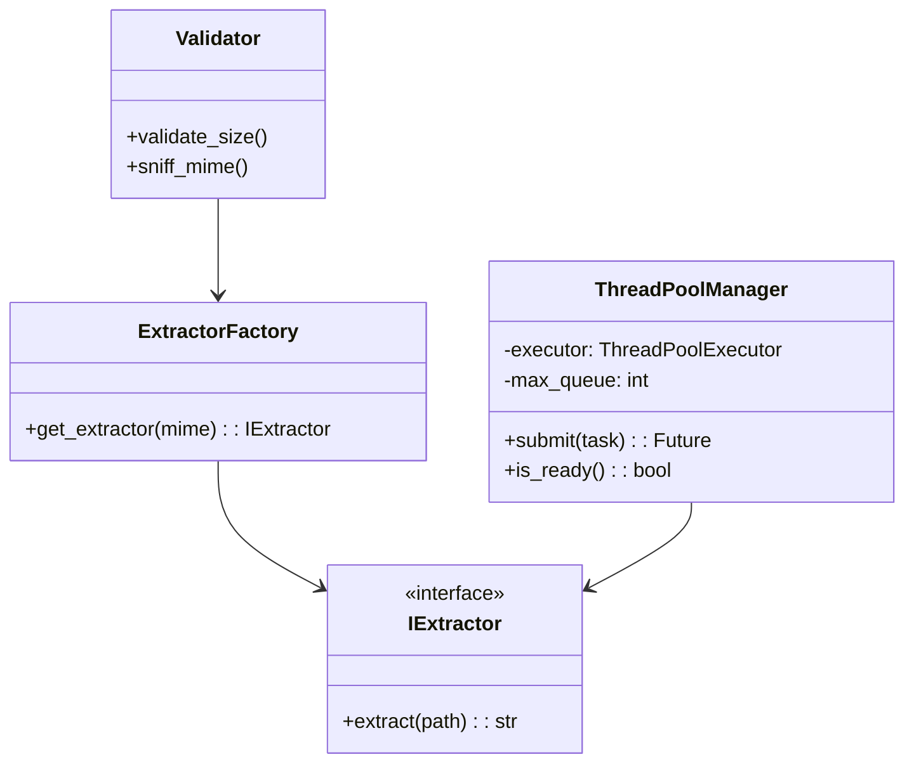

# Internals

## Strategies

* `PdfExtractionStrategy` — `pymupdf` open doc, iterate pages up to `1000`, `get_text()`, check `char cap 1M`.
* `DocxExtractionStrategy` — `python-docx` `Document(path)`, unzip guard `100 MB` before parse, `paragraph.text` join.
* `TxtExtractionStrategy` — `read().decode('utf-8', errors='ignore')`.
* `TextCleaner` — `re.sub(r'\s+', ' ', text).strip()` + `truncate 1M`.

## ThreadPool

* Pool size `WORKER_THREADS` env or `os.cpu_count()`, `READINESS_MAX_QUEUE_DEPTH=50`.
* `is_ready()` → `busy < max and queued <50`.
* Timeout `30s` via `concurrent.futures.wait(..., timeout=30)`.

## Class view

Temp file isolation prevents `zip bomb` — `MAX_DOCX_UNCOMPRESSED_BYTES` checked via `zipfile.infolist()` sum before extraction.

See `01-architecture.md` for readiness graph and `08-configuration.md` for env.
