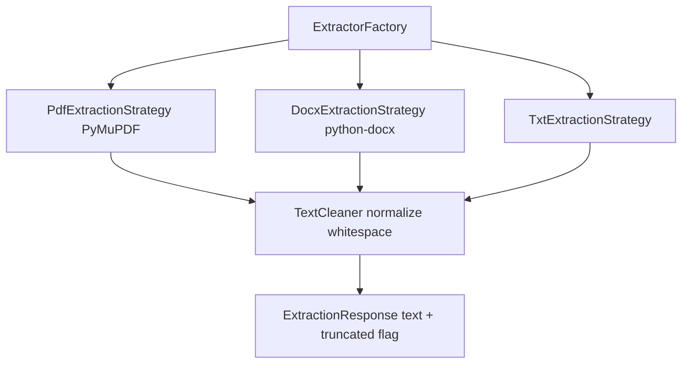
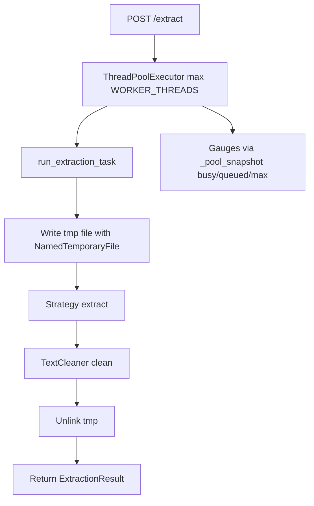
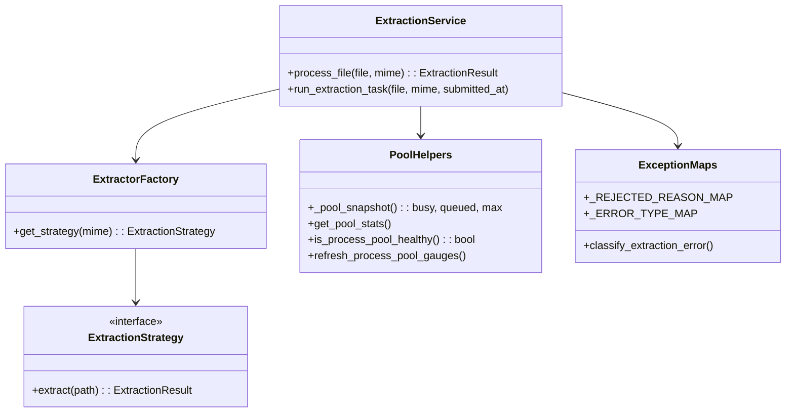

# Internals

## Strategies

* `PdfExtractionStrategy` — `fitz.open(path)`, guard `page_count > MAX_PDF_PAGES (1000)` → `422`, iterate pages with `get_text("blocks")` filtered by `HEADER_FOOTER_MARGIN_PT` band and `TEXT_BLOCK_TYPE`, track `unreadable_pages` for `truncated` (no dead `total_pages`), join via `_drop_repeated_lines` with `HEADER_REPETITION_RATIO 0.8`, break when `total_length > MAX_TEXT_LENGTH (1M)`.
* `DocxExtractionStrategy` — `_guard_uncompressed_size` via `zipfile.infolist()` sum vs `MAX_DOCX_UNCOMPRESSED_BYTES (100 MB)` → `422`, then `docx.Document(path)` paragraph join with `_clean_inline` stripping field control chars `[\x13\x14\x15]`.
* `TxtExtractionStrategy` — `read()` then `decode("utf-8").removeprefix(UTF8_BOM)` fallback to `latin-1` with `LATIN1_BOM`.
* `TextCleaner` — normalize `\r\n`, strip control/invisible chars, fix hyphenated line breaks, dedupe spaces, collapse `\n{3,}` → `\n\n`.

## ThreadPool

* Pool size `WORKER_THREADS` env or `os.cpu_count()`, `READINESS_MAX_QUEUE_DEPTH=50`.
* Centralised `_pool_snapshot()` in `app/core/metrics.py:109` hides `ThreadPoolExecutor._work_queue.qsize()` / `_max_workers` / `_shutdown`; `get_pool_stats()` and `refresh_process_pool_gauges()` delegate to it, `is_process_pool_healthy()` checks `not _shutdown` via `getattr`.
* `run_extraction_task` (`app/domain/extraction/service.py:26`) records `extraction_queue_wait_seconds`, `mark_extraction_started/finished`, measures `extraction_duration_seconds` with success/error labels, then `TextCleaner.clean`.
* `ExtractionService.process_file` uses `content = b""` init before `try` (replaces fragile `"content" in dir()`), defense-in-depth size check vs `MAX_UPLOAD_SIZE_BYTES` even though `validate_upload` already fail-fasts, writes tmp, unlinks in `finally`.
* Timeout `EXTRACTION_TIMEOUT_SECONDS=30.0` via `asyncio.wait_for(run_in_executor(...), timeout=30)` in `app/api/v1/endpoints/extract.py:28`.
* Unified error taxonomy via `_REJECTED_REASON_MAP` and `_ERROR_TYPE_MAP` in `app/core/metrics.py:192-204` (`too_large` vs `file_too_large/document_too_large` split).

## Class view

Temp file isolation prevents zip bomb — `MAX_DOCX_UNCOMPRESSED_BYTES` checked before parsing. `app/main.py:28` registers `document_parser_exception_handler` directly; single `_combined_middleware` handles logging + metrics timing.

See `01-architecture.md` for readiness graph and `08-configuration.md` for env.
