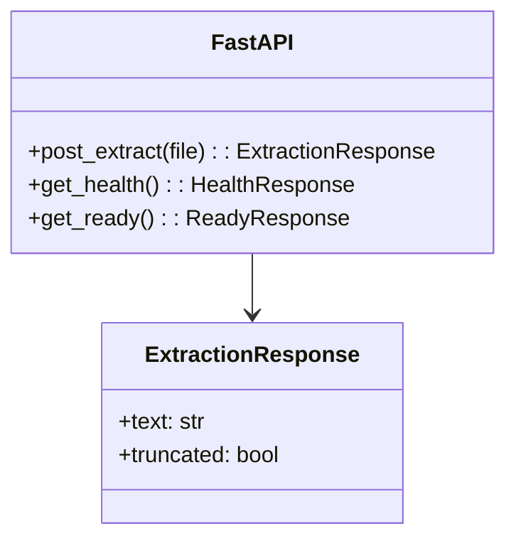

# API

## Endpoints

| Method | Path | Body | Success | Errors |
|---|---|---|---|---|
| `GET` | `/health` | — | `200 {"status":"ok"}` | `503 {"status":"unavailable"}` if pool saturated |
| `GET` | `/ready` | — | `200 {"status":"ready"}` | `503` if `busy>=max` or `queued>=50` |
| `GET` | `/metrics` | — | Prometheus text | — |
| `POST` | `/extract` | `multipart file` | `200 ExtractionResponse{text, truncated}` | `413` too large, `415` unsupported, `422` page/zip bomb, `504` timeout |



## Examples

```bash
curl -F file=@sample.pdf http://localhost:8000/extract
curl -F file=@sample.docx http://localhost:8000/extract
curl -F file=@sample.txt http://localhost:8000/extract
curl http://localhost:8000/health
```

## Status mapping

| Code | When |
|---|---|
| `413` | `size >10 MiB` |
| `415` | `mime not in {pdf,docx,txt}` |
| `422` | `pages>1000` or `uncompressed>100 MB` |
| `504` | `ThreadPool` timeout `30s` |
| `503` | `health/ready` when pool saturated |

See `02-validation.md` for sniff and `03-internals.md` for factory.
