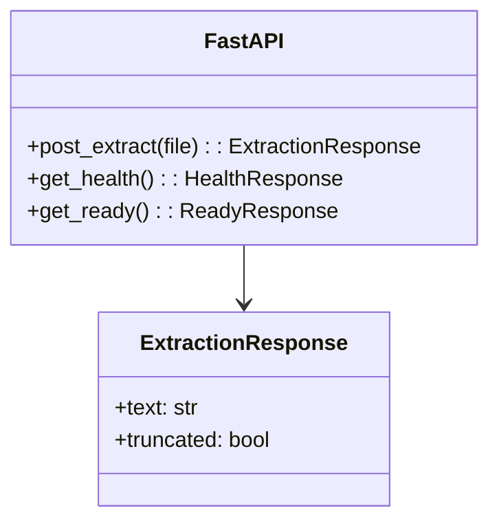

# API

## Endpoints

| Method | Path | Body | Success | Errors |
|---|---|---|---|---|
| `GET` | `/api/v1/health` | — | `200 {"status":"ok"}` | `503 {"status":"unavailable"}` if pool not healthy |
| `GET` | `/api/v1/ready` | — | `200 {"status":"ready"}` | `503` if not healthy or `busy>=max` or `queued>=50` |
| `GET` | `/api/v1/metrics` | — | Prometheus text | — |
| `POST` | `/api/v1/extract` | `multipart file` | `200 ExtractionResponse{text, truncated}` | `413` too large, `415` unsupported, `422` page/zip bomb, `504` timeout |



## Examples

```bash
curl -F file=@sample.pdf http://localhost:8000/api/v1/extract
curl -F file=@sample.docx http://localhost:8000/api/v1/extract
curl -F file=@sample.txt http://localhost:8000/api/v1/extract
curl http://localhost:8000/api/v1/health
```

## Status mapping

| Code | When |
|---|---|
| `413` | `size >10 MiB` |
| `415` | `mime not in {pdf,docx,txt}` |
| `422` | `pages>1000` or `uncompressed>100 MB` |
| `504` | `ThreadPool` timeout `30s` |
| `503` | `health` when pool not healthy, `ready` when `busy/queued` saturated or race `stats is None` |

See `02-validation.md` for sniff and `03-internals.md` for factory.
