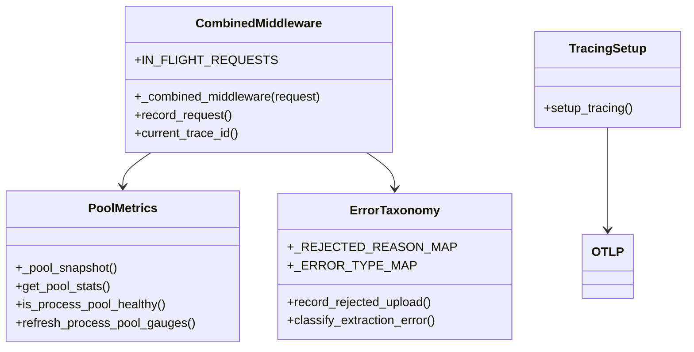

# Observability

Logs are JSON to stdout via `app/core/logging.py:JsonFormatter`. Tracing is OTel if `OTEL_EXPORTER_OTLP_ENDPOINT` set. Metrics at `GET /metrics` via `app/core/metrics.py` + `prometheus_client`.

## Metrics

| Metric | Type | Labels | Buckets / Notes |
|---|---|---|---|
| `http_requests_total` | Counter | `method, route, status_code` | via `record_request` |
| `http_request_errors_total` | Counter | `method, route, status_code` | `status >=400` |
| `http_request_duration_seconds` | Histogram | `method, route, status_code` | `0.01..10.0` |
| `in_flight_requests` | Gauge | — | inc/dec in `_combined_middleware` |
| `parsed_documents_total` | Counter | `mime_type, status` | `success/error` |
| `parsed_file_size_bytes` | Histogram | `mime_type` | `1KB..10MB` |
| `extracted_text_bytes_total` | Counter | `mime_type` | volume rate |
| `extracted_text_length_bytes` | Histogram | `mime_type` | distribution `1KB..5MB` |
| `extraction_compression_ratio` | Histogram | `mime_type` | `file/text` `0.5..500` |
| `extraction_duration_seconds` | Histogram | `mime_type, status` | `0.01..30s` |
| `extraction_queue_wait_seconds` | Histogram | `mime_type` | `0.001..5s` |
| `extraction_failures_total` | Counter | `mime_type, error_type` | `file_too_large/document_too_large/unsupported_file_type/timeout/corrupt_document/unexpected` via `_ERROR_TYPE_MAP` |
| `extraction_timeouts_total` | Counter | `mime_type` | `asyncio.TimeoutError` |
| `rejected_uploads_total` | Counter | `reason` | `too_large` (collapsed `FileTooLarge+DocumentTooLarge` via `_REJECTED_REASON_MAP`), `unsupported_type` |
| `extraction_pool_active_threads` | Gauge | — | `busy` from `_pool_snapshot` |
| `extraction_pool_queue_depth` | Gauge | — | `queued` from `_pool_snapshot` |
| `extraction_pool_max_workers` | Gauge | — | `max` from `_pool_snapshot` |

Code at `app/core/metrics.py` with `app/main.py:_combined_middleware` (single `perf_counter()` timing, logs `duration_ms+trace_id`, records via `record_request` except `/metrics`). Pool helpers `app/core/metrics.py:_pool_snapshot` hide `_work_queue.qsize()` / `_max_workers` / `_shutdown`.

## Dashboards and alerts

| Alert | Expr | For |
|---|---|---|
| Parser down | `up{job="document-parser"}==0` | `2m` |
| High error rate | `rate(http_requests_total{job="document-parser",status_code=~"4..|5.."}[5m])` | `10m >5%` |
| High latency | `histogram_quantile(0.95, rate(http_request_duration_seconds_bucket[5m])) >2s` | `10m` |
| Extraction failures | `rate(parsed_documents_total{status="error"}[5m]) >0.1` | `10m` |
| High rejection rate | `rate(rejected_uploads_total[5m]) >1` | `15m` |
| Pool saturation | `extraction_pool_queue_depth >10` | `10m` |

Tracing: `app/core/tracing.py:setup_tracing` + `opentelemetry-instrumentation-fastapi` middleware + `OTLP` exporter; `app/main.py:lifespan` registers pool then tracing.

## Class view

