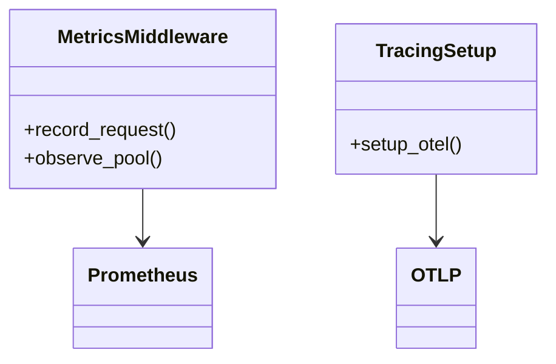

# Observability

Logs are JSON to stdout. Tracing is OTel if `OTEL_EXPORTER_OTLP_ENDPOINT` set. Metrics at `GET /metrics` for Prometheus.

## Metrics

| Metric | Type | Labels |
|---|---|---|
| `http_requests_total` | Counter | `method, route, code` |
| `http_request_duration_seconds` | Histogram | `method, route` |
| `documents_parsed_total` | Counter | `mime, status` |
| `extraction_failures_total` | Counter | `mime, error` |
| `rejected_uploads_total` | Counter | `reason` |
| `extraction_pool` | Gauge | `busy, queued, max` |

Code at `app/monitoring.py` via `prometheus_client` + `opentelemetry-instrumentation-fastapi`.

## Dashboards and alerts

| Alert | Expr |
|---|---|
| Parser down | `up{job="parser"}==0` for `2m` |
| High error rate | `rate(http_requests_total{code=~"5.."}[10m]) >0.05` |
| High latency | `histogram_quantile(0.95, http_request_duration) >2` for `10m` |
| Extraction failures | `rate(extraction_failures[10m]) >0.1` |
| High rejection rate | `rate(rejected_uploads[15m]) >1` |
| Pool saturation | `extraction_pool{state="queued"} >10` for `10m` |

Tracing: `opentelemetry-instrumentation-fastapi` middleware + `OTLP` exporter.

## Class view

