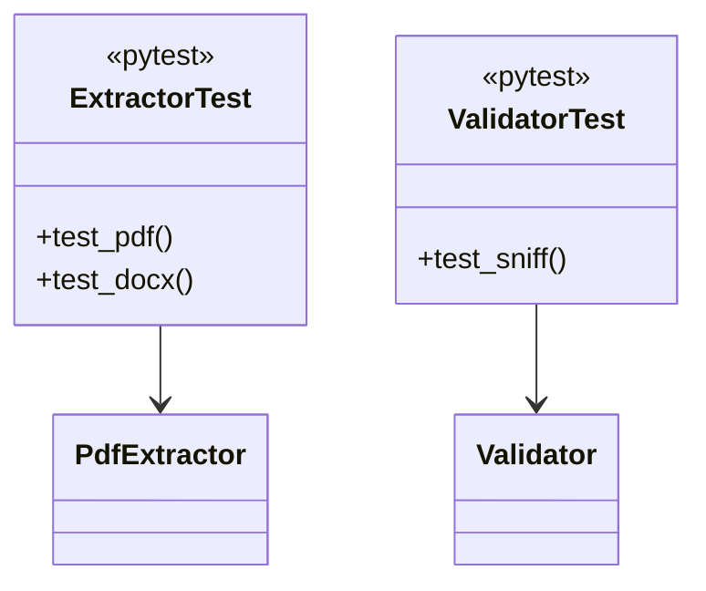

# Testing

## Commands

```bash
# Run unit tests
make test

# Run with coverage
make test-coverage

# Run integration (needs Docker)
make test-integration

# Run load (k6)
make load-test
```

## Unit

```
tests/test_extractor.py
tests/test_validator.py
tests/test_cleaner.py
tests/test_app.py
```

`pytest -v` via `pytest-asyncio`.

## Integration

`pytest -m integration -v` (needs `infra/compose.yml` up).

## Load

See `load/README.md`:

| Mode | File | Stages |
|---|---|---|
| `vus` | `script.js` `ramping-vus` | `5s:5, 10s:5, 5s:0` |
| `rps` | `script.js` `ramping-arrival-rate` | `5s:10, 10s:10, 5s:0` |
| `health` | `script.js` `constant-vus` | `5 VUs 30s` |

```bash
make load-test VUS=20 DURATION=1m
make load-test MODE=rps RPS=100 VUS=50
```

Each VU picks random `pdf/docx/txt` from `load/fixtures/`, posts `multipart`, checks `200` and `text`.

## Class under test


