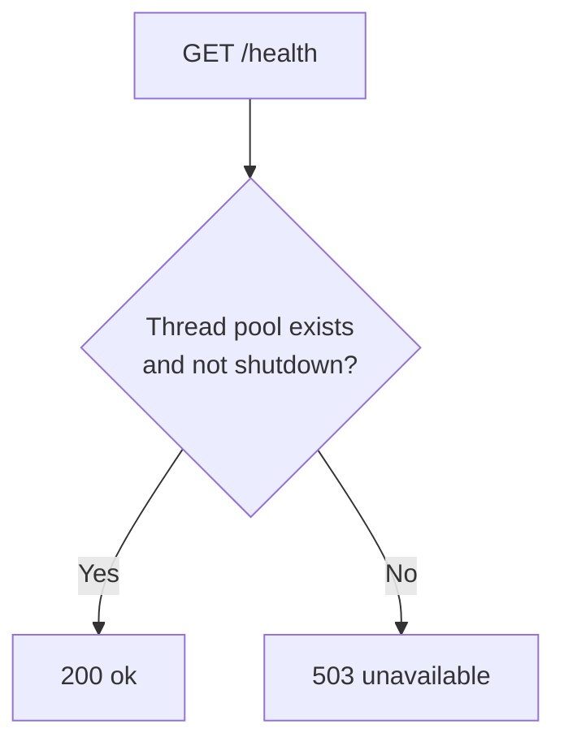
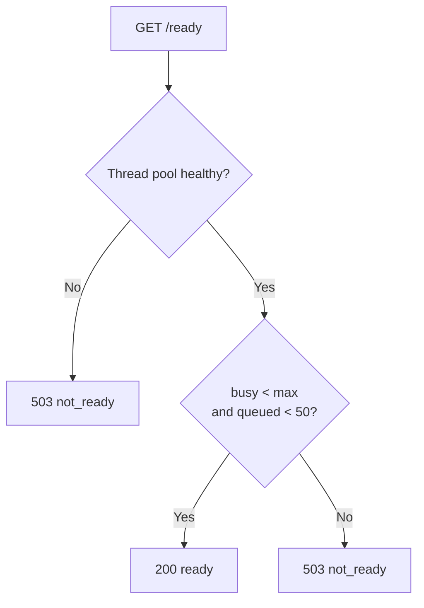

# Health Checks

This document explains how the Document Parser service monitors its own health and how you can check if it's working properly.

## Why Health Checks Matter

Health checks help you know:

- Is the service running?
- Can it handle new requests?
- Is the thread pool saturated?

This is important for:

- **Monitoring** - Know when something goes wrong
- **Load balancing** - Route traffic only to healthy instances
- **Debugging** - Quickly identify what's broken

## How Health Checks Work

The service has two types of health checks:

### 1. Health Check (`/api/v1/health`)

Checks if the service is running and the thread pool is operational:



**What it checks:**
- Thread pool is initialized
- Thread pool is not shutdown

### 2. Readiness Check (`/api/v1/ready`)

Checks if the service can handle new requests:



**What it checks:**
- Thread pool is healthy (exists and not shutdown)
- Active threads (`busy`) are below the maximum
- Queued tasks are below `READINESS_MAX_QUEUE_DEPTH` (default 50)

## Health Endpoints

| Endpoint | What It Does | When to Use |
|----------|--------------|-------------|
| `GET /api/v1/health` | Basic health check | Liveness probes (is the process alive?) |
| `GET /api/v1/ready` | Readiness check | Readiness probes (can it accept traffic?) |
| `GET /api/v1/metrics` | Prometheus metrics | Monitoring dashboards |

## Port Layout

| Service | Host Port | Container Port | Purpose |
|---------|-----------|----------------|---------|
| document-parser | 8000 | 8000 | API (extract + health + metrics) |

## Docker Health Checks

When running with Docker, the service includes health checks:

```yaml
healthcheck:
  test: ["CMD", "curl", "-f", "http://localhost:8000/api/v1/health"]
  interval: 30s
  timeout: 10s
  retries: 3
  start_period: 20s
```

**What this means:**
- Check every 30 seconds
- Timeout after 10 seconds
- Fail after 3 consecutive failures
- Wait 20 seconds before first check (startup time)

## Monitoring Health

### What to Monitor

| Metric | Warning | Critical |
|--------|---------|----------|
| Service up | Down > 1 min | Down > 2 min |
| Pool queue depth | > 10 | > 40 |
| Extraction error rate | > 1% | > 5% |
| Extraction latency p95 | > 5s | > 15s |

### Health Check Commands

```bash
# Check if service is healthy
curl http://localhost:8000/api/v1/health

# Check if service is ready for traffic
curl http://localhost:8000/api/v1/ready

# Check metrics
curl http://localhost:8000/api/v1/metrics

# Check Docker health status
docker ps --format "table {{.Names}}\t{{.Status}}"
```

## Troubleshooting

**Service returns `503 unavailable`?**
- Check if the service process is running
- Look at logs for startup errors
- Verify the thread pool initialized correctly

**Service returns `503 not_ready`?**
- The thread pool is saturated (too many concurrent extractions)
- Wait for current extractions to complete
- Increase `WORKER_THREADS` if this happens frequently
- Check `extraction_pool_queue_depth` metric

**Health check timeout?**
- The service may be overloaded
- Check `extraction_pool_active_threads` metric
- Look at service logs for errors

**Docker health check failing?**
- Check container logs (`docker compose logs document-parser`)
- Verify the health check command works inside the container
- Ensure port 8000 is correctly mapped

## Related Documentation

- [Configuration](../getting-started/configuration.md) - Health check settings
- [Observability](../operations/observability.md) - Metrics and alerts
- [Architecture](../concepts/architecture.md) - How components connect
